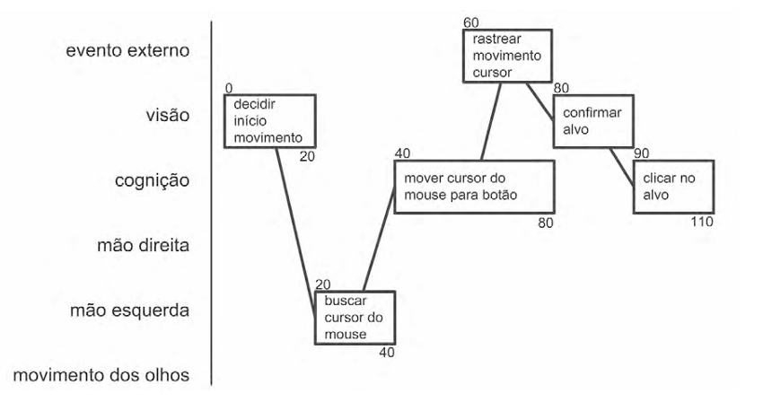
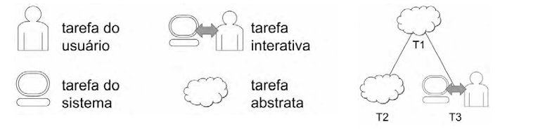
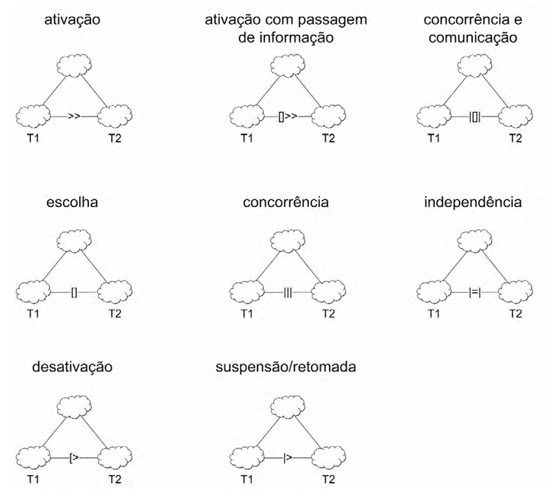

# Análise de Tarefas

## Introdução

Uma análise de tarefas é utilizada para se ter um entendimento sobre qual é o trabalho dos usuários, como eles o realizam e por quê. Nesse tipo de análise, o trabalho é definido em termos dos objetiso que os usuários querem ou precisam atingir (BARBOSA, Simone, 2010, p.191). Em IHC, a análise de tarefas é fundamental para o design centrado no usuário, pois permite identificar as necessidades, objetivos e dificuldades dos usuários ao interagir com o sistema. A partir dessa análise, é possível criar interfaces mais intuitivas e eficientes, que atendam melhor às expectativas e demandas dos usuários.

Dentre os métodos de análise de tarefas mais comuns, podemos destacar a <strong>Análise Herárquica de Tarefas</strong> (HTA – Hierarchical Task Analysis, Annett, 2003; Annett e Duncan, 1967), o <strong>GOMS</strong> (Goals, Operators, Methods, and Selection Rules, Kieras, 2003) e o <strong>ConcurTaskTrees</strong> (CTT; Paternò, 2000). 

### Análise Herárquica de Tarefas (HTA)

Desenvolvida na década de 1960, a HTA visa entender as competências e habilidades exibidas em tarefas complexas e não repetitivas, servindo para identificar problemas relacionados ao desempenho da tarefa. Ela ajuda a relacionar o que as pessoas fazem (ou se recomenda que façam), por que fazem, e quais as consequências caso não o façam corretamente (BARBOSA, Simone, 2010, p.192). A HTA inclui uma análise funcional de tarefas que começa com a definição dos objetivos das pessoas, considerando as ações através das quais a tarefa pode ser realizada para atingir esses objetivos.

Toda tarefa pode ser definida como objetivo e, no caso de tarefas complexas, definidas em termos de objetivos e subobjetivos, num desdobramento hierarquico chamado de decomposição de tarefas ou redescrição. No nível mais baixo da hierarquia, cada subobjetivo é alcançado por uma operação. Os objetivos e operações podem ser representados em um diagrama cujo os elementos são mostrados na figura 1.

<center>
<p><strong>Figura 1:</strong> Elementos de um diagrama HTA</p>


Autor: [Paulo Henrique](https://github.com/paulomh) | Fonte: BARBOSA, Simone, 2010, p.179
</center>

Além disso, segundo Barbosa e Silva, Uma <strong>operação</strong> é especificada pelas circunstâncias nas quais o objetivo é ativado (input ou entrada), pelas atividades ou ações (actions) que contribuem para atingi-lo e pelas condições que indicam o seu atingimento (feedback). Uma <strong>ação</strong> pode ser entendida como uma instrução para fazer algo sob certas circunstâncias, o <strong>input</strong> como estados e o <strong>feedback</strong> como testes ou avaliação do estado fi nal. A ação pode ser vista formalmente como uma regra de transformação entre estados.<sup>[1](../analise-de-requisitos/analiseTarefas.md#referências-bibliográficas)</sup> Assim, as principais características de uma operação são as ações que devem ser desempenhadas para atingir um objetivo e as condições que indicam que o objetivo foi alcançado. (BARBOSA, Simone, 2010, p.193)

### GOMS

O GOMS é um modelo de análise de tarefas que visa prever o tempo que um usuário levará para realizar uma tarefa. O modelo é baseado em quatro componentes: <strong>Goals</strong> (objetivos), <strong>Operators</strong> (operadores), <strong>Methods</strong> (métodos) e <strong>Selection Rules</strong> (regras de seleção). Os objetivos são as metas que o usuário deseja alcançar, os operadores são as ações que o usuário pode realizar, os métodos são as sequências de operadores que o usuário pode executar para alcançar um objetivo e as regras de seleção são as condições que determinam qual método deve ser escolhido. Em suma, o GOMS caracteriza o conhecimento procedimental de uma pessoa ao realizar tarefas num determinado dispositivo (Kieras,2003)(BARBOSA, Simone, 2010, p.197).

O GOMS é utilizado principalmente em situações onde os usuários realizam tarefas que já dominam. Essa análise presupõe que eles sabem o que fazer e como fazer, mas não necessariamente por quê. O modelo é baseado em um conjunto de regras que descrevem como as tarefas são realizadas, permitindo prever o tempo que um usuário levará para realizar uma tarefa.

Além disso, o GOMS possui alguns modelos derivados: KLM (Card et al., 1983), CMN-GOMS (Card et al., 1983) e CPM-GOMS (John e Gray, 1995), descritos a seguir.

#### KLM (Keystroke-Level Method)

O KLM é uma técnica mais simplificada do GOMS que utiliza um conjunto predefinido de operadores primitivos: 
- K para pressionar uma tecla ou botão; 
- P para apontar com o mouse um alvo num dispositivo visual; 
- H para mover as mãos para o teclado ou outro dispositivo; 
- D para desenhar um segmento de reta em um grid; 
- M para se preparar mentalmente para realizar uma ação ou uma série de ações primitivas fortemente relacionadas entre si;
- R para o tempo de resposta do sistema, durante o qual o usuário precisa esperar.

O KLM também inclui um conjunto de heurísticas sobre como posicionar operadores mentais durante a preparação. A estimativa de tempos de execução pode ser utilizada para comparar ideias em tarefas de benchmark, fazer uma avaliação paramétrica para explorar o espaço defi nido por importantes variáveis e fazer análises sobre as suposições feitas (BARBOSA, Simone, 2010, p.199). 

#### CMN-GOMS (Card, Moran e Newell)

No CMN-GOMS os operadores são executados estritamente em ordem sequencial, e os métodos são apresentaods numa notação semelhante a um pseudocódigo, incluindo submétodos e condicionais. Quantitativamente, os modelos CMN-GOMS permitem prever a sequência de operadores e o tempo de execução. Qualitativamente, eles focam métodos para alcançar objetivos: métodos semelhantes são facilmente identifi cados, métodos atipicamente curtos ou longos se destacam e podem disparar ideias de design, como, por exemplo, a inclusão de teclas de atalho para comandos frequentes e pontos de feedback para o usuário. (BARBOSA, Simone, 2010, p.199-200)

#### CPM-GOMS (Cognitive Perceptual Motor)

O CPM-GOMS é uma versão do GOMS baseada diretamente na forma de representação de tarefas cognitivas, perceptuais e motoras. Ele é utilizado para modelar tarefas que envolvem a percepção e a cognição, como a leitura de um texto, a busca por informações em um ambiente gráfico ou a resolução de problemas. O CPM-GOMS 
utiliza um diagrama tipo PERT para representar os operadores e as dependências entre eles. Nessa análise, o caminho crítico fornece uma previsão simples do tempo total da tarefa (Figura 2).

<center>
<p><strong>Figura 2:</strong> Exemplo de modelo CPM-GOMS</p>



Autor: [Paulo Henrique](https://github.com/paulomh) | Fonte: BARBOSA, Simone, 2010, p.202

</center>

A construção de um modelo CPM-GOMS inicia com a construção do modelo CMN-GOMS, cujos operadores são em seguida classificados em operadores cognitivos, perceptivos e motores do MHP. Atribuímos então uma duração estimada a cada operador e calculamos o tempo de execução previsto para a tarefa. É possível ainda efetuar uma análise qualitativa da relação entre aspectos do design e o tempo de execução, bem como fazer simulações de designs alternativos e ajudar a identificar por que um terá um desempenho melhor do que o outro.(BARBOSA, Simone, 2010, p.201-202) O CPF-GOMS assume que o usuário é extremamente experiente e executa as tarefas tão rápido quanto a arquitetura MHP.

### ConcurTaskTrees (CTT)

O modelo de árvores de tarefas concorrentes (ConcurTaskTrees – CTT) foi criado para auxiliar a avaliação e o design e avaliação de IHC (BARBOSA, Simone, 2010, p.203). Nesse modelo, existem quatro tipos de tarefas (Figura 3):
- tarefas do usuários, realizadas fora do sistema;
- tarefas do sistema, realizadas pelo sistema sem interagir com o usuário;
- tarefas de interação, realizadas pelo sistema em resposta a uma ação do usuário; e
- tarefas abstratas, que não são tarefas, mas sim uma representação de uma composição de tarefas que auxilie a decomposição.

<center>
<p><strong>Figura 3:</strong> Tipos de tarefas em CTT</p>



Autor: [Paulo Henrique](https://github.com/paulomh) | Fonte: BARBOSA, Simone, 2010, p.203

</center>

O CTT permite representar várias relações entre tarefas, aumentando a expressividade da notação. São elas:
- <strong>ativação:</strong> T1 >> T2 significa que a segunda tarefa (T2) só pode iniciar após a primeira (T1) terminar;
- <strong>ativação com passagem de informação:</strong> T1 [] >> T2 especifica qque, além de T2 só iniciar depois de T1, a informação produzida por T1 é passada para T2;
- <strong>escolhas (tarefas alternativas):</strong> T1 [] T2 indica que duas tarefas que estejam habilitadas num momento, mas que, uma vez que uma delas se inicia, a outra é desabilitada;
- <strong>tarefas concorrentes:</strong> T1 || T2 significa que as duas tarefas podem ser executadas em qualquer ordem ou simultaneamente;
- <strong>tarefas concorrentes e comunicantes:</strong> T1 | [] | T2 indica que as tarefas podem ser executadas em qualquer ordem ou simultaneamente, mas que elas podem se comunicar durante a execução.
- <strong>tarefas independentes:</strong> T1 |=| T2 especifica que as tarefas podem ser realizadas em qualquer ordem, porém quando uma se inicia, é necessário terminar para que a outra possa ser iniciada.
- <strong>desativação:</strong> T1 [> T2 especifica que T1 é completamente interrompida por T2];
- <strong>suspenção/retomada:</strong> T1 |> T2 especifica que T1 pode ser interrompida por T2 e é retomada do ponto em que parrou assim que T2 terminar.

<center>
<p><strong>Figura 4:</strong> Relações entre trefas no CTT</p>



Autor: [Paulo Henrique](https://github.com/paulomh) | Fonte: BARBOSA, Simone, 2010, p.204

</center>

## Metodologia

Com base nos [cenários](../analise-de-requisitos/cenarios.md) desenvolvidos anteriormente, cada membro elaborou duas análises de tarefas utilizando uma das técnicas expressas nesse documento, de forma distinta, em um mesmo cenário.

## Análise das Tarefas

### Tarefa 01 - Realizar pedido no e-SIC

Neta tarefa, a persona José Ricardo deseja realizar um pedido de informação no e-SIC. Para isso, ele acessa o site da prefeitura, navega até a aba do e-SIC, busca pelo formulário de pedido de informação, preenche os campos obrigatórios e envia o pedido.

#### Análise HTA

<center>
    <p><strong>Figura 5:</strong> Análise da tarefa: Realizar pedido no e-SIC</p>
    
    Autor: [Paulo Henrique](https://github.com/paulomh) | Fonte: Draw.io, 2024
</center>

#### Análise CMN-GOMS

```
GOAL 0: Buscar informações no e-SIC
    GOAL 1: Localizar a seção "Cidadão / e-SIC"
        OP 1.1: Guiar o cursor para o botão "Mapa do Site"
        OP 1.2: Clicar no botão "Mapa do Site"
        OP 1.3: Ler as opções do mapa e identificar a seção "Cidadão / e-SIC"
        OP 1.4: Clicar na seção "Cidadão / e-SIC"
    OR
        OP 1.5: Usar o carousel para navegar pelas opções
        OP 1.6: Clicar na opção "e-SIC" no carousel

    GOAL 2: Acessar o e-SIC
        OP 2.1: Identificar as opções "Pedido Identificado" ou "Pedido Anônimo"
        SE o usuário deseja anonimato
            OP 2.2: Clicar em "Pedido Anônimo"
        ELSE
            OP 2.3: Clicar em "Pedido Identificado"
            OP 2.4: Inserir e-mail e senha
            OP 2.5: Confirmar login ou criar nova conta

    GOAL 3: Preencher o formulário de solicitação
        OP 3.1: Inserir informações básicas (nome, endereço, título da solicitação)
        OP 3.2: Descrever detalhadamente a solicitação
        OP 3.3: Anexar arquivos, se necessário

    GOAL 4: Cadastrar a solicitação
        OP 4.1: Verificar se todos os campos estão preenchidos corretamente
        OP 4.2: Clicar no botão "Cadastrar"
        OP 4.3: Confirmar recebimento da mensagem de sucesso ou verificar mensagens de erro
GOAL 5: Solicitação de informações enviada com sucesso
```
<center>
    Autor: [Paulo Henrique](https://github.com/paulomh)
</center>


### Tarefa 02 - Agendar consulta médica no site da prefeitura

Esta tarefa foi realizada com base no [Cenário 1: Agendamento de Consulta Médica para Dona Lúcia](../analise-de-requisitos/cenarios.md#cenários-identificados), descrito no documento de Cenários. O cenário ilustra as dificuldades de usuários com baixa familiaridade tecnológica, como Dona Lúcia, ao interagir com o site da Prefeitura de Nova Iorque. A análise foi realizada utilizando as técnicas de CMN-GOMS detalhado e Análise Hierárquica de Tarefas (HTA), que permitiram decompor as atividades em etapas claras e objetivas.

#### Análise CMN-GOMS detalhado

```
GOAL 0: Agendar consulta médica no site da prefeitura.
	GOAL 1: Localizar a seção de agendamento.
		METHOD 1.A: Navegar pelo menu principal.
		(SEL. RULE: Usuário identifica visualmente a opção correta no menu)
    			OP. 1.A.1: Ler as opções do menu principal.
    			OP. 1.A.2: Clicar na seção "Saúde".
    			OP. 1.A.3: Verificar se aparece a opção "Agendamento de Consultas".
    			OP. 1.A.4: Clicar em "Agendamento de Consultas".
		METHOD 1.B: Usar a barra de pesquisa do site.
		(SEL. RULE: Usuário não encontra a opção no menu principal ou prefere buscar diretamente)
    			OP. 1.B.1: Localizar a barra de pesquisa no site.
    			OP. 1.B.2: Posicionar o cursor na barra de pesquisa.
    			OP. 1.B.3: Digitar "agendamento de consultas".
    			OP. 1.B.4: Pressionar "Enter".
    			OP. 1.B.5: Verificar se os resultados incluem a opção correta.
    			OP. 1.B.6: Clicar no link correspondente.

	GOAL 2: Preencher o formulário de agendamento.
   		METHOD 2.A: Informar dados obrigatórios.
		(SEL. RULE: Se o usuário não fez login, ele deve preencher os dados obrigatórios)
    			METHOD 2.A.A:Preencher campos obrigatórios.
    	   			OP. 2.A.A.1:Preencher nome, CPF, endereço, número do CNS.
    			METHOD 2.A.B:Revisar preenchimento automático.
        			OP. 2.A.B.1:Verificar se os campos obrigatórios estão preenchidos automaticamente (login já efetuado).
        			OP. 2.A.B.2:Confirmar ou corrigir os dados preenchidos automaticamente.
    		METHOD 2.B: Escolher especialidade, data, horário e UBS disponível.
    		(SEL. RULE: Usuário deve selecionar todos os campos antes de submeter)
        		OP. 2.B.1: Escolher especialidade médica no menu suspenso.
        		OP. 2.B.2: Selecionar a data desejada no calendário interativo.
        		OP. 2.B.3: Escolher o horário disponível na lista de opções.
       			OP. 2.B.4: Escolher a UBS disponível mais próxima.
	
	GOAL 3: Concluir o agendamento.
		METHOD 3.A: Salvar o comprovante de agendamento.
		(SEL. RULE: Usuário quer armazenar o comprovante)
    			OP. 3.A.1: Clicar no botão "Baixar comprovante".
    			OP. 3.A.2: Escolher o local para salvar o arquivo.
    			OP. 3.A.3: Confirmar o download.
 ```
<center>
    Autor: [Weverton Rodrigues](https://github.com/vevetin)
</center>

#### Análise HTA
<center>
    <p><strong>Figura 6:</strong> Análise da tarefa: Agendar consulta médica no site da prefeitura</p>
    
    Autor: [Weverton Rodrigues](https://github.com/vevetin) | Fonte: Draw.io, 2024
</center>


## Referências Bibliográficas
> \- 1. BARBOSA, Simone, et al. Interação Humano-Computador. 1. ed. Rio de Janeiro: Elsevier, 2010. 

## Bibliografia
- BARBOSA, Simone, et al. Interação Humano-Computador. 1. ed. Rio de Janeiro: Elsevier, 2010.

## Histórico de Versão
---
| Versão | Data | Autor(es) | Descrição | Data de Revisão | Revisor(es) |
|:---:|:---:|---|---|:---:|---|
| 1.0 | 01/12/2024 | [Paulo Henrique](https://github.com/paulomh) | criação do documento | 01/12/2024 | [Weverton Rodrigues](https://github.com/vevetin) |
| 1.1 | 02/12/2024 | [Paulo Henrique](https://github.com/paulomh) | Adição da Tarefa 01 | 02/12/2024 | [Necivaldo Amaral](https://github.com/junioramaral22) |
| 1.2 | 02/12/2024 | [Weverton Rodrigues](https://github.com/vevetin) | Adição da Tarefa 02 | 02/12/2024 | [Paulo Henrique](https://github.com/paulomh) |