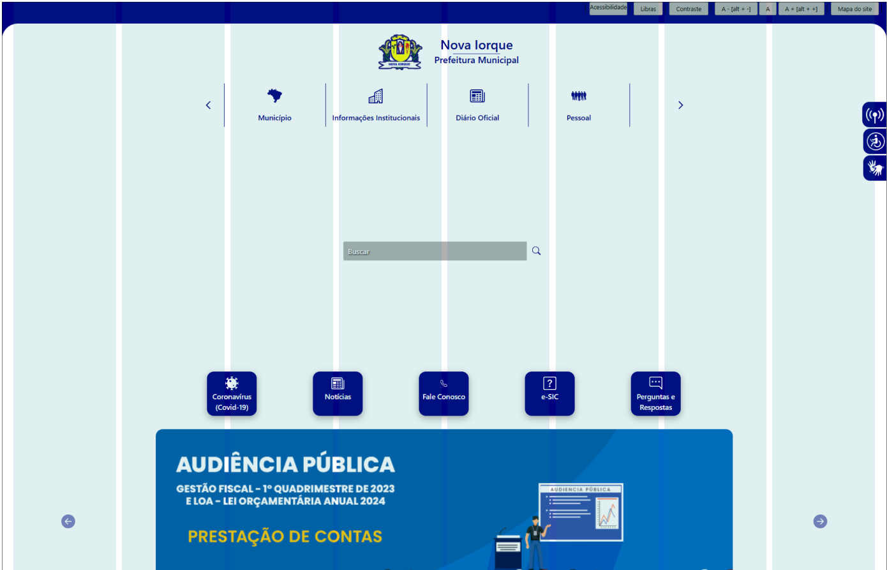
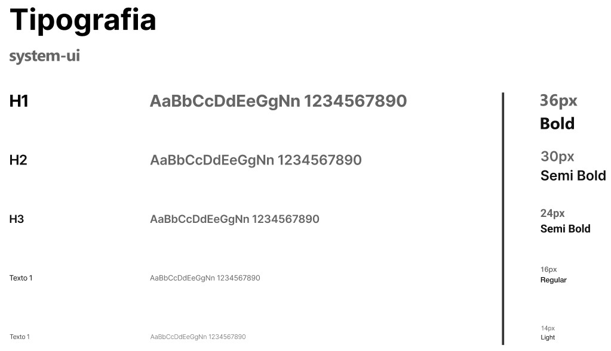
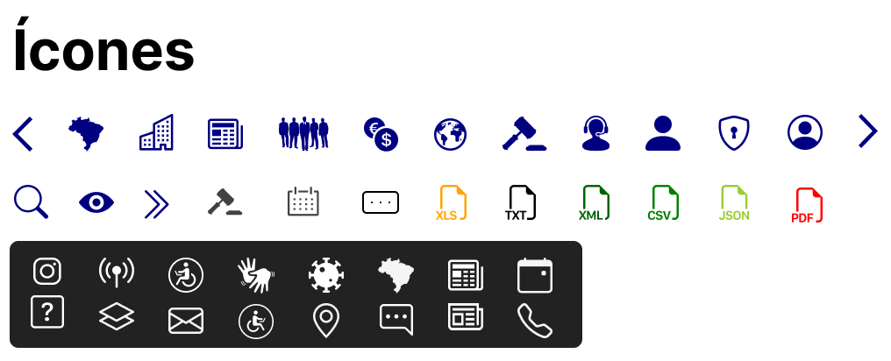
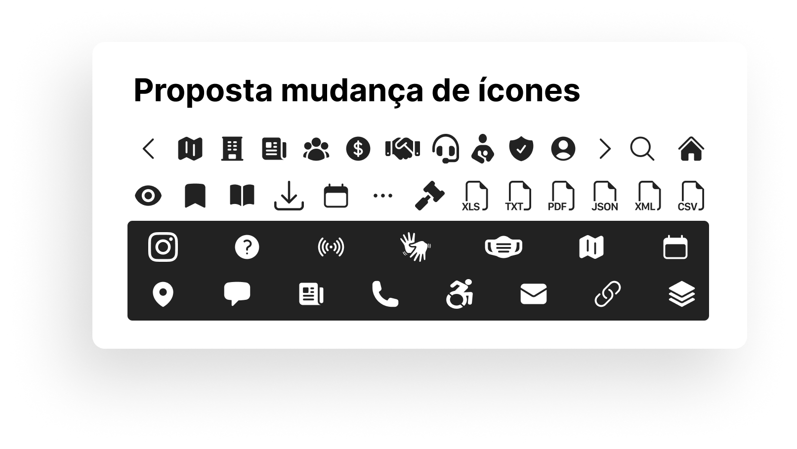
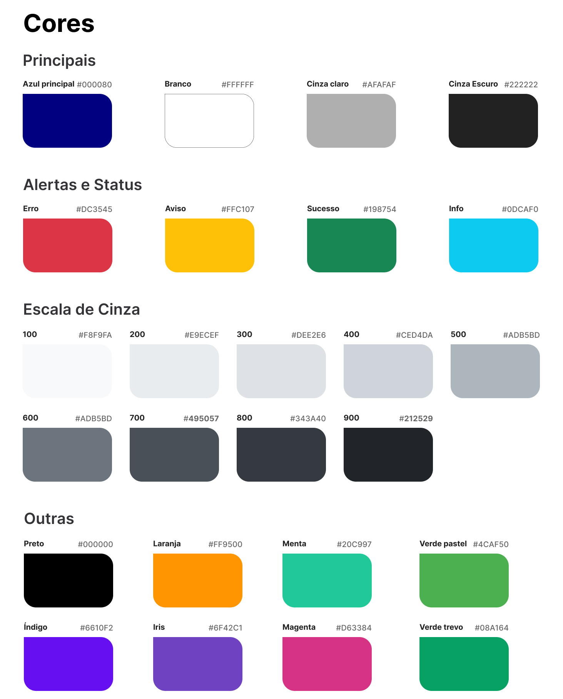
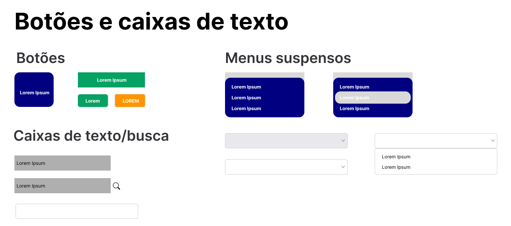
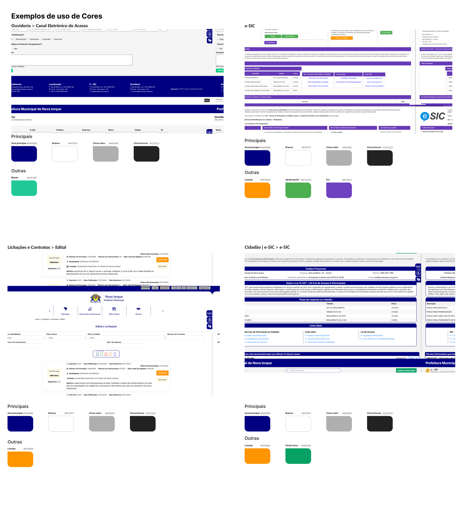

# Guia de Estilo

## Introdução

### Objetivo do guia de estilo

O Guia de Estilo tem como objetivo assegurar a consistência, a qualidade e a usabilidade no design. Ele serve como um documento centralizado, reunindo as principais decisões de design, diretrizes e recomendações que orientam a criação e o desenvolvimento da interface. Este guia proporciona uma base para todos os membros da equipe de design e desenvolvimento, garantindo que as decisões tomadas sejam implementadas de forma coerente e eficaz ao longo do ciclo de vida do projeto.

### Organização e conteúdo do guia de estilo

O guia está estruturado para ser uma ferramenta prática e acessível, a qual pode ser consultada a qualquer momento durante o desenvolvimento e também para futuras atualizações ou melhorias no sistema. Seu conteúdo inclui diretrizes sobre layout, tipografia, cores, símbolos, interação, vocabulário e muito mais, fornecendo os fundamentos necessários para criar uma experiência de usuário intuitiva, eficiente e agradável.

### Público-alvo do guia de estilos

O público-alvo deste guia inclui os membros da equipe de design, desenvolvedores, gerentes de projeto e qualquer outro profissional envolvido no processo de criação e manutenção do site. Ao seguir as recomendações deste guia, o time de desenvolvimento estará apto a entregar um produto consistente, que atenda às necessidades dos usuários e que seja fácil de manter e expandir.

### Como utilizar o guia

Este guia deve ser consultado continuamente durante o desenvolvimento do site e utilizado como referência nas fases de design, implementação e manutenção. As diretrizes e recomendações podem ser aplicadas de maneira flexível, ajustando-se conforme as necessidades específicas do projeto, mas sempre mantendo a coerência com os princípios estabelecidos.

### Manutenção do guia

A manutenção do guia de estilo deve ser uma prática contínua. O documento precisa ser atualizado sempre que novas diretrizes ou alterações no design forem feitas, garantindo que todos os membros da equipe tenham acesso à versão mais atualizada. Isso assegura que futuras melhorias ou ajustes no site sigam as mesmas diretrizes, mantendo a consistência e qualidade ao longo do tempo.

## Resultados de Análise

A análise do site da Prefeitura Municipal de Nova Iorque revelou aspectos importantes sobre o ambiente de uso e os [perfis de seus usuários](../analise-de-requisitos/perfilDeUsuario.md). Embora o site seja acessível a partir de diferentes dispositivos, como celulares e tablets, esta análise focou na interação por computadores, considerando que muitos usuários realizam tarefas mais detalhadas e formais, como consultas a informações públicas, pagamento de impostos e agendamento de serviços, nesse tipo de dispositivo.

O público é composto por cidadãos em geral, movimentos sociais, profissionais de setores públicos e privados, além de pessoas com necessidades especiais. A diversidade desse público exige uma interface que combine clareza na navegação com simplicidade no design, garantindo que as diferentes necessidades sejam atendidas de maneira eficaz.

Os acessos ao site ocorrem, predominantemente, em ambientes domiciliares ou profissionais, onde a confiabilidade e a funcionalidade são essenciais para a realização de tarefas específicas. Apesar de o site apresentar elementos que buscam facilitar a interação do usuário, a análise indicou que há oportunidades de melhoria, especialmente em aspectos de acessibilidade e usabilidade, com foco nos usuários que possuem pouca familiaridade tecnológica ou necessidades especiais.

## Elementos de Interface

### Disposição espacial e grid
<!-- Definir a estrutura de layout e a utilização de grids para garantir que o design seja organizado e responsivo. --> 

<b>Figura 1</b> - Grid e layout do site

Autor: [Rodrigo Wendrel](https://github.com/rodwendrel) | Fonte: Figma, 2024

**Configurações do Grid:** 

- 8 colunas 
- 24 px gutter (espaçamento entre colunas) 
- 40 px margins (margem extra) 

Se tratando de um portal .gov ele deve seguir diretivas e estilos de design definidos no Padrão Digital do Governo Disponível em: https://www.gov.br/ds/fundamentos-visuais/grid.

<!-- ### Janelas -->
<!-- Descrever o uso de janelas ou painéis, como elas devem ser estruturadas e quando devem ser usadas. --> 
 
### Tipografia

A tipografia utilizada no site da Prefeitura Municipal de Nova Iorque segue uma lógica de fallbacks, priorizando fontes nativas dos sistemas operacionais dos usuários. Isso assegura que o design mantenha a legibilidade e a consistência, independentemente do dispositivo utilizado.

**Fonte principal:** `system-ui`  
Representa a fonte padrão do sistema operacional do usuário, garantindo alta compatibilidade e desempenho. Quando não disponível, a fonte de fallback segue uma lista que cobre a maioria dos sistemas operacionais, garantindo a continuidade da experiência de leitura.

**Fontes de Fallback:** 
Caso a fonte principal não esteja disponível, o sistema recorrerá às fontes seguintes, que são amplamente suportadas em diferentes dispositivos: `-apple-system`, `Segoe UI`, `Roboto`, `Helvetica Neue`, `Arial` e `sans-serif`.

A seguir, apresentamos os estilos tipográficos utilizados no site, com exemplos de cada tipo de texto, incluindo seu tamanho e peso.

<b>Figura 2</b> - Estilos Tipográficos

    

Autor: [Weverton Rodrigues](https://github.com/vevetin) | Fonte: Figma, 2024

### Símbolos não tipográficos

Os símbolos não tipográficos, como ícones e gráficos, são essenciais para guiar os usuários, destacar informações e indicar ações no site. No entanto, a escolha atual dos ícones no site da Prefeitura de Nova Iorque apresenta limitações, prejudicando a clareza e a usabilidade.

A seguir, são apresentados os ícones atualmente utilizados no site:

<b>Figura 3</b> - Ícones Atuais do Site da Prefeitura de Nova Iorque

    

        
    

Autor: [Weverton Rodrigues](https://github.com/vevetin) | Fonte: Figma, 2024

Para melhorar a experiência do usuário, propomos a adoção de ícones revisados, baseados nos Princípios de Gestalt, conforme descrito por Simone Barbosa (2010)[1](guiaDeEstilo.md#referências-bibliográficas). Os ícones revisados seguem, principalmente, os princípios de simetria, similaridade e fecho, promovendo maior padronização e clareza.

<b>Figura 4</b> - Proposta de Ícones para o Site da Prefeitura de Nova Iorque

    

        
    

Autor: [Weverton Rodrigues](https://github.com/vevetin) | Fonte: Figma, 2024

A aplicação desses princípios garantirá uma interface mais intuitiva, consistente e alinhada às boas práticas de design visual.

### Cores

As cores utilizadas no design do site da Prefeitura Municipal de Nova Iorque foram escolhidas com base na harmonia e acessibilidade. A paleta de cores inclui tons principais, neutros e de status, visando garantir contraste e legibilidade em diversos dispositivos e contextos.

<b>Figura 5</b> - Cores Utilizadas no Design do Site

    

        
    

Autor: [Weverton Rodrigues](https://github.com/vevetin) | Fonte: Figma, 2024

## Elementos de Interação

<b>Figura 6</b> - Botões e Caixas de Texto Utilizadas no Design do Site

    

        
    

Autor:  [Rodrigo Wendrel](https://github.com/rodwendrel) | Fonte: Figma, 2024

<!-- ### Estilos de interação
<!-- Explicar os tipos de interação disponíveis no site (clique, toque, arrastar, etc.) e como eles devem ser implementados. -->

<!-- ### Seleção de um estilo -->
<!-- Determinar qual estilo de interação será adotado para ações como navegação, preenchimento de formulários, etc. -->

<!-- ### Aceleradores (teclas de atalho) -->
<!-- Se for pertinente, listar as teclas de atalho que podem ser usadas para otimizar a navegação no site. -->

<!-- ## Elementos de Ação -->

<!-- ### Preenchimento de campos -->
<!-- Instruções sobre como os campos de formulários devem ser estruturados e como o usuário deve interagir com eles. -->

<!-- ### Seleção -->
<!-- Definir as regras para selecionar opções, como menus suspensos ou caixas de seleção. -->

<!-- ### Ativação -->
<!-- Descrever como os botões de ação devem ser utilizados para ativar funções, como envio de formulários ou navegação entre páginas. -->

## Exemplo de uso de Cores

<b>Figura 7</b> - Uso de cores dentro do site

    

        
    

Autor:  [Rodrigo Wendrel](https://github.com/rodwendrel) | Fonte: Figma, 2024

### Terminologia 

A terminologia utilizada no site deve ser simples e direta, evitando jargões ou termos técnicos que possam dificultar a compreensão por parte dos usuários. É essencial manter uma nomenclatura consistente em todas as seções, botões e funcionalidades, assegurando uniformidade e facilitando a navegação. Sempre que necessário, recomenda-se incluir explicações adicionais, como descrições ou dicas, especialmente para termos ou funcionalidades mais complexas.

### Tipos de tela

Os tipos de tela devem ser organizados de forma lógica e funcional. A tela inicial, por exemplo, deve destacar atalhos para as funcionalidades mais relevantes, como serviços frequentemente utilizados ou notícias importantes. Já as telas secundárias devem seguir uma hierarquia visual clara, enfatizando as informações principais. Telas de erro precisam apresentar mensagens objetivas e fornecer orientações práticas para que o usuário saiba como proceder. Além disso, telas de confirmação devem validar as ações realizadas com mensagens claras, como “Agendamento concluído com sucesso”. Por fim, telas de suporte devem estar facilmente acessíveis e oferecer conteúdos úteis, como FAQs, contatos e links para soluções rápidas.

### Sequências de diálogos

As sequências de diálogos devem priorizar clareza e objetividade, garantindo que as interações sigam um fluxo lógico e intuitivo. Tarefas mais complexas, como preenchimento de formulários, devem ser divididas em etapas progressivas, acompanhadas por uma indicação do progresso. É importante fornecer feedback constante ao usuário, por meio de notificações visuais ou mensagens que confirmem as ações realizadas. Adicionalmente, mecanismos de prevenção de erros, como validação de campos e mensagens de alerta, devem ser implementados para evitar falhas durante a interação. Sempre que possível, deve-se permitir que o usuário revise as informações antes de confirmá-las, promovendo maior confiança no processo e reduzindo possíveis retrabalhos.

## Considerações Finais

O Guia de Estilo desenvolvido para o site da Prefeitura Municipal de Nova Iorque consolida as principais diretrizes e recomendações para a criação de uma interface coesa, acessível e funcional. A análise realizada ao longo deste documento destacou tanto os pontos fortes quanto as limitações da interface existente, fornecendo uma base para a proposição de melhorias que atendam às diversas necessidades dos usuários.

Embora o site já possua uma estrutura funcional, foram identificados aspectos a serem aprimorados, especialmente em relação à acessibilidade, usabilidade e clareza visual. A organização e apresentação dos conteúdos também foram revisadas para facilitar a navegação, promovendo uma experiência intuitiva e eficiente ao usuário.

O sucesso deste guia depende diretamente de sua adoção e manutenção contínua. Recomenda-se que ele seja tratado como um documento dinâmico, sendo atualizado sempre que novas práticas de design ou alterações na interface forem implementadas. A consistência na aplicação deste guia contribuirá não apenas para a melhoria contínua do site, mas também para o atendimento mais eficaz aos objetivos institucionais e às expectativas dos usuários.

Em suma, este documento oferece uma base sólida para orientar o design e o desenvolvimento do site, promovendo a criação de uma interface inclusiva, funcional e visualmente atrativa. Alinhado às melhores práticas de Interação Humano-Computador, este trabalho representa um passo importante na formação dos alunos, consolidando o aprendizado e as práticas desenvolvidas na disciplina de IHC.

## Bibliografia

> \- BARBOSA, Simone, et al. Interação Humano-Computador e Experiência do Usuário. Leanpub, 2022. Disponível em: https://leanpub.com/ihc-ux. Acesso em: 18 nov. 2024.

> \- BRASIL. Ministério da Gestão e da Inovação em Serviços Públicos. Padrões Web em Governo Eletrônico. [S.l]: MGI, [2024?]. Disponível em: https://www.gov.br/governodigital/pt-br/acessibilidade-e-usuario/acessibilidade-digital/padroes-web-em-governo-eletronico. Acesso em: 28 nov. 2024.

> \- BRASIL. Prefeitura Municipal de Nova Iorque. Prefeitura Municipal de Nova Iorque. Disponível em: https://www.novaiorque.ma.gov.br/. Acesso em: 28 nov. 2024.   

> \- BRASIL. Padrão Digital do Governo. Fundamentos visuais. Disponível em: https://www.gov.br/ds/fundamentos-visuais/grid. Acesso em: 02 dez. 2024.   

## Referências Bibliográficas

> \- BARBOSA, Simone, et al. Interação Humano-Computador. 1. ed. Rio de Janeiro: Elsevier, p.50-51, 2010.

## Histórico de Versão
---
| Versão | Data | Autor(es) | Descrição | Data de Revisão | Revisor(es) |
|:---:|:---:|---|---|:---:|---|
| 1.0 | 28/11/2024 | [Weverton Rodrigues](https://github.com/vevetin) | criação do documento | 02/12/2024 | [Paulo Henrique](https://github.com/paulomh), [Pedro Luiz](https://github.com/pedroluizfo) |
| 1.1 | 30/11/2024 | [Weverton Rodrigues](https://github.com/vevetin) | adição dos subtópicos tipografia, símbolos não tipográficos e cores | 02/12/2024 | [Paulo Henrique](https://github.com/paulomh), [Pedro Luiz](https://github.com/pedroluizfo) | 
| 1.1 | 30/11/2024 | [Rodrigo Wendrel](https://github.com/rodwendrel) | Numeração das figuras, grid e layout, exemplo de uso de cores, atualização das bibliografia | | | 
