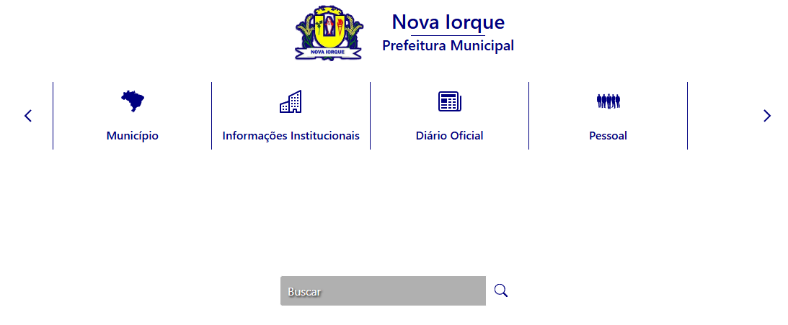
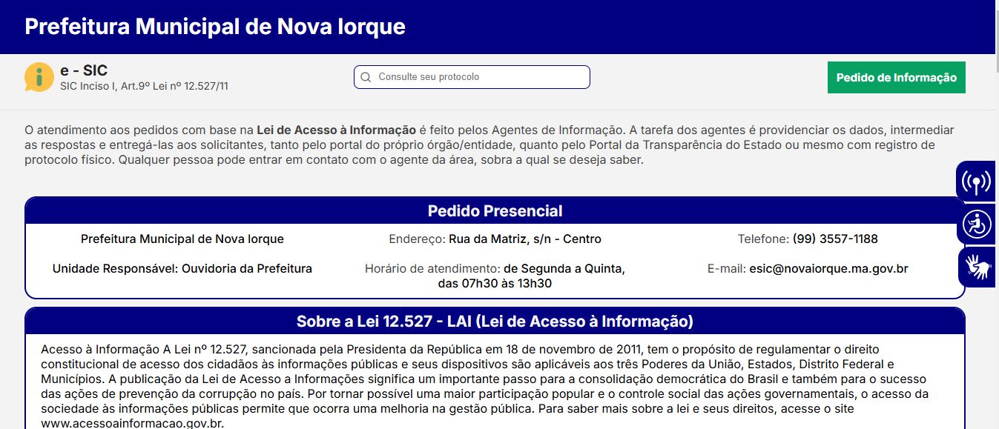
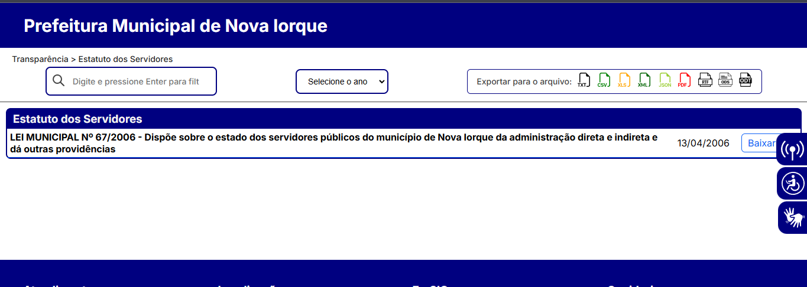
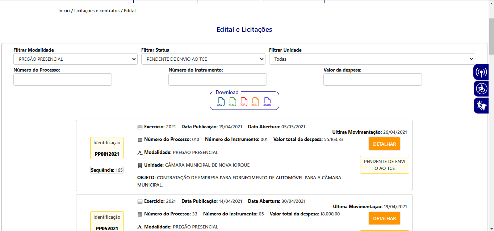

# Princípios Gerais

## Introdução

Para que um modelo conceitual seja eficaz no atendimento às demandas específicas de seus usuários e promova uma navegação intuitiva, é indispensável que sua concepção seja fundamentada em princípios e diretrizes claros. Esses fundamentos são essenciais para garantir uma interação eficiente e satisfatória entre os usuários e o sistema. No caso deste projeto, esses conceitos serão aplicados na criação de artefatos relacionados ao site da Prefeitura de Nova Iorque com foco na disciplina de Interação Humano-Computador.

## Metodologia

A análise dos princípios de design utilizados no site da Prefeitura de Nova Iorque foi baseada nos conceitos apresentados no livro Interação Humano-Computador, de Barbosa [1]. Este trabalho visa identificar potenciais inconsistências ou desvios das boas práticas, além de sugerir ajustes que otimizem a experiência do usuário. As propostas de melhoria serão implementadas nos artefatos do projeto, garantindo que o sistema atenda aos princípios de usabilidade, acessibilidade e design centrado no usuário.

## Correspondência com as Expectativas dos Usuários

Um princípio essencial em Interação Humano-Computador é alinhar o design da interface com as expectativas dos usuários. Isso significa criar elementos e ações que sejam intuitivos e de fácil entendimento, permitindo que os usuários naveguem de maneira fluida e sem surpresas. No contexto do site da Prefeitura de Nova Iorque, isso se traduz em tornar o acesso a serviços como consulta de tributos, licitações, e informações sobre as leis municipais simples e direto, garantindo uma experiência eficiente e sem obstáculos inesperados.

#### Análise

O site da Prefeitura de Nova Iorque utiliza um carrossel para destacar diversas funcionalidades e informações. No entanto, o design e a interação com esse carrossel podem ser considerados contraintuitivos, prejudicando a navegação do usuário. Para navegar entre os itens, o usuário precisa clicar nas pequenas setas ou aguardar a rotação automática, o que nem sempre é claro ou imediato. O tamanho reduzido das setas e a falta de feedback visual adequado dificultam a navegação eficiente, fazendo com que o usuário precise de mais esforço para acessar as informações desejadas.

Além disso, a barra de busca, que teoricamente deveria ser uma solução para encontrar rapidamente informações ou serviços no site, não funciona corretamente. Quando o usuário tenta realizar uma pesquisa, ele não consegue obter os resultados esperados, o que torna a busca por serviços e documentos ainda mais frustrante. Isso reduz ainda mais a eficiência do site, uma vez que, sem uma ferramenta de busca funcional, o usuário é forçado a navegar manualmente por várias páginas ou se depender de métodos menos diretos, como o carrossel, que já é problemático.

Figura 1: Funcionalidades escondidas em carrossel e botão de busca não funcional

### Simplicidade nas Estruturas das Tarefas

A simplicidade na estruturação das tarefas é crucial para minimizar o esforço mental e reduzir os erros durante a interação com o sistema. Isso significa tornar as atividades mais diretas e fáceis de realizar, evitando sobrecarregar o usuário com complexidade desnecessária. Norman (1988) aponta quatro estratégias para atingir esse objetivo:

1. Oferecer Suporte Variado: Fornecer múltiplas formas de suporte para ajudar os usuários a aprender e executar suas tarefas de maneira mais eficiente. Isso pode incluir tutoriais, dicas contextuais ou feedback visual, que facilitam o entendimento do processo.

2. Aumentar a Visibilidade dos Elementos: Utilizar a tecnologia para revelar aspectos do sistema que, de outra forma, seriam invisíveis, melhorando o feedback recebido pelo usuário. Isso permite que o usuário perceba facilmente o status da tarefa e mantenha o controle sobre o que está fazendo.

3. Automatizar Tarefas: Automatizar total ou parcialmente as tarefas pode reduzir a carga cognitiva e simplificar o processo. A automação deve manter o fluxo natural do processo, sem complicar a interação.

4. lterar a Natureza da Tarefa: Quando possível, a tarefa pode ser reconfigurada ou simplificada para torná-la mais direta, reduzindo os passos necessários ou mudando a forma de interação, para que seja mais intuitiva.

Essas abordagens visam garantir que as tarefas no sistema sejam o mais simples possível, permitindo que os usuários se concentrem no que realmente importa, sem precisar gastar energia excessiva na execução de tarefas complexas ou desnecessárias.

#### Análise 

A análise da funcionalidade de pesquisa do e-SIC no site da Prefeitura de Nova Iorque revela um problema significativo: a ausência de um botão de confirmação para a busca. Isso torna o processo de pesquisa pouco intuitivo, já que os usuários não sabem como confirmar a pesquisa ou se ela foi iniciada corretamente. Embora pressionar "Enter" possa funcionar, essa ação não é evidente para todos, especialmente para usuários menos experientes. A falta de feedback visual também contribui para a confusão. Uma solução simples, como adicionar um botão visível ou fornecer feedback claro, poderia melhorar a experiência do usuário e tornar a navegação mais fluida.

Figura 2: caixa de busca sem confirmação visua

### Equilíbrio entre controle e liberdade do usuário.

Garantir um equilíbrio entre o controle e a liberdade do usuário envolve proporcionar a sensação de autonomia durante a interação com o sistema, sem sobrecarregar o usuário com opções desnecessárias. Como o dispositivo é de uso pessoal, é fundamental que o usuário se sinta no comando, sem se perder no processo. Isso inclui permitir a exploração do sistema de forma intuitiva, possibilitar o cancelamento de ações e oferecer configurações que atendam às necessidades do usuário, enquanto mantém valores padrão adequados para facilitar o uso.

#### Análise 
O site da Prefeitura de Nova Iorque apresenta um problema na seção do Estatuto dos Servidores, onde a falta de um botão de retorno impede o usuário de navegar facilmente para outras páginas. Isso limita o controle do usuário, que não consegue voltar rapidamente à página anterior ou acessar outras seções do site sem perder o fluxo da navegação. A adição de um botão de retorno ou uma barra de navegação persistente seria uma solução simples e eficaz para melhorar a experiência e a autonomia do usuário.

Figura 3: funcionalidade de verificação de estatuto dos servidores sem possibilidade de cancelamento ou retorno

### Consistência e padronização.

A consistência e padronização são fundamentais para garantir uma boa experiência de uso, pois elas facilitam o aprendizado e a interação com a interface. Isso envolve seguir padrões de design e evitar confusão com a terminologia, além de manter a uniformidade nos elementos, ações e resultados apresentados. Os componentes automáticos não devem apresentar variações inesperadas, mas, se houver necessidade de comportamentos diferentes, a distinção visual entre eles deve ser clara. Em alguns casos, a inconsistência pode ser intencional, como em diálogos de confirmação, onde rótulos representativos dos efeitos desejados exigem uma pausa para reflexão por parte do usuário, assegurando que ele compreenda as consequências de sua escolha.

#### Análise  

Ao acessar o site da Prefeitura de Nova Iorque, é possível observar que alguns elementos da interface não seguem uma padronização visual, o que pode impactar a experiência do usuário. Como exemplo, a caixa de pesquisa ocupa grande parte da tela, o que cria uma discrepância em relação ao design de outros elementos na página, como os ícones de navegação. Essa falta de uniformidade visual entre os componentes do site pode prejudicar a clareza e a fluidez na navegação, tornando o ambiente mais confuso para o usuário.

Além disso, a falta de um botão de confirmação visível na caixa de pesquisa compromete a interação do usuário, pois, sem o suporte adequado, ele pode não entender completamente como acionar a funcionalidade de busca. Este problema, combinado com a despadronização do design da interface, pode gerar frustração e uma experiência de navegação menos eficiente.

Figura 4: discrepâncias na padronização do site

### Promoção da Eficiência do Usuário

A promoção da eficiência do usuário envolve o desenvolvimento de designs que busquem melhorar o desempenho do usuário ao realizar tarefas e interagir com o sistema. Isso significa criar interfaces que permitam aos usuários atingirem seus objetivos de maneira rápida e sem esforço excessivo, garantindo que as ações necessárias sejam intuitivas e diretas. O objetivo é fornecer uma experiência mais fluida e produtiva, onde os usuários possam realizar suas atividades de forma eficiente, sem se perder em processos complicados ou desnecessários. Isso resulta em uma navegação mais eficaz e uma interação que favorece a satisfação do usuário.

#### Análise 

Ao analisar o site da Prefeitura de Nova Iorque, percebe-se que ele compromete a eficiência do usuário devido à falta de um botão de confirmação claro na barra de busca, o que pode gerar incerteza na execução das ações. Além disso, a navegação não é otimizada para uma experiência fluida, dificultando a realização de tarefas de maneira rápida. A ausência de feedback visual e uma interface confusa fazem com que o usuário precise repetir ações, prejudicando a eficiência e a produtividade do site. Melhorias na clareza e no design seriam necessárias para otimizar a experiência do usuário.

### Antecipação das necessidades do usuário.

Prever as necessidades do usuário envolve projetar sistemas que identifiquem e atendam automaticamente às demandas do usuário, muitas vezes com base no contexto em que ele se encontra. Isso pode ser feito ao fornecer sugestões ou automatizar certas ações, o que melhora a experiência e facilita a interação. Ao adotar essa abordagem proativa, o sistema se torna mais intuitivo, tornando a navegação mais eficiente e a experiência do usuário mais fluida. Esse tipo de design não só simplifica o processo, mas também torna o uso do sistema mais agradável e eficaz.

#### Análise 

No site da Prefeitura de Nova Iorque, a antecipação das necessidades dos usuários não é totalmente evidente. Embora a página principal ofereça alguns links diretos como "Fale Conosco" e "e-SIC", que facilitam a navegação para demandas específicas, o site poderia se beneficiar de sugestões ou ações automatizadas que acompanham o comportamento do usuário, otimizando a navegação. Por exemplo, ao acessar a caixa de busca, o site não oferece sugestões de busca ou pré-preenche campos com informações relevantes baseadas em dados do usuário ou localização, o que tornaria a interação mais eficiente. 

### Visibilidade e reconhecimento.

Visibilidade e reconhecimento garantem que o sistema mostre claramente o que pode ser feito e como o usuário deve interagir com ele. Antes de executar uma ação, as opções precisam ser visíveis e compreensíveis. Após a ação, o feedback deve ser imediato, permitindo que o usuário entenda o resultado e o progresso. Isso inclui fornecer informações sobre o estado do sistema, como o andamento de um processo, ajudando a evitar que o usuário se sinta perdido e promovendo uma experiência mais fluída e eficiente.

#### Análise  
A análise de Visibilidade e Reconhecimento no site da Prefeitura de Nova Iorque revela que a falta de feedback visual imediato e de indicações claras das opções disponíveis prejudica a experiência do usuário. Quando a barra de pesquisa não oferece respostas visíveis ou sinais claros de progresso, os usuários ficam inseguros sobre o sucesso de suas ações. Isso dificulta a navegação e pode causar confusão. Além disso, a organização do conteúdo precisa ser mais destacada, facilitando a localização das informações importantes e melhorando a interação geral com o site.

### Relevância do conteúdo e comunicação clara.

A relevância do conteúdo é fundamental para garantir que as informações fornecidas atendam diretamente às necessidades do usuário, sendo apresentadas de forma clara e compreensível. Isso assegura que os usuários consigam acessar facilmente o que realmente precisam, sem se deparar com distrações ou informações irrelevantes. A maneira como o conteúdo é exposto no sistema também é crucial para otimizar a experiência, garantindo que a comunicação seja eficiente, intuitiva e focada no que é importante para o usuário. Isso melhora a usabilidade e torna a interação mais produtiva.

#### Análise
A página de "Licitações e Contratos" do site da Prefeitura de Nova Iorque apresenta um conteúdo relevante e organizado de forma que facilita a busca e filtragem das informações pelos usuários. Os filtros de pesquisa, como "Modalidade", "Status" e "Unidade", são claros e permitem uma navegação eficiente, alinhada com as expectativas dos usuários que buscam processos licitatórios específicos. A disposição das informações, como número do processo, status e valores das despesas, é objetiva e diretamente relacionada às necessidades dos cidadãos.

Entretanto, o design da página, embora funcional, poderia ser mais agradável visualmente, já que as opções de filtro e as tabelas apresentam uma estrutura simples. Apesar disso, o site cumpre sua função de fornecer informações relevantes de maneira acessível e prática, o que é essencial para a transparência e a usabilidade do portal.

Figura 5: Apresentação dos editais de licitação e contrato 

### Projeto para prevenção de erros.

O sistema deve ser projetado para identificar e antecipar possíveis erros dos usuários, oferecendo maneiras de recuperá-los facilmente e minimizando as consequências de ações incorretas. Além disso, é importante evitar que ações críticas ou irreversíveis sejam realizadas sem a devida confirmação, mantendo esses controles distantes das funções mais comuns. Mensagens de erro devem ser claras, informativas e construtivas, ajudando o usuário a entender o problema e como corrigi-lo. Também é fundamental disponibilizar ajuda contextual e focada nas tarefas, garantindo que o usuário tenha suporte quando necessário, facilitando uma experiência mais fluida e sem frustrações.

#### Análise

No caso da página 'Fale Conosco' do site da Prefeitura, ao se deparar com um erro 404, o usuário é impedido de utilizar uma funcionalidade importante de comunicação. Isso indica uma falha no design do site, já que não há uma validação ou previsão de que a página poderia não estar acessível, causando frustração e perda de confiança no sistema. Para seguir o princípio de prevenção de erros, seria necessário implementar uma verificação de disponibilidade das páginas e fornecer feedback claro e proativo ao usuário, como mensagens que informem sobre a indisponibilidade da página e alternativas de contato.

Figura 6: Erro 404 na pagina fale conosco  

## Referências

> <a id="REF1" href="#anchor_1">1.</a> BARBOSA, S. D. J.; SILVA, B. S. Interação Humano-Computador. Rio de Janeiro: Elsevier, 2011.
>
> <a id="REF2" href="#anchor_2">2.</a> Norman, D.A. & Draper, S.W. User Centered System Design. Hillsdale, NJ: Lawrence Erlbaum, 1986.

## Bibliografia

> > \-  Universidade de Brasília (UnB), Campus UnB Gama: Faculdade de Ciências e Tecnologias em Engenharia. Documentação do projeto de Interação Humano-Computador: Dominio Publico. Semestre 2023.2, Universidade de Brasília, Gama, 2023. Disponível em: https://interacao-humano-computador.github.io/2023.2-Dominio-Publico/analise_de_requisitos/principios_gerais/ Acesso em: 02 dez. 2024.  

---
| Versão | Data | Autor(es) | Descrição | Data de Revisão | Revisor(es) |
|:---:|:---:|---|---|:---:|---|
| 1.0 | 02/12/2024 | [Necivaldo Amaral](https://github.com/junioramaral22) | criação do documento e artefatos| 02/12/2024 | [Weverton Rodrigues](https://github.com/vevetin) |