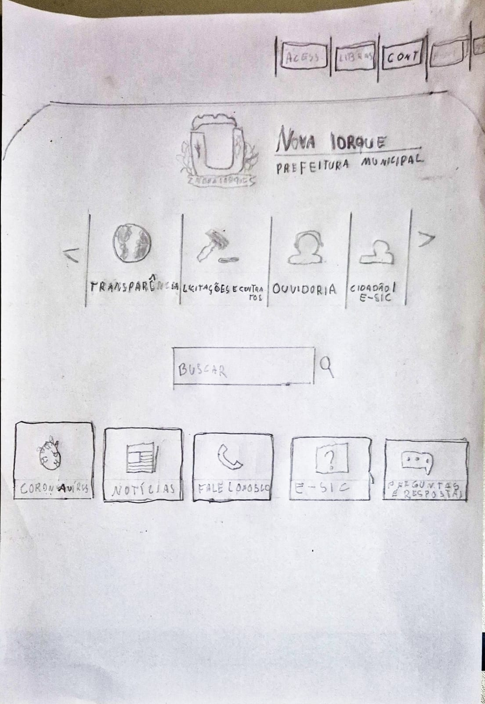
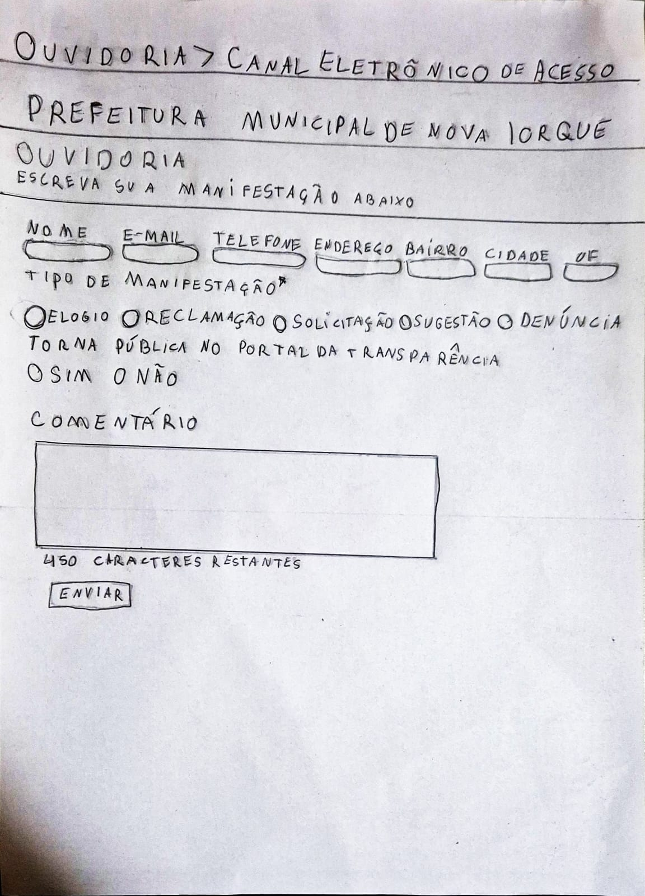

# Protótipo de Papel

## Introdução

Protótipo é uma representação limitada de um design que permite aos usuários interagir com ele e explorar a sua conveniência[1](./prototipoDePapel.md#referências-bibliográficas). Protótipos respondem a questões e fornecem suporte aos designers para a escolha de uma dentre as várias opções. Portanto, servem para vários fins: por exemplo, testar a viabilidade técnica de uma ideia, esclarecer requisitos vagos, realizar testes com usuários e avaliações, ou verificar se um design é compatível com o resto do desenvolvimento do sistema[2](./prototipoDePapel.md#referências-bibliográficas).

Um protótipo de baixa-fidelidade é aquele que não se assemelha muito ao produto final, utilizando materiais muito diferentes da versão final pretendida, como papel e cartolina, ao invés de telas eletrônicas, por exemplo. Eles são úteis devido a sua simplicidade, baixo custo e velocidade na produção. Isso significa que protótipos de baixa-fidelidade podem ser rapidamente modificados, possibilitando a exploração de ideias alternativas e novos tipos de design[3](./prototipoDePapel.md#referências-bibliográficas). 

O protótipo de papel é uma técnica de prototipação de baixa-fidelidade que consiste em desenhar a interface de um sistema em folhas de papel, simulando a interação do usuário com o sistema. O protótipo de papel é uma técnica de baixo custo e de fácil aplicação, que permite testar a usabilidade de um sistema de forma rápida e eficiente.

## Objetivo

Com base no nível 02 de design, avaliação e desenvolvimento do processo de design da [Engenharia de Usabilidade de Mayhew](../../planejamento/processosDeDesign.md#engenharia-de-usabilidade-de-mayhew), o objetivo deste documento é apresentar os protótipos de baixa-fidelidade desenvolvidos utilizando a técnica de protótipo de papel das tarefas selecionadas, por cada membro, do site da Prefeitura Municipal de Nova Iorque.

## Metodologia

Utilizando os [storyboards](../nivel01/Storyboard/storyboards.md) e [diagramas das análises de tarefas](../../analise-de-requisitos/analiseTarefas.md) como base, seguindo a técnica de prototipação em papel, cada membro se responsabilizou em desenvolver seu respectivo protótipo seguindo a tarefa específica selecionada do site.

## Protótipos

### Protótipo de Papel 1 - Fazer um pedido no e-SIC

Baseado no [diagrama HTA - Realizar Pedido no e-SIC](../../analise-de-requisitos/analiseTarefas.md#tarefa-01---realizar-pedido-no-e-sic) e tendo como base o objetivo do [storyboard - Fazer um pedido no e-SIC](../nivel01/Storyboard/storyboards.md#storyboard-1---fazer-um-pedido-no-e-sic), foi desenvolvido o protótipo de papel para a tarefa de fazer um pedido no e-SIC.

(Imagem inicial do protótipo)

Na tela inicial, há duas formas de se acessar o e-SIC: por meio do "Mapa do Site" no canto superior direito ou pelo carrosel no qual se localiza a opção "Cidadão / e-SIC". Ao clicar na opção "Mapa do Site", uma pequena janela se abre com as opções de acesso ao e-SIC. 

(Imagem do protótipo após clicar em "Mapa do Site")

Ao passar o mouse sobre a opção "Cidadão / e-SIC" no carrosel, surgirá uma extensão com as opções de acesso ao e-SIC.

(Imagem do protótipo após passar o mouse sobre "Cidadão / e-SIC")

Ambas opções levam para a página do e-SIC. Nesta página, há a possibilidade de fazer um pedido ou consultar um pedido já realizado através de um protocolo. Além disso, há também informações úteis sobre onde fazer um pedido presencialmente, explicação da lei de acesso à informação, prazo de resposta por parte da prefeitura e uma tabela mostrando o os pedidos e eventuais respostas.

(Imagem do protótipo da página do e-SIC)

Ao passar o mouse sobre a opção "Pedido de Informação", surgirá uma extensão com três opções: "Entrar", "Cadastrar" e "Pedido Anônimo". Ao clicar em "Cadastrar", o usuário será redirecionado para a página de cadastro. Ao clicar em "Pedido Anônimo", o usuário será redirecionado para o formulário de pedido de forma anônima.

(Imagem do protótipo após clicar em "Pedido de Informação")

#### Fluxo Alternativo - "Entrar"

Ao clicar em "Entrar", o usuário será redirecionado para a página de login. Nela o usuárrio inserirá seu email e senha e clicará em "Login". Caso o usuário não tenha cadastro, ele poderá clicar em "Cadastrar" para ser redirecionado para a página de cadastro.

(Imagem do protótipo após clicar em "Entrar")

Feito o login, o usuário será redirecionado para a página com o formulário de pedido. Na página do formulário de pedido, o usuário preencherá os campos de "Resumo" e "Detalhamento da Solicitação", obrigatórios, e selecionar a "Unidade Desejada" que é opcional.

(Imagem do protótipo da página do formulário de pedido)

#### Fluxo Alternativo - "Cadastrar"

Caso o usuário clique em "Cadastrar", ele será redirecionado para a página de cadastro. Nela, o usuário preencherá os campos de "CPF ou CNPJ", "Nome Completo", "Data de Nascimento", "Sexo", "Escolaridade", "Telefone", "Email" e "Senha" e clicará em "Cadastrar". Caso o usuário já tenha cadastro, ele poderá clicar em "Entrar" para ser redirecionado para a página de login.

(Imagem do protótipo da página de cadastro)

Após clicar em "Cadastrar", o usuário receberá uma confirmação de cadastro e logo em seguida será redirecionado para a página do e-SIC. Após o cadastro, o [fluxo alternativo - "Entrar"](#fluxo-alternativo---entrar) será seguido.

#### Fluxo Alternativo - "Pedido Anônimo"

Ao clicar em "Pedido Anônimo", o usuário será redirecionado para o formulário de pedido de forma anônima. Neste formulário, o usuário preencherá os campos de "Reside no Muncípio", "Sexo", "Escolaridade", "Faixa Etária", opcionais, "Resumo", "Detalhamento da Solicitação", obrigatórios e a "Unidade Desejada" que é opcional. Após preencher os campos, o usuário clicará em "Enviar".

(Imagem do protótipo da página do formulário de pedido de forma anônima)

Após clicar em "Enviar", o pedido será registrado e aparecerá uma janela de confirmação da realização do pedido na qual redirecionará o usuário para a página do e-SIC com o pedido registrado.

(Imagem do protótipo da janela de confirmação)

(Imagem do protótipo da página do e-SIC com o pedido registrado)

### Protótipo de Papel 2 - Agendamento de Consulta Médica para Dona Lúcia

### Protótipo de Papel 3 - Envio de Nota Fiscal de Serviço

### Protótipo de Papel 4 - Registro de reclamação na ouvidoria

Baseado na análise de tarefas GOMS para "Abrir uma nova solicitação no canal de ouvidoria virtual", foi desenvolvido o protótipo de papel que representa as etapas do processo.

#### Tela Inicial
Na tela inicial, o usuário tem três métodos principais para acessar o canal de ouvidoria:

Navegando pelo carrossel de ícones:
O usuário identifica o carrossel na página principal e localiza o ícone da ouvidoria visualmente.

<b>Figura 01</b> - Página principal 

    

        
    

Autor: [Pedro Luiz](https://github.com/pedroluizfo)

Posicionando o mouse diretamente sobre o ícone da ouvidoria:
Quando o usuário encontra o ícone da ouvidoria diretamente, uma descrição é exibida ao passar o mouse, indicando a funcionalidade antes de clicar.

Selecionando o link direto para o canal eletrônico de acesso:
O usuário, já familiarizado com o site, localiza rapidamente o link "Canal Eletrônico de Acesso" na página inicial e clica para acessar a ouvidoria.

#### Página da Ouvidoria Virtual
Ao acessar a seção da ouvidoria virtual, o usuário tem a opção de preencher uma nova solicitação ou acompanhar uma solicitação existente.

<b>Figura 02</b> - Página da ouvidoria 

    

        
    

Autor: [Pedro Luiz](https://github.com/pedroluizfo) 

Nova solicitação:
O usuário clica em "Nova Solicitação" e é redirecionado para o formulário de manifestação.

Acompanhamento de solicitação existente:
O usuário pode inserir o código de acompanhamento na seção dedicada e visualizar o status de sua solicitação.
(Imagem: Página da ouvidoria com o campo de acompanhamento destacado)

Formulário de Manifestação
Ao acessar o formulário, o usuário segue as etapas abaixo:

Preenchimento de informações pessoais:
O formulário exibe os campos obrigatórios: Nome, E-mail, Telefone, Endereço, Bairro, Cidade e UF. O usuário insere as informações manualmente.
(Imagem: Formulário com campos pessoais destacados e preenchidos)

Seleção do tipo de manifestação:
O usuário seleciona a natureza da manifestação (Elogio, Reclamação, Solicitação, Sugestão ou Denúncia) em um menu suspenso.
(Imagem: Menu suspenso de tipo de manifestação com uma opção selecionada)

Descrição da manifestação:
O usuário localiza o campo de texto, insere os detalhes da solicitação e escolhe se deseja que a manifestação seja pública ou anônima.
(Imagem: Campo de texto preenchido com a opção de privacidade selecionada)

Confirmação e Código de Acompanhamento
Após revisar todos os dados preenchidos:

O usuário clica no botão "Enviar".
Uma mensagem de confirmação é exibida com o código de acompanhamento gerado automaticamente.
O código pode ser anotado para acompanhamento futuro.
(Imagem: Tela de confirmação com o código gerado destacado)
#### Fluxo Alternativo - Acompanhamento de Solicitações
Caso o usuário já tenha um código de acompanhamento, ele pode seguir o fluxo abaixo:

Acessa a página de "Acompanhamento de Solicitações".
Insere o código no campo apropriado e clica em "Buscar".
Visualiza o status da solicitação.
(Imagem: Página de acompanhamento com campo preenchido e status exibido)
Esse protótipo em papel visa facilitar a validação do design e a experiência do usuário em cada etapa do processo.

### Protótipo de Papel 5 - Busca por licitação fracassada

## Bibliografia

> \- BRASIL. Prefeitura Municipal de Nova Iorque. Prefeitura Municipal de Nova Iorque. Disponível em: https://www.novaiorque.ma.gov.br/. Acesso em: 02 jan. 2025.   

## Referências Bibliográficas

> 1. PREECE, Jenny; ROGERS, Yvonne; SHARP, Helen. Interaction design: beyond human-computer interaction. 1. ed. New York: J. Wiley & Sons, 2002. Capítulo 08: Design, Prototipação e Construção. Página 261. Disponível em: [libgen.li/file.php?md5=02236874c9b62b7d9aed9ec21639968a](https://libgen.li/file.php?md5=02236874c9b62b7d9aed9ec21639968a). Acesso em: 02 jan. 2025.

> 2. PREECE, Jenny; ROGERS, Yvonne; SHARP, Helen. Interaction design: beyond human-computer interaction. 1. ed. New York: J. Wiley & Sons, 2002. Capítulo 08: Design, Prototipação e Construção. Página 261. Disponível em: [libgen.li/file.php?md5=02236874c9b62b7d9aed9ec21639968a](https://libgen.li/file.php?md5=02236874c9b62b7d9aed9ec21639968a). Acesso em: 02 jan. 2025.

> 3. PREECE, Jenny; ROGERS, Yvonne; SHARP, Helen. Interaction design: beyond human-computer interaction. 1. ed. New York: J. Wiley & Sons, 2002. Capítulo 08: Design, Prototipação e Construção. Página 262-263. Disponível em: [libgen.li/file.php?md5=02236874c9b62b7d9aed9ec21639968a](https://libgen.li/file.php?md5=02236874c9b62b7d9aed9ec21639968a). Acesso em: 02 jan. 2025.

## Histórico de Versão

| Versão | Data | Autor(es) | Descrição | Data de Revisão | Revisor(es) |
|:---:|:---:|---|---|:---:|---|
| 1.0 | 02/01/2025 | [Paulo Henrique](https://github.com/paulomh) | Criação do documento | 02/01/2025 | [Weverton Rodrigues](https://github.com/vevetin)  |
| 1.1 | 05/01/2025 | [Paulo Henrique](https://github.com/paulomh) | Protótipo - Realizar pedido no e-SIC | 05/01/2025 | [Rodrigo Wendrel](https://github.com/junioramaral22)  |
| 1.2 | 05/01/2025 | [Pedro Luiz](https://github.com/pedroluizfo) | Protótipo - Registrar chamado na ouvidoria | 05/01/2025 | [Rodrigo Wendrel](https://github.com/junioramaral22)  |

