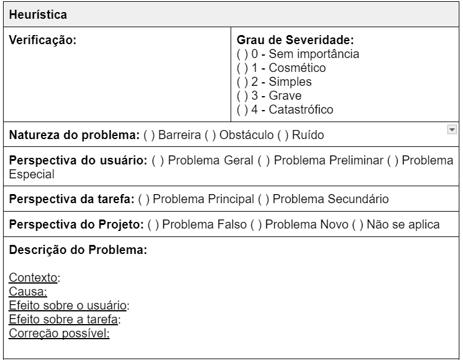

# Planejamento do Relatos dos Protótipos de Alta Fidelidade

## Introdução

O presente documento tem como base o [Planejamento da Avaliação do Protótipo de Alta Fidelidade](./planejamentoAvaliacaoPrototipoAltaFidelidade.md) e tem como propósito principal definir a organização e a apresentação dos dados obtidos durante a avaliação do protótipo de alta fidelidade. Os resultados desse planejamento serão apresentados em um relatório detalhado, no qual serão ressaltados pontos de melhoria no sistema, bem como propostas de redesign identificadas pelo grupo.

## Metodologia

A abordagem metodológica adotada neste projeto será a observação, na qual um usuário será convidado a realizar uma simulação utilizando o protótipo de alta fidelidade. Essa estratégia envolve a condução de simulações individuais, com o objetivo de coletar informações detalhadas sobre as percepções, experiências e desafios enfrentados pelo usuário ao realizar as tarefas propostas com o protótipo.

Para organizar e planejar as atividades, será empregado o framework DECIDE, conforme mencionado no [planejamento de avaliação](./planejamentoAvaliacaoPrototipoAltaFidelidade.md). Esse framework oferece uma estrutura eficaz para orientar o processo de tomada de decisão e a gestão das atividades. Ele auxilia na definição de critérios, na análise de alternativas, na identificação de riscos e na escolha da melhor estratégia para cada situação específica.

### Objetivos e escopo da avaliação

Nesta etapa, é essencial esclarecer o objetivo da avaliação e justificar sua realização. Isso inclui demonstrar a relevância do processo, estabelecer expectativas claras, definir metas concretas e oferecer uma visão abrangente sobre o contexto e o propósito da avaliação.

No caso em questão, os objetivos específicos incluem:

* Ideias e Alternativas de Design.
* Avaliar a conformidade do protótipo com um padrão previamente definido.
* Identificar problemas relacionados à interação e à interface do usuário.

Além disso, a análise da avaliação deve buscar responder às seguintes perguntas para verificar se os objetivos foram alcançados:

1. O protótipo de alta fidelidade possibilitou a exploração de conceitos de design?
2. Foram identificadas sugestões de melhoria para o protótipo apresentado?
3. Foi possível detectar problemas preliminares de usabilidade?
4. Ideias-chave de design puderam ser identificadas?

Com base nas respostas a essas questões, será possível validar a eficácia do protótipo e propor ajustes que aprimorem tanto a usabilidade quanto o alinhamento com os objetivos do projeto.

## Método da avaliação

O método escolhido para a avaliação será a observação. Durante o processo, os participantes serão convidados a executar tarefas específicas, enquanto avaliadores acompanham atentamente, registrando dados detalhados sobre as percepções, experiências e desafios enfrentados pelos usuários.

A metodologia utilizada para a coleta de dados será descrita de forma rigorosa no relatório final. Este documento destacará as bases teóricas que justificaram a escolha desse método, eventuais adaptações feitas em abordagens previamente estabelecidas e como a observação foi conduzida de acordo com o planejamento do projeto.

O relatório também incluirá as seguintes informações:

* Nome do protótipo de alta fidelidade avaliado.
* Perguntas utilizadas durante a avaliação.
* Local onde a avaliação foi realizada.
* Horário de início e término da atividade.
* Link para a gravação da entrevista (quando aplicável).
* Lista de participantes presentes na avaliação.
* Link para acessar o protótipo de alta fidelidade avaliado.

Para a avaliação heurística, os protótipos serão avaliados com base nos princípios heurísticos de Nielsen, explicitados por Barbosa e Silva[4](./planejamentoDoRelatoAvaliacaoProtipoAltaFidelidade.md#referências-bibliográficas), que incluem os seguintes critérios:

- Visibilidade do status do sistema
- Correspondência entre o sistema e o mundo real
- Controle do usuário e liberdade
- Consistência e padronização
- Rreconhecimento em vez de memorização
- Flexibilidade e eficiência de uso
- Design estético e minimalista
- Prevenção de erros
- Ajuda e documentação

Para eventuais violações, o avaliador especificará com uma imagem da parte do protótipo violado e explicará a vioalação por meio do formulário abaixo:

<b>Figura 1</b> - Formulário para avaliação heurística

Fonte: (MACIEL et al. 2003, pág. 12)[3](./planejamentoDoRelatoAvaliacaoProtipoAltaFidelidade.md#bibliografia)

Autor: [Paulo Henrique](https://github.com/paulomh)

## Seleção de participantes

Para garantir a eficácia da avaliação do protótipo de alta fidelidade, a escolha dos participantes será feita de maneira estratégica e criteriosa. Os indivíduos selecionados devem refletir o perfil do usuário final do produto, conforme descrito na documentação disponível em [Perfil de Usuário](../../analise-de-requisitos/perfilDeUsuario.md). Essa abordagem assegura que o feedback coletado seja relevante, representativo e alinhado ao público-alvo do protótipo.

## Custos
No relato, será detalhado que não houve custos associados à realização da avaliação do protótipo de alta fidelidade. Todas as atividades foram planejadas de maneira a utilizar recursos já disponíveis, garantindo a viabilidade do processo sem necessidade de investimentos adicionais.

## Aspectos éticos

Preservar a privacidade dos participantes é fundamental, assegurando que suas identidades e opiniões permaneçam confidenciais e não sejam divulgadas publicamente. Antes do início da avaliação, será obtido o consentimento explícito de cada participante, informando-os de forma clara sobre o propósito da avaliação, o uso previsto de seus dados e os critérios éticos estabelecidos no termo de consentimento.

## Análise e interpretação dos resultados

Neste item, os avaliadores que participaram da avaliação devem apresentar de forma organizada, resumida e clara os feedbacks do usuário coletados, incluindo tabelas com as perguntas planejadas e as repostas dos usuários.

Como por exemplo, na tabela deve ser listado os problemas encontrados também.

## Reprojeto do sistema

Com base na análise dos dados coletados, na interpretação das informações e na identificação de problemas durante a avaliação, os avaliadores irão planejar e propor sugestões para o aprimoramento do sistema. Essas propostas serão fundamentadas nos insights obtidos, visando corrigir falhas, melhorar a experiência do usuário e alinhar o sistema às expectativas e necessidades identificadas durante o processo de avaliação.

## Gravações da avaliação

Neste item, os avaliadores apresentarão as gravações realizadas durante os testes-pilotos e as avaliações com os usuários. Essas gravações servirão como material complementar para análise, proporcionando uma visão mais detalhada sobre o desempenho do protótipo, as interações dos participantes e os desafios enfrentados.

## Referências Bibliográficas

> 1. BARBOSA, Simone Diniz Junqueira et al. Interação humano-computador e experiência do usuário. 1. ed. Rio de Janeiro: Simone Diniz Junqueira Barbosa, 2021. Capítulo 11: Planejamento da Avaliação de IHC Autopublicação. ISBN: 978-65-00-19677-1.
> 2. ROSA, José Guilherme Santa. Avaliação e Projeto No Deisng de Interfaces. 1. ed. Rio de Janeiro: Elsevier, 2010. Capítulo 8: Teste de Usabilidade.
> 3. MACIEL, Cristiano; NOGUEIRA, José; CIUFFO, Leandro; GARCIA, Ana. Avaliação Heurística de Sítios na Web. 2003. Disponível em: https://marcelohsantos.com/aulas/include/2022-1/projeto_Interface_Usuario/Aula7_artigo.pdf. Acesso em: 25 jan. 2025.
> 4. BARBOSA, Simone Diniz Junqueira et al. Interação humano-computador e experiência do usuário. 1. ed. Rio de Janeiro: Simone Diniz Junqueira Barbosa, 2021. Capítulo 12: Métodos de Avaliação de IHC, página 282. ISBN: 978-65-00-19677-1.

## Histórico de Versão

| Versão | Data | Autor(es) | Descrição | Data de Revisão | Revisor(es) |
|:---:|:---:|---|---|:---:|---|
| 1.0 | 14/01/2025 |  [Necivaldo Amaral](https://github.com/junioramaral22) | Criação do documento | 14/01/2025 | [Weverton Rodrigues](https://github.com/vevetin) |
| 1.0 | 25/01/2025 |  [Paulo Henrique](https://github.com/paulomh) | Adcionando template avaliação heurística | 25/01/2025 | [Necivaldo Amaral](https://github.com/junioramaral22) |

