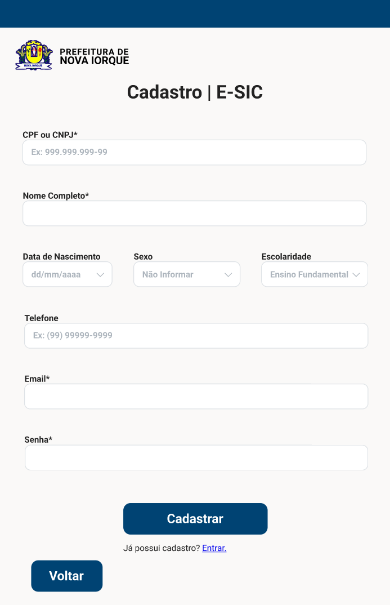

# Protótipos de Alta Fidelidade

## Introdução

O protótipo de alta fidelidade constitui uma representação sofisticada do sistema proposto, caracterizada por um elevado grau de detalhamento que simula, com precisão, a aparência e a funcionalidade do produto final. Diferentemente dos protótipos de baixa fidelidade, que priorizam a concepção inicial e a validação de ideias básicas, o protótipo de alta fidelidade permite a avaliação de aspectos complexos, como navegabilidade, desempenho e interação do usuário com a interface. Essa abordagem visa aproximar-se da experiência real do usuário, contribuindo para a identificação de potenciais melhorias e garantindo maior alinhamento com os objetivos do projeto. Apesar de demandar maior tempo e recursos, o uso de protótipos de alta fidelidade é fundamental para a validação de decisões de design e o aperfeiçoamento do sistema antes da implementação final.[1](./prototipoDeAltaFidelidade.md#referências-bibliográficas)

## Objetivo

Com base no nível 3 do processo de Design, Avaliação e Desenvolvimento da [Engenharia de Usabilidade de Mayhew](../../planejamento/processosDeDesign.md#engenharia-de-usabilidade-de-mayhew), este documento tem como objetivo apresentar os protótipos de alta fidelidade desenvolvidos para as tarefas selecionadas no site da Prefeitura Municipal de Nova Iorque. A construção dos protótipos foi realizada com foco na simulação detalhada das interfaces e interações propostas, permitindo a avaliação da usabilidade, navegabilidade e aderência às necessidades dos usuários.

## Metodologia

O protótipo de alta fidelidade foi desenvolvido com base em um processo iterativo, iniciado pela criação de [protótipos de baixa fidelidade em papel](../nivel02/prototipoDePapel.md). Esses protótipos serviram para definir a estrutura das interfaces e orientar o refinamento das interações.

O [Guia de Estilo](../../analise-de-requisitosII/guiaDeEstilo.md), previamente desenvolvido, também será seguido durante o desenvolvimento dos protótipos de alta fidelidade, assegurando que as interfaces mantenham consistência visual, acessibilidade e alinhamento com as necessidades do público-alvo.

## Protótipos de Alta Fidelidade

Os protótipos de alta fidelidade representam as principais funcionalidades do sistema, cada uma desenvolvida por um integrante do grupo. A tela inicial, comum a todas as funcionalidades, foi projetada para oferecer uma navegação clara e acessível, servindo como ponto de entrada para opções como o e-SIC, agendamento de consultas médicas, busca por licitações fracassadas e envio de notas fiscais de serviço.

<b>Figura 1</b> - proposta de Tela Inicial para o site da Prefeitura de Nova Iorque

Autor: [Weverton Rodrigues](https://github.com/vevetin)

A seguir, são detalhados os protótipos de alta fidelidade desenvolvidos para cada funcionalidade:

### Protótipo de Alta Fidelidade 1 - Fazer um pedido no e-SIC
Na página inicial, há duas formas de acessar a página do e-SIC: pelo botão "e-SIC" presente no canto inferior na aba "Mais Acessados" ou através do menu principal, localizado no cabeçalho da página:

<b>Figura 2</b> - Menu de acesso ao e-SIC pela Tela Inicial

Autor: [Paulo Henrique](https://github.com/paulomh)

Ambas as opções redirecionam o usuário para a página do e-SIC. Nesta página, o usuário pode realizar um pedido de transparência, tanto anônimo quanto identificado, além de possuir acesso a informações sobre o serviço, legislação e contato.

<b>Figura 3</b> - Página do e-SIC

Autor: [Paulo Henrique](https://github.com/paulomh)

Clicando no botão "Realizar Pedido", aparecerá três opções de pedido: "Pedido Anônimo", "Entrar com uma conta" ou "Cadastrar um novo usuário".

<b>Figura 4</b> - Opções de Pedido no e-SIC

Autor: [Paulo Henrique](https://github/paulomh)

Ao clicar em "Pedido Anônimo", o usuário será redirecionado para a página de formulário de pedido anônimo, onde poderá preencher as informações necessárias para realizar o pedido.

<b>Figura 5</b> - Formulário de Pedido Anônimo no e-SIC

Autor: [Paulo Henrique](https://github/paulomh)

Com o formulário de pedido anônimo devidamente preenchido e clicando em "Cadastrar Pedido", o usuário receberá um feedback de sucesso e poderá acompanhar o andamento do pedido por meio de um protocolo.

<b>Figura 6</b> - Feedback de Sucesso no e-SIC

Autor: [Paulo Henrique](https://github/paulomh)

Pela figura 4, Se o usuário optar por "Entrar com uma conta", será redirecionado para a página de login, onde poderá acessar sua conta e realizar um pedido identificado.

<b>Figura 7</b> - Página de Login no e-SIC

Autor: [Paulo Henrique](https://github/paulomh)

Por fim, pela figura 4, ao clicar em "Cadastrar um novo usuário", o usuário será redirecionado para a página de cadastro, onde poderá criar uma conta para realizar pedidos identificados.

<b>Figura 8</b> - Página de Cadastro no e-SIC

Autor: [Paulo Henrique](https://github/paulomh)

Tanto a figura 7 e 8, após o login ou cadastro, o usuário será redirecionado para a página de formulário de pedido identificado, onde poderá preencher as informações necessárias para realizar o pedido.

<b>Figura 9</b> - Formulário de Pedido Identificado no e-SIC

Autor: [Paulo Henrique](https://github/paulomh)

Com o formulário de pedido identificado devidamente preenchido e clicando em "Cadastrar Pedido", o usuário receberá um feedback de sucesso e poderá acompanhar o andamento do pedido por meio de um protocolo.

<b>Figura 10</b> - Feedback de Sucesso no e-SIC

Autor: [Paulo Henrique](https://github/paulomh)

Ao clicar em "Continuar" nas figuras 6 e 10, o usuário será redirecionado para a página do e-SIC com o seu pedido devidamente cadastrado e poderá acompanhar o andamento do pedido por meio de um protocolo.

<b>Figura 11</b> - Pedido Cadastrado no e-SIC

Autor: [Paulo Henrique](https://github/paulomh)

### Protótipo de Alta Fidelidade 2 - Agendamento de Consulta Médica

Esta funcionalidade foi projetada para facilitar o acesso dos cidadãos ao agendamento de consultas médicas no sistema de saúde municipal, promovendo praticidade e eficiência na interação com o serviço público. 

<b>Figura 12</b> - Tela Principal do Agendamento de Consulta Médica

Autor: [Weverton Rodrigues](https://github.com/vevetin)

<b>Figura 13</b> - Elementos Adicionais e Componentes Complementares

Autor: [Weverton Rodrigues](https://github.com/vevetin)

### Protótipo de Alta Fidelidade 3 - Busca por licitação fracassada
*(Protótipo em desenvolvimento. A versão final será apresentada assim que disponível.)*

### Protótipo de Alta Fidelidade 4 - Envio de Nota Fiscal de Serviço
*(Protótipo em desenvolvimento. A versão final será apresentada assim que disponível.)*

## Referências Bibliográficas

> 1. PREECE, Jenny; ROGERS, Yvonne; SHARP, Helen. Interaction Design: beyond human-computer interaction. 1. ed. New York: J. Wiley & Sons, 2002. Capítulo 08: Design, Prototipação e Construção. Páginas 265-266. Disponível em: https://libgen.li/file.php?md5=02236874c9b62b7d9aed9ec21639968a. Acesso em: 10 jan. 2025.

> 2. ROSA, José; MORAES, Anamaria. Avaliação e projeto no design de interfaces. São Paulo: 2AB, 2010. Capítulo 09: Teste de usabilidade. Página 157.

## Histórico de Versão

| Versão | Data | Autor(es) | Descrição | Data de Revisão | Revisor(es) |
|:---:|:---:|---|---|:---:|---|
| 1.0 | 12/01/2025 |  [Weverton Rodrigues](https://github.com/vevetin) | Criação do documento | 12/01/2025 | [Paulo Henrique](https://github.com/paulomh) |
| 1.1 | 25/01/2025 |  [Paulo Henrique](https://github.com/paulomh) | Adicionando fluxo de interação do protótipo de alta fidelidade - Fazer um pedido no e-SIC | 25/01/2025 | [Rodrigo Wendrel](https://github.com/rodwendrel) |
