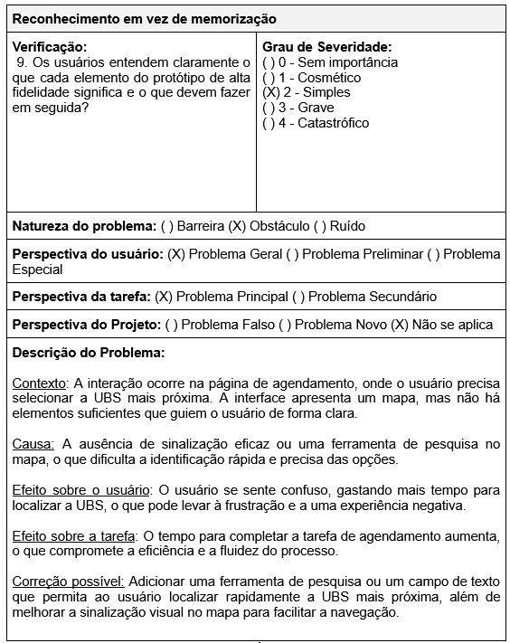
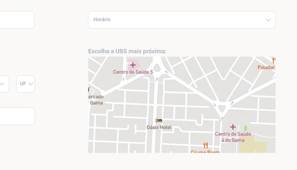
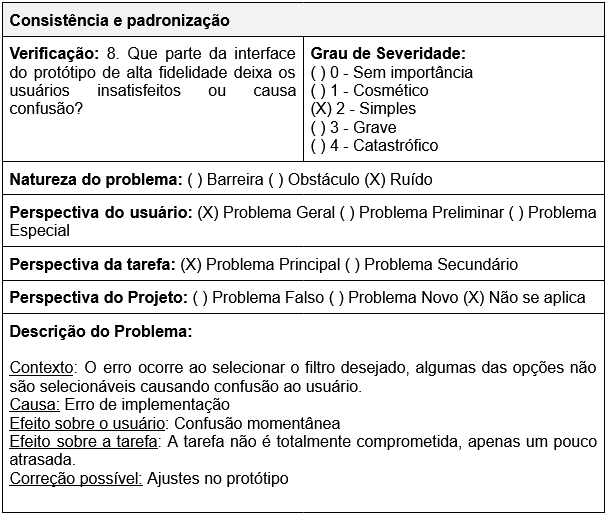
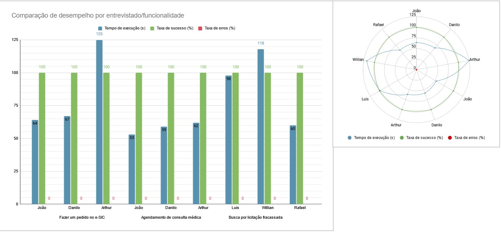

# Relato dos Resultados da Avaliação dos Protótipos de Alta Fidelidade

## Introdução

O presente documento tem como objetivo relatar os resultados obtidos durante a avaliação dos Protótipos de Alta Fidelidade do sistema proposto. A avaliação foi conduzida com o intuito de identificar as alternativas de design, verificar a conformidade com os padrões estabelecidos e apontar problemas na interação e na interface do usuário. A análise foi realizada com base no [Planejamento da Avaliação dos Protótipos de Alta Fidelidade](./planejamentoAvaliacaoPrototipoAltaFidelidade.md), que descreve as abordagens e métodos adotados para a avaliação, e a organização dos dados segue as diretrizes descritas no [Planejamento do Relato dos Protótipos de Alta Fidelidade](./planejamentoDoRelatoAvaliacaoProtipoAltaFidelidade.md).

## Cronograma Executado

<b>Tabela 1</b> - Cronograma Executado

| Entrevistador(es) | Entrevistado(s) | Horário de Início | Horário de Fim | Data Executada | Tarefa | Local |
| :---------------: | :-------------: | :---------------: | :------------: | :------------: | :----: | :---: |

Autor: [Weverton Rodrigues](https://github.com/vevetin)

## Resultado da Avaliação - Fazer um pedido no e-SIC

### Seleção dos participantes

Os participantes selecionados para a avaliação do protótipo de alta fidelidade da funcionalidade de [fazer um pedido no e-SIC](./prototipoDeAltaFidelidade.md#protótipo-de-alta-fidelidade-1---fazer-um-pedido-no-e-sic)
foram escolhidos com base no perfil de usuário conforme descrito no [Planejamento da Avaliação dos Protótipos de Alta Fidelidade](./planejamentoAvaliacaoPrototipoAltaFidelidade.md#i---identificar-e-administrar-as-questões-práticas-da-avaliação).
Foram entrevistados 3 participantes, número recomendado por Krug[1](./relatoPrototipoAltaFidelidade.md#referências-bibliográficas), com experiência intermediária/avançada em tecnologia.

A tabela a seguir apresenta as perguntas, e suas respectivas respostas, utilizadas pós-entrevista para avaliar a tarefa definida nesse escopo do protótipo de alta fidelidade com base nos objetivos
de ideias e alternativas de design, conformidade com um padrão e problemas na interação e interface.

<b>Tabela x</b> - Respostas para Avaliação do Protótipo de Alta Fidelidade (Fazer um pedido no e-SIC)

| Objetivo                           | Pergunta                                                                                                                                            | Resposta                                                                                                                                                                                                                                                                                       |
| ---------------------------------- | --------------------------------------------------------------------------------------------------------------------------------------------------- | ---------------------------------------------------------------------------------------------------------------------------------------------------------------------------------------------------------------------------------------------------------------------------------------------- |
| Ideias e Alternativas de Design    | 1. Qual das alternativas de design do protótipo de alta fidelidade é mais eficiente e fácil de aprender?                                            | Todos os participantes optaram por acessar a página do e-SIC pelo componente "Mais Acessados" presente na tela inicial, visto que ela é a opção que menos exige esforço para ser aprendida.                                                                                                    |
| Ideias e Alternativas de Design    | 2. Qual alternativa de design os usuários preferem? Por quê?                                                                                        | Navegar pelo componente "Mais Acessados" e, na página do e-SIC, fazer um "Pedido Anônimo". O componente "Mais Acessados" por ser mais eficiente e intuitivo e "Pedido Anônimo" por trazer uma maior segurança, visto que não exige nenhum passo extra para realizar o pedido de transparência. |
| Ideias e Alternativas de Design    | 3. Qual alternativa de design se espera que tenha um impacto negativo menor ao ser adotada?                                                         | A seção "Mais Acessados".                                                                                                                                                                                                                                                                      |
| Conformidade com um padrão         | 4. O site está de acordo com os padrões de acessibilidade do W3C?                                                                                   | Sim.                                                                                                                                                                                                                                                                                           |
| Conformidade com um padrão         | 5. Os termos na interface seguem convenções estabelecidas no domínio?                                                                               | Sim.                                                                                                                                                                                                                                                                                           |
| Conformidade com um padrão         | 6. A interface segue algum padrão pré-estabelecido?                                                                                                 | Sim, o protótipo segue as diretrizes do guia de estilo e os padrões de design pré-estabelecidos.                                                                                                                                                                                               |
| Problemas na Interação e Interface | 7. Os usuários conseguem operar o protótipo de alta fidelidade? Eles atingem seus objetivos de maneira eficiente? Com que frequência cometem erros? | Todos os participantes conseguiram operar a tarefa designada no protótipo de alta fidelidade com eficiência e sem erros.                                                                                                                                                                       |
| Problemas na Interação e Interface | 8. Que parte da interface do protótipo de alta fidelidade deixa os usuários insatisfeitos ou causa confusão?                                        | Não houveram partes na tarefa que deixaram os usuários insatisfeitos ou confusos.                                                                                                                                                                                                              |
| Problemas na Interação e Interface | 9. Os usuários entendem claramente o que cada elemento do protótipo de alta fidelidade significa e o que devem fazer em seguida?                    | Sim, todos os participantes entenderam claramente os elementos presentes no protótipo.                                                                                                                                                                                                         |

Autor: [Paulo Henrique](https://github.com/paulomh) 

### Avaliação Heurística

**Objetivo e método**  
A avaliação heurística teve como objetivo identificar problemas de usabilidade na realização da tarefa de fazer um pedido no e-SIC, usando como base as heurísticas propostas por Nielsen[3](./relatoPrototipoAltaFidelidade.md#referências-bibliográficas). As heurísticas avaliadas foram selecionadas considerando a relevância para o contexto do protótipo e incluíram:

- Controle do usuário e liberdade: para avaliar se os usuários podem corrigir facilmente erros ou desfazer ações indesejadas;
- Prevenção de erros: para identificar possíveis problemas que possam levar a erros durante a interação;
- Reconhecimento em vez de memorização: para garantir que elementos da interface sejam intuitivos e não exijam esforço desnecessário de memória por parte dos usuários.
- Design estético e minimalista: para avaliar a clareza e simplicidade da interface, evitando elementos desnecessários ou confusos.

**Resultados**

Controle do usuário e liberdade: durante a avaliação não foram identificados problemas significativos. A formulário utilizado para enviar o pedido no e-SIC permite que os usuários corrijam facilmente erros e desfaçam ações indesejadas, garantindo uma experiência de uso satisfatória.

Prevenção de erros: a interface do protótipo apresentou um bom desempenho. A execução da tarefa não apresenta riscos significativos de erros, e os usuários conseguem completar a ação de forma eficiente e sem dificuldades.

Reconhecimento em vez de memorização: os elementos da interface são fáceis e intuitivos de serem compreendidos, não exigindo esforço desnecessário de memória por parte dos usuários. A navegação pelo protótipo é clara e direta, facilitando a interação e a conclusão da tarefa.

Design estético e minimalista: a interface do protótipo apresentou um design limpo e organizado, evitando elementos desnecessários ou confusos. A disposição dos elementos e a clareza das informações contribuem para uma experiência de uso agradável e eficiente.

### Teste de Usabilidade

**Métricas de Desempenho e Observações Qualitativas**

<b>Tabela x</b> - Comparação de desempenho por usuário

| Entrevistado(s) | Tempo de execução (s) | Taxa de sucesso (%) | Taxa de erro (%) | Observações Qualitativas                                          |
| :-------------: | :-------------------: | :-----------------: | :--------------: | ----------------------------------------------------------------- |
|      João       |          64s          |        100%         |        0%        | Simples, tarefa bem direcionada, definida e clara para o usuário. |
|     Danilo      |          67s          |        100%         |        0%        | Tarefa bem direcionada e fluída.                                  |
|     Arthur      |         125s          |        100%         |        0%        | Tarefa bem explícita visualmente.                                 |

Autor: [Paulo Henrique](https://github.com/paulomh)

### Registro da avaliação

A seguir, são apresentados os registros em vídeo dos testes de usabilidade realizados com os três participantes. Cada vídeo captura a interação do usuário com o protótipo de alta fidelidade, permitindo uma análise mais detalhada do comportamento durante o processo de uso.

**Entrevista 01: João**

<iframe width="560" height="315" src="https://www.youtube.com/embed/sPpdnZXHeu8" title="YouTube video player" frameborder="0" allow="accelerometer; autoplay; clipboard-write; encrypted-media; gyroscope; picture-in-picture; web-share" referrerpolicy="strict-origin-when-cross-origin" allowfullscreen></iframe>

**Entrevista 02: Danilo**

<iframe width="560" height="315" src="https://www.youtube.com/embed/FUcHnzW5z9w" title="YouTube video player" frameborder="0" allow="accelerometer; autoplay; clipboard-write; encrypted-media; gyroscope; picture-in-picture; web-share" referrerpolicy="strict-origin-when-cross-origin" allowfullscreen></iframe>

**Entrevista 03: Arthur**

<iframe width="560" height="315" src="https://www.youtube.com/embed/JqmuI6iKVSI" title="YouTube video player" frameborder="0" allow="accelerometer; autoplay; clipboard-write; encrypted-media; gyroscope; picture-in-picture; web-share" referrerpolicy="strict-origin-when-cross-origin" allowfullscreen></iframe>

## Resultado da Avaliação - Agendamento de Consulta Médica

### Seleção dos participantes

Para a avaliação do protótipo de alta fidelidade da funcionalidade de Agendamento de Consulta Médica, foram convidados 6 participantes, incluindo alguns que já haviam contribuído em etapas anteriores do projeto. Destes, 3 estavam disponíveis, o que foi considerado suficiente, conforme previsto no [Planejamento da Avaliação dos Protótipos de Alta Fidelidade](./planejamentoAvaliacaoPrototipoAltaFidelidade.md), que recomendava um grupo reduzido para identificar problemas principais, alinhado à abordagem de Krug[1](./relatoPrototipoAltaFidelidade.md#referências-bibliográficas).

Todos os participantes possuíam experiência intermediária ou avançada com tecnologia, sendo dois classificados como usuários secundários. O terceiro participante, apesar de não ter utilizado sistemas similares anteriormente, foi incluído para ampliar a diversidade de perspectivas e avaliar possíveis barreiras enfrentadas por usuários com esse perfil.

A tabela a seguir apresenta as perguntas feitas pós entrevista e avaliação do rotótipo de alta fidelidade, abordando alternativas de design, conformidade com padrões e usabilidade.

<b>Tabela 1</b> - Respostas para Avaliação do Protótipo de Alta Fidelidade

| Objetivo                            | Pergunta                                                                                                                                            | Respostas                                                                                                                                                                                                                                            |
| ----------------------------------- | --------------------------------------------------------------------------------------------------------------------------------------------------- | ---------------------------------------------------------------------------------------------------------------------------------------------------------------------------------------------------------------------------------------------------- |
| Ideias e Alternativas de Design     | 1. Qual das alternativas de design do protótipo de alta fidelidade é mais eficiente e fácil de aprender?                                            | Todos os participantes preferiram a navegação pela seção "Mais Acessados", considerando-a prática e fácil de aprender.                                                                                                                               |
| Ideias e Alternativas de Design     | 2. Qual alternativa de design os usuários preferem? Por quê?                                                                                        | A navegação direta pela seção "Mais Acessados" foi considerada a mais eficiente e intuitiva.                                                                                                                                                         |
| Ideias e Alternativas de Design     | 3. Qual alternativa de design se espera que tenha um impacto negativo menor ao ser adotada?                                                         | A solução de navegação direta pela seção "Mais Acessados" tem menor potencial de causar frustração.                                                                                                                                                  |
| Conformidade com um padrão          | 4. O site está de acordo com os padrões de acessibilidade do W3C?                                                                                   | O protótipo está em conformidade com os padrões de acessibilidade do W3C.                                                                                                                                                                            |
| Conformidade com um padrão          | 5. Os termos na interface seguem convenções estabelecidas no domínio?                                                                               | A terminologia utilizada segue as convenções estabelecidas no domínio e está clara para os usuários.                                                                                                                                                 |
| Conformidade com um padrão          | 6. A interface segue algum padrão pré-estabelecido?                                                                                                 | O protótipo segue as diretrizes do guia de estilo e os padrões de design pré-estabelecidos (exemplo: ePWG).                                                                                                                                          |
| Problemas na Interação e Interface  | 7. Os usuários conseguem operar o protótipo de alta fidelidade? Eles atingem seus objetivos de maneira eficiente? Com que frequência cometem erros? | Os participantes conseguiram operar o protótipo de forma eficiente, sem erros ou dificuldades.                                                                                                                                                       |
| Problemas na Interação e Interface  | 8. Que parte da interface do protótipo de alta fidelidade deixa os usuários insatisfeitos ou causa confusão?                                        | Danilo sugeriu melhorar a sinalização ou adicionar um campo de pesquisa na página de agendamento (especificamente na área de seleção da UBS mais próxima), pois ficou confuso ao selecionar a UBS no mapa.                                           |
| Problemas na Interação e Interface. | 9. Os usuários entendem claramente o que cada elemento do protótipo de alta fidelidade significa e o que devem fazer em seguida?                    | Todos os participantes entenderam claramente os elementos da interface e as ações a serem realizadas. O feedback contínuo, como indicações no processo de agendamento, ajudou a manter os usuários informados e seguros sobre o andamento da tarefa. |

Autor(es): [Weverton Rodrigues](https://github.com/vevetin) 

### Avaliação Heurística

**Objetivo e método**  
A avaliação heurística teve como objetivo identificar problemas de usabilidade no protótipo de alta fidelidade da funcionalidade de Agendamento de Consulta Médica, com base nas heurísticas de Nielsen[3](./relatoPrototipoAltaFidelidade.md#referências-bibliográficas). O foco principal foi verificar a aderência da interface a princípios fundamentais de usabilidade, assegurando uma experiência fluida e eficiente para os usuários.
As heurísticas avaliadas foram selecionadas considerando a relevância para o contexto do protótipo e incluíram:

- Visibilidade do estado do sistema: para verificar se o sistema fornece feedback adequado e em tempo real aos usuários durante a interação;
- Consistência e padronização: para assegurar que os elementos e interações seguem padrões previsíveis e consistentes;
- Controle e liberdade do usuário: para avaliar se os usuários podem corrigir facilmente erros ou desfazer ações indesejadas;
- Reconhecimento em vez de memorização: para garantir que elementos da interface sejam intuitivos e não exijam esforço desnecessário de memória por parte dos usuários;

A análise foi conduzida de forma individual, seguindo os passos recomendados para uma avaliação heurística. Cada aspecto da interface foi examinado em relação às heurísticas selecionadas, e os problemas identificados foram registrados e classificados quanto à severidade, natureza e impacto na experiência do usuário.

**Resultados**

Visibilidade do estado do sistema/Controle e liberdade do usuário: Durante a avaliação da heurística de Visibilidade do estado do sistema, não foram identificados problemas significativos. O protótipo proporciona feedback adequado durante a interação do usuário, permitindo que os usuários compreendam o status da tarefa sem dificuldades.

Consistência e padronização: A interface seguiu de maneira satisfatória os princípios de consistência e padronização, utilizando elementos e interações previsíveis, como botões de navegação, tipografia e cores consistentes ao longo de todo o protótipo.

Reconhecimento em vez de memorização: Em relação à heurística de Reconhecimento em vez de memorização, foi identificado um ponto de melhoria na área de seleção da UBS mais próxima, especificamente no mapa. Um entrevistado demonstrou confusão ao interagir com o mapa para escolher a UBS, o que pode ser considerado um obstáculo. O feedback sugeriu melhorar a sinalização ou incluir um campo de pesquisa para facilitar a localização.

<b>Figura x</b> - Tabela Reconhecimento em vez de Memorização

Autor: [Weverton Rodrigues](https://github.com/vevetin)

<b>Figura x</b> - Imagem do Protótipo (Seleção de UBS no Mapa)

Autor: [Weverton Rodrigues](https://github.com/vevetin)

### Teste de Usabilidade

**Métricas de Desempenho e Observações Qualitativas**

A tabela a seguir apresenta o desempenho de cada entrevistado durante o teste de usabilidade, destacando o tempo de execução, a taxa de sucesso e a taxa de erro. Além disso, são registradas observações qualitativas que indicam áreas em que os usuários encontraram dificuldades ou pontos de confusão, como no caso do Danilo, que teve uma pequena dificuldade ao marcar a UBS no mapa, mas conseguiu completar a tarefa com sucesso.

<b>Tabela x</b> - Comparação de desempenho por usuário

| Entrevistado(s) | Tempo de execução (s) | Taxa de sucesso (%) | Taxa de erro (%) | Observações Qualitativas                                                                     |
| :-------------: | :-------------------: | :-----------------: | :--------------: | -------------------------------------------------------------------------------------------- |
|      João       |          53s          |        100%         |        0%        | -                                                                                            |
|     Danilo      |          59s          |        100%         |        0%        | Encontrou dificuldade ao marcar a UBS no mapa, mas conseguiu completar a tarefa com sucesso. |
|     Arthur      |          62s          |        100%         |        0%        | -                                                                                            |

Autor: [Weverton Rodrigues](https://github.com/vevetin)

### Registro da avaliação

A seguir, são apresentados os registros em vídeo dos testes de usabilidade realizados com os três participantes. Cada vídeo captura a interação do usuário com o protótipo de alta fidelidade, permitindo uma análise mais detalhada do comportamento durante o processo de uso.

**Entrevista 01: João (Início no minuto `3:28`)**

<iframe width="560" height="315" src="https://www.youtube.com/embed/sPpdnZXHeu8" title="YouTube video player" frameborder="0" allow="accelerometer; autoplay; clipboard-write; encrypted-media; gyroscope; picture-in-picture; web-share" referrerpolicy="strict-origin-when-cross-origin" allowfullscreen></iframe>

**Entrevista 02: Danilo (Início no minuto `2:30`)**

<iframe width="560" height="315" src="https://www.youtube.com/embed/FUcHnzW5z9w" title="YouTube video player" frameborder="0" allow="accelerometer; autoplay; clipboard-write; encrypted-media; gyroscope; picture-in-picture; web-share" referrerpolicy="strict-origin-when-cross-origin" allowfullscreen></iframe>

**Entrevista 03: Arthur (Início no minuto `4:45`)**

<iframe width="560" height="315" src="https://www.youtube.com/embed/JqmuI6iKVSI" title="YouTube video player" frameborder="0" allow="accelerometer; autoplay; clipboard-write; encrypted-media; gyroscope; picture-in-picture; web-share" referrerpolicy="strict-origin-when-cross-origin" allowfullscreen></iframe>

## Resultado da Avaliação - Busca por licitação fracassada

### Seleção dos participantes

Os participantes selecionados para a avaliação do protótipo de alta fidelidade da funcionalidade de buscar por licitação fracassada foram escolhidos com base no perfil de usuário conforme descrito no Planejamento da Avaliação dos Protótipos de Alta Fidelidade. Foram entrevistados 3 participantes, número recomendado por Krug1, com experiência intermediária/avançada em tecnologia.

A tabela a seguir apresenta as perguntas, e suas respectivas respostas, utilizadas pós-entrevista para avaliar a tarefa definida nesse escopo do protótipo de alta fidelidade com base nos objetivos de ideias e alternativas de design, conformidade com um padrão e problemas na interação e interface.

<b>Tabela 1</b> - Respostas para Avaliação do Protótipo de Alta Fidelidade

| Objetivo                            | Pergunta                                                                                                                                            | Respostas                                                                                                     |
| ----------------------------------- | --------------------------------------------------------------------------------------------------------------------------------------------------- | ------------------------------------------------------------------------------------------------------------- |
| Ideias e Alternativas de Design     | 1. Qual das alternativas de design do protótipo de alta fidelidade é mais eficiente e fácil de aprender?                                            | Todos os participantes preferiram a navegação pela seção "Mais Acessados".                                    |
| Ideias e Alternativas de Design     | 2. Qual alternativa de design os usuários preferem? Por quê?                                                                                        | A seção "Mais Acessados" foi a mais intuitiva.                                                                |
| Ideias e Alternativas de Design     | 3. Qual alternativa de design se espera que tenha um impacto negativo menor ao ser adotada?                                                         | A seção "Mais Acessados" se mostrou suficientemente boa para evitar frustrações por parte dos usuários.       |
| Conformidade com um padrão          | 4. O site está de acordo com os padrões de acessibilidade do W3C?                                                                                   | O protótipo está em conformidade com os padrões de acessibilidade do W3C.                                     |
| Conformidade com um padrão          | 5. Os termos na interface seguem convenções estabelecidas no domínio?                                                                               | A terminologia utilizada segue as convenções estabelecidas no domínio e está clara para os usuários.          |
| Conformidade com um padrão          | 6. A interface segue algum padrão pré-estabelecido?                                                                                                 | O protótipo segue as diretrizes do guia de estilo e os padrões de design pré-estabelecidos (exemplo: ePWG).   |
| Problemas na Interação e Interface  | 7. Os usuários conseguem operar o protótipo de alta fidelidade? Eles atingem seus objetivos de maneira eficiente? Com que frequência cometem erros? | Os participantes conseguiram operar o protótipo de forma eficiente sem erros mas com um ponto de dificuldade. |
| Problemas na Interação e Interface  | 8. Que parte da interface do protótipo de alta fidelidade deixa os usuários insatisfeitos ou causa confusão?                                        | Rafael identificou um problema na seleção de filtros                                                          |
| Problemas na Interação e Interface. | 9. Os usuários entendem claramente o que cada elemento do protótipo de alta fidelidade significa e o que devem fazer em seguida?                    | Todos os participantes entenderam claramente os elementos da interface e as ações a serem realizadas.         |

Autor(es): [Rodrigo Wendrel](https://github.com/rodwendrel) 

### Avaliação Heurística

**Objetivo e método**  
A avaliação heurística teve como objetivo identificar problemas de usabilidade no protótipo de alta fidelidade da funcionalidade de Agendamento de Consulta Médica, com base nas heurísticas de Nielsen[3](./relatoPrototipoAltaFidelidade.md#referências-bibliográficas). O foco principal foi verificar a aderência da interface a princípios fundamentais de usabilidade, assegurando uma experiência fluida e eficiente para os usuários.
As heurísticas avaliadas foram selecionadas considerando a relevância para o contexto do protótipo e incluíram:

- Visibilidade do estado do sistema: para verificar se o sistema fornece feedback adequado e em tempo real aos usuários durante a interação;
- Consistência e padronização: para assegurar que os elementos e interações seguem padrões previsíveis e consistentes;
- Controle e liberdade do usuário: para avaliar se os usuários podem corrigir facilmente erros ou desfazer ações indesejadas;
- Reconhecimento em vez de memorização: para garantir que elementos da interface sejam intuitivos e não exijam esforço desnecessário de memória por parte dos usuários;

A análise foi conduzida de forma individual, seguindo os passos recomendados para uma avaliação heurística. Cada aspecto da interface foi examinado em relação às heurísticas selecionadas, e os problemas identificados foram registrados e classificados quanto à severidade, natureza e impacto na experiência do usuário.

**Resultados**

Apenas a heurística de Consistência e Padronização foi violada por um erro de implementação mas que não impediu que os usuários concluíssem a tarefa.

<b>Figura x</b> - Tabela Consistência e padronização

Autor: [Rodrigo Wendrel](https://github.com/rodwendrel)

### Teste de Usabilidade

**Métricas de Desempenho e Observações Qualitativas**

<b>Tabela x</b> - Comparação de desempenho por usuário

| Entrevistado(s) | Tempo de execução (s) | Taxa de sucesso (%) | Taxa de erro (%) | Observações Qualitativas                                                                     |
| :-------------: | :-------------------: | :-----------------: | :--------------: | -------------------------------------------------------------------------------------------- |
|      luis       |          1:38          |        100%         |        0%        | -                                                                                            |
|     Willian     |          1:68          |        100%         |        0%        |  |
|     Rafael      |          60s          |        100%         |        0%        | - Trouxe a questão dos filtros onde podem atrapalhar a experiência do usuário                                                                                           |

Autor: [Rodrigo Wendrel](https://github.com/rodwendrel)

### Registro da avaliação

A seguir, são apresentados os registros em vídeo dos testes de usabilidade realizados com os três participantes. Cada vídeo captura a interação do usuário com o protótipo de alta fidelidade, permitindo uma análise mais detalhada do comportamento durante o processo de uso.

**Entrevista 01: Luis**

<iframe width="560" height="315" src="https://www.youtube.com/embed/mAWPaWoNzpg?si=2M0RNQm3zXTV0j8D" title="YouTube video player" frameborder="0" allow="accelerometer; autoplay; clipboard-write; encrypted-media; gyroscope; picture-in-picture; web-share" referrerpolicy="strict-origin-when-cross-origin" allowfullscreen></iframe>

**Entrevista 02: Willian**

<iframe width="560" height="315" src="https://www.youtube.com/embed/i_YMbcUuS-c?si=Mby69dv3b4iZFyrF" title="YouTube video player" frameborder="0" allow="accelerometer; autoplay; clipboard-write; encrypted-media; gyroscope; picture-in-picture; web-share" referrerpolicy="strict-origin-when-cross-origin" allowfullscreen></iframe>

**Entrevista 03: Rafael**

<iframe width="560" height="315" src="https://www.youtube.com/embed/y7IWZoKPXEI?si=sUdRX7aXyqexBWBP" title="YouTube video player" frameborder="0" allow="accelerometer; autoplay; clipboard-write; encrypted-media; gyroscope; picture-in-picture; web-share" referrerpolicy="strict-origin-when-cross-origin" allowfullscreen></iframe>

 <!--
## Resultado da Avaliação - Envio de Nota Fiscal de Serviço

### Seleção dos participantes

### Avaliação Heurística

**Objetivo e método**

 Heurísticas 

**Resultados**

tabela com: heurística violada, verificação (pergunta), descrição do problema, grau de severidade, natureza do problema, perspectiva do usuário, perspectiva da tarefa, perspectiva do projeto, correção possível 
 caso não tenha sido violada, adicionar na tabela a linha ex: | Resultado |(X) Não violada - "A interface segue padrões consistentes". (mudar texto para corresponder à heurística)| 

 Imagem do erro 

### Teste de Usabilidade

**Métricas de Desempenho e Observações Qualitativas**

tabela com: tempo de execução, taxa de sucesso, taxa de erros, observacoes 

 obs: Análise do comportamento do usuário, incluindo pontos de confusão,
 dificuldades em usar a interface, ou áreas em que o usuário teve dificuldades de compreender a funcionalidade. 

### Registro da avaliação
 
 -->

## Análise dos Resultados

Neste tópico, apresentamos a análise dos resultados obtidos nas avaliações das funcionalidades testadas. As métricas analisadas incluem o tempo de execução, a taxa de sucesso e a taxa de erro. Para facilitar a compreensão, os resultados são ilustrados por meio de gráficos e tabelas, proporcionando uma visão clara do desempenho de cada funcionalidade, além de destacar possíveis áreas de melhoria para otimizar a experiência do usuário.

**1. Tabela de Média e Desvio Padrão**  

A tabela complementa as informações apresentadas no gráfico, fornecendo um resumo detalhado dos dados de tempo de execução, taxa de sucesso e taxa de erro para cada funcionalidade. A análise dos resultados confirma que todas as funcionalidades tiveram um desempenho excelente em termos de taxa de sucesso e taxa de erro. Contudo, o tempo de execução e a variação de desempenho, especialmente para "Pedido e-SIC", sugerem que há oportunidades para otimizar o processo, tornando-o mais ágil e eficiente para os usuários.

<b>Tabela x</b> - Dados de Média e Desvio Padrão do Tempo de Execução, Taxa de Sucesso e Taxa de Erro

| Funcionalidade | Tempo de execução (s) - média | Tempo de execução (s) - desvio padrão | Taxa de sucesso (%) - média |Taxa de sucesso (%) - desvio padrão | Taxa de erros (%) - média | Taxa de erros (%) - desvio padrão |
|---|:---:|:---:|:---:|:---:|:---:|:---:|
|Fazer um pedido no e-SIC|85.33|34.39|100|0|0|0|
|Agendamento de consulta médica|58|4.58|100|0|0|0|
|Busca por licitação fracassada|92|29.46|100|0|0|0|

Autor: [Weverton Rodrigues](https://github.com/vevetin)

**2. Tempo de Execução, Taxa de Sucesso e Taxa de Erro**  

<b>Figura x</b> - Gráfico de Comparação de Tempo de Execução, Taxa de Sucesso e Taxa de Erro

Autor: [Weverton Rodrigues](https://github.com/vevetin)

O gráfico de barras apresenta a comparação entre o tempo de execução, a taxa de sucesso e a taxa de erro para as funcionalidades testadas. O "Agendamento de Consulta Médica" teve o menor tempo médio de execução (58 segundos), seguido por "Fazer um pedido no e-SIC" com 85,33 segundos e "Busca por Licitação Fracassada" com 92 segundos. A maior variação no tempo de execução foi observada em "Fazer um pedido no e-SIC", indicando que alguns usuários enfrentaram maior dificuldade para completar a tarefa. Todas as funcionalidades atingiram uma taxa de sucesso de 100%, evidenciando que os usuários conseguiram realizar as tarefas com êxito. Além disso, a taxa de erro foi de 0% para todas as funcionalidades, sugerindo que o protótipo foi intuitivo e sem falhas durante os testes.

**Considerações finais**  

Os resultados obtidos indicam uma alta usabilidade das funcionalidades testadas. A taxa de sucesso de 100% e a taxa de erro de 0% para todas as tarefas demonstram que os usuários conseguiram realizar as ações propostas sem dificuldades. Contudo, o tempo de execução e a variação entre os participantes, especialmente para a funcionalidade "Fazer um pedido no e-SIC", sugerem que há oportunidades de melhoria na agilidade de algumas funcionalidades, em especial nas tarefas que exigem mais interações. O gráfico em radar também pode ser útil para ilustrar a comparação global entre as funcionalidades, facilitando a visualização das diferenças no desempenho.

## Planejamento de reprojeto

## Bibliografia

> 1. BARBOSA, Simone Diniz Junqueira et al. Interação humano-computador e experiência do usuário. 1. ed. Rio de Janeiro: Simone Diniz Junqueira Barbosa, 2021. Capítulo 12: Métodos de Avaliação de IHC. Páginas 301-304. Autopublicação. ISBN: 978-65-00-19677-1.

> 2. ROSA, José Guilherme Santa. Avaliação e Projeto No Deisng de Interfaces. 1. ed. Rio de Janeiro: Elsevier, 2010. Capítulo 8: Teste de Usabilidade.

> 3. BARBOSA, Simone Diniz Junqueira et al. Interação humano-computador e experiência do usuário. 1. ed. Rio de Janeiro: Simone Diniz Junqueira Barbosa, 2021. Capítulo 12: Métodos de Avaliação de IHC, página 282. ISBN: 978-65-00-19677-1.

## Referências Bibliográficas

## Histórico de Versão

| Versão |    Data    | Autor(es)                                        | Descrição                                        | Data de Revisão | Revisor(es)                                           |
| :----: | :--------: | ------------------------------------------------ | ------------------------------------------------ | :-------------: | ----------------------------------------------------- |
|  1.0   | 24/01/2025 | [Weverton Rodrigues](https://github.com/vevetin) | Criação do documento                             |   25/01/2025    | [Paulo Henrique](https://github.com/paulomh)          |
|  1.1   | 26/01/2025 | [Paulo Henrique](https://github.com/paulomh)     | Adicionando Resultado - Fazer um pedido no e-SIC |   26/01/2025    | [Necivaldo Amaral](https://github.com/junioramaral22) |
|  1.2   | 26/01/2025 | [Rodrigo Wendrel](https://github.com/rodwendrel) | Adicionando - Licitação Fracassada               |  26/01/2025     |  [Weverton Rodrigues](https://github.com/vevetin) |

