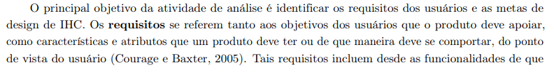
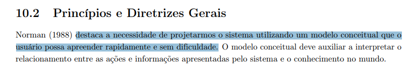
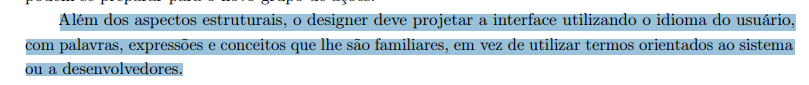
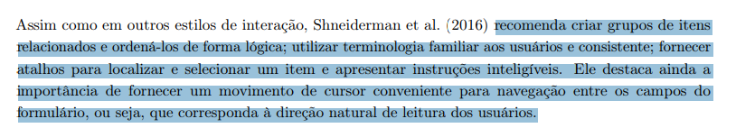
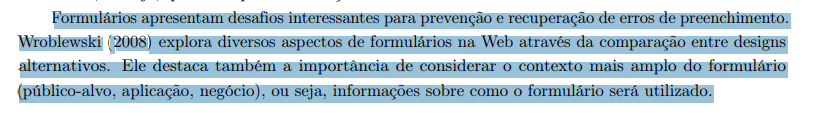
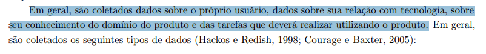

# Características da Plataforma

## Introdução

O presente documento tem como objetivo apresentar o planejamento da verificação do artefato relacionado à Características da Plataforma.

## Lista de Verificação

A tabela a seguir apresenta a lista de verificação das Características da Plataforma. Vale ressaltar que alguns itens presentes na lista são reaproveitados de outras listas de verificação presentes na seção: [Verificações](/docs/category/verificações). A resposta da lista de verificação será preenchida com "Conforme", "Não Conforme", "Não Aplicável" e "Sugestão de Melhoria". 

<b>Tabela 1</b> - Lista de Verificação Características da Plataforma

| Categoria | Questão | Resposta | Versão, Data e hora da avaliação | Fonte | Autor(es) |
|-----------|---------|----------|----------------------------------|-------|-----------|
| Objetivos | 1. A plataforma possui objetivos claramente definidos que atendem às necessidades dos usuários?|          |          | BARBOSA, Simone Diniz Junqueira et al. Interação humano-computador e experiência do usuário. 1. ed. Rio de Janeiro: Simone Diniz Junqueira Barbosa, 2021. Capítulo 7: Identificação de Necessidades dos Usuários e Definição dos Requisitos de IHC Página 135.  Autopublicação. ISBN: 978-65-00-19677-1. Figuras [G.1](./caracteristicasPlataforma.md#apêndice-h---características-da-plataforma)(Apêndice H - Características da Plataforma) |   [Necivaldo Amaral](https://github.com/junioramaral22) e [Weverton Rodrigues](https://github.com/vevetin)   |
| Objetivos | 2. A plataforma tem um modelo conceitual que o usuário consegue apreender rapidamente?|          |          | BARBOSA, Simone Diniz Junqueira et al. Interação humano-computador e experiência do usuário. 1. ed. Rio de Janeiro: Simone Diniz Junqueira Barbosa, 2021. Capítulo 10: Princípios e Diretrizes para o Design de IHC Página 238.  Autopublicação. ISBN: 978-65-00-19677-1. Figuras [G.2](caracteristicasPlataforma.md#apêndice-h---caracteristicasPlataforma)(Apêndice G - Características da Plataforma) |   [Paulo Henrique](https://github.com/paulomh) e [Rodrigo Ferreira](https://github.com/rodwendrel) |
| Design da Interface e Interação | 3. A interface da plataforma utiliza uma linguagem familiar ao usuário?|          |          | BARBOSA, Simone Diniz Junqueira et al. Interação humano-computador e experiência do usuário. 1. ed. Rio de Janeiro: Simone Diniz Junqueira Barbosa, 2021. Capítulo 10: Princípios e Diretrizes para o Design de IHC Página 239.  Autopublicação. ISBN: 978-65-00-19677-1. Figuras [G.3](caracteristicasPlataforma.md#apêndice-h---caracteristicasPlataforma)(Apêndice G - Características da Plataforma) |     [Necivaldo Amaral](https://github.com/junioramaral22) |
| Design da Interface e Interação | 4. A plataforma fornece instruções claras sobre como utilizar suas funcionalidades?|          |          | BARBOSA, Simone Diniz Junqueira et al. Interação humano-computador e experiência do usuário. 1. ed. Rio de Janeiro: Simone Diniz Junqueira Barbosa, 2021. Capítulo 9: Design de IHC Página 221.  Autopublicação. ISBN: 978-65-00-19677-1. Figuras [G.4](caracteristicasPlataforma.md#apêndice-h---caracteristicasPlataforma)(Apêndice G - Características da Plataforma) |     [Necivaldo Amaral](https://github.com/junioramaral22), [Paulo Henrique](https://github.com/paulomh) e [Rodrigo Ferreira](https://github.com/rodwendrel)|
| Design da Interface e Interação | 5. A navegação na plataforma é intuitiva e eficiente?|          |          | BARBOSA, Simone Diniz Junqueira et al. Interação humano-computador e experiência do usuário. 1. ed. Rio de Janeiro: Simone Diniz Junqueira Barbosa, 2021. Capítulo 9: Design de IHC Página 221.  Autopublicação. ISBN: 978-65-00-19677-1. Figuras [G.5](caracteristicasPlataforma.md#apêndice-h---caracteristicasPlataforma)(Apêndice G - Características da Plataforma) | [Weverton Rodrigues](https://github.com/vevetin) |
| Design da Interface e Interação | 6. A plataforma previne erros de interação e oferece mecanismos de recuperação?|          |          | BARBOSA, Simone Diniz Junqueira et al. Interação humano-computador e experiência do usuário. 1. ed. Rio de Janeiro: Simone Diniz Junqueira Barbosa, 2021. Capítulo 9: Design de IHC Página 221.  Autopublicação. ISBN: 978-65-00-19677-1. Figuras [G.6](caracteristicasPlataforma.md#apêndice-h---caracteristicasPlataforma)(Apêndice G - Características da Plataforma) | [Rodrigo Ferreira](https://github.com/rodwendrel) |
| Contexto e Uso da Plataforma | 7. A plataforma é adaptável aos diferentes níveis de conhecimento dos usuários?|          |          | BARBOSA, Simone Diniz Junqueira et al. Interação humano-computador e experiência do usuário. 1. ed. Rio de Janeiro: Simone Diniz Junqueira Barbosa, 2021. Capítulo 9: Design de IHC Página 221.  Autopublicação. ISBN: 978-65-00-19677-1. Figuras [G.7](caracteristicasPlataforma.md#apêndice-h---caracteristicasPlataforma)(Apêndice G - Características da Plataforma) | [Paulo Henrique](https://github.com/paulomh)   |
| Contexto e Uso da Plataforma | 8. A plataforma monitora o feedback dos usuários para identificar oportunidades de melhoria?|          |          | BARBOSA, Simone Diniz Junqueira et al. Interação humano-computador e experiência do usuário. 1. ed. Rio de Janeiro: Simone Diniz Junqueira Barbosa, 2021. Capítulo 9: Design de IHC Página 221.  Autopublicação. ISBN: 978-65-00-19677-1. Figuras [G.8](caracteristicasPlataforma.md#apêndice-h---caracteristicasPlataforma)(Apêndice G - Características da Plataforma) | [Rodrigo Ferreira](https://github.com/rodwendrel) e [Necivaldo Amaral](https://github.com/junioramaral22)   |

Autor: [Necivaldo Amaral](https://github.com/junioramaral22) 

## Resultados

Os resultados obtidos através da aplicação da inspeção da lista de verificação serão sumarizados com dados quantitativos e qualitativos, e posteriormente sendo feito um comparativo com os resultados obtidos de inspeções anteriores. Por fim, será disponibilizada a gravação da execução da inspeção.

## Bibliografia

> \- BARBOSA, Simone, et al. Interação Humano-Computador e Experiência do Usuário. Leanpub, 2022. Disponível em: https://leanpub.com/ihc-ux. Acesso em: 09 dez. 2024.

## Apêndice G - Características da Plataforma

<b>Figura G.1 </b>Objetivos Definidos

<b>Figura G.2 </b>Modelo Conceitual

<b>Figura G.3 </b>Interface Plataforma

<b>Figura G.4 </b>Instruções Plataforma

<b>Figura G.5 </b>Navegação Plataforma

<b>Figura G.6 </b>Prevenção de Erros

<b>Figura G.7 </b>Nível de Conhecimento Usuários

<b>Figura G.8 </b>Feedback Usuários

## Histórico de Versão
---
| Versão | Data | Autor(es) | Descrição | Data de Revisão | Revisor(es) |
|:---:|:---:|---|---|:---:|---|
| 1.0 | 03/02/2025 | [Necivaldo Amaral](https://github.com/junioramaral22) | Criação do documento | 03/02/2025 |[Weverton Rodrigues](https://github.com/vevetin)|