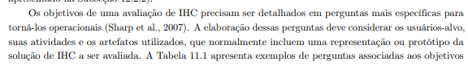
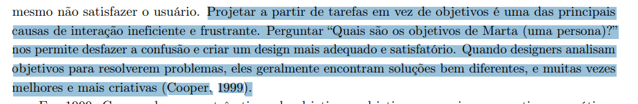
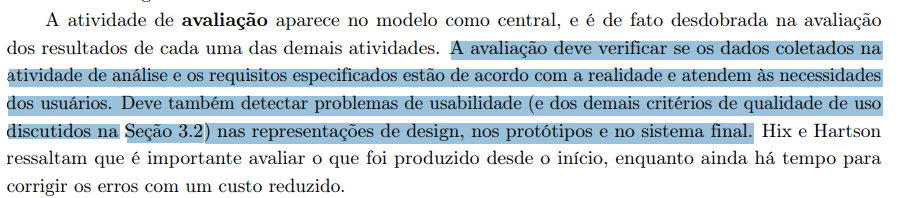
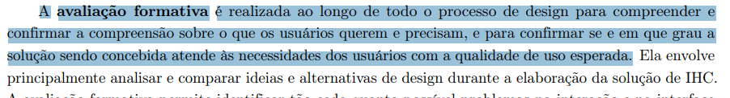
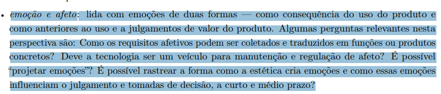
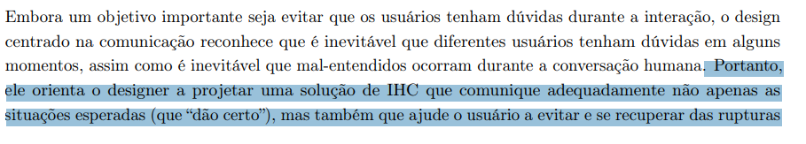
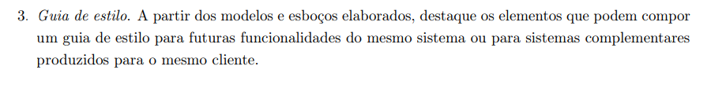
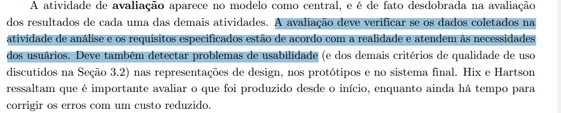

# Metas de Usabilidade

## Introdução

O presente documento tem como objetivo apresentar o planejamento da verificação do artefato relacionado à Metas de Usabilidade

## Lista de Verificação

A tabela a seguir apresenta a lista de verificação das Características da Plataforma. Vale ressaltar que alguns itens presentes na lista são reaproveitados de outras listas de verificação presentes na seção: [Verificações](/docs/category/verificações). A resposta da lista de verificação será preenchida com "Conforme", "Não Conforme", "Não Aplicável" e "Sugestão de Melhoria". 

<b>Tabela 1</b> - Lista de Verificação Metas de Usabilidade

| Categoria | Questão | Resposta | Versão, Data e hora da avaliação | Fonte | Autor(es) |
|-----------|---------|----------|----------------------------------|-------|-----------|
| Objetivos | 1. Os objetivos principais da interface em termos de usabilidade estão definidos de forma clara?|          |          |  Figuras [H.1](./metasDeUsabilidade.md#apêndice-h---características-da-plataforma)(Apêndice H - Metas de Usabilidade) |   [Necivaldo Amaral](https://github.com/junioramaral22) e [Weverton Rodrigues](https://github.com/vevetin)   |
| Objetivos | 2. O sistema considera os objetivos gerais dos usuários ao usar a plataforma?|          |          |   Figuras [H.2](./metasDeUsabilidade.md#apêndice-h---características-da-plataforma)(Apêndice H - Metas de Usabilidade) |   [Paulo Henrique](https://github.com/paulomh) e [Rodrigo Ferreira](https://github.com/rodwendrel) |
| Design da Interface e Interação | 3. Os fatores de qualidade de uso são priorizados no design da plataforma?|          |          |   Figuras [H.3](./metasDeUsabilidade.md#apêndice-h---características-da-plataforma)(Apêndice H - Metas de Usabilidade) |     [Necivaldo Amaral](https://github.com/junioramaral22) |
| Design da Interface e Interação | 4. A interface é fácil de aprender?|          |          |   Figuras [H.4](./metasDeUsabilidade.md#apêndice-h---características-da-plataforma)(Apêndice H - Metas de Usabilidade) |     [Necivaldo Amaral](https://github.com/junioramaral22), [Paulo Henrique](https://github.com/paulomh) e [Rodrigo Ferreira](https://github.com/rodwendrel)|
| Metas de Usabilidade | 5. A interação com o sistema é agradável para o usuário?|          |          |   Figuras [H.5](./metasDeUsabilidade.md#apêndice-h---características-da-plataforma)(Apêndice H - Metas de Usabilidade) | [Weverton Rodrigues](https://github.com/vevetin) |
| Metas de Usabilidade| 6. O sistema oferece mecanismos de recuperação de erros?|          |          |   Figuras [H.6](./metasDeUsabilidade.md#apêndice-h---características-da-plataforma)(Apêndice H - Metas de Usabilidade) | [Rodrigo Ferreira](https://github.com/rodwendrel) |
| Metas de Usabilidade| 7. As metas de usabilidade foram representadas em guias de estilo?|          |          |  Figuras [H.7](./metasDeUsabilidade.md#apêndice-h---características-da-plataforma)(Apêndice H - Metas de Usabilidade) | [Paulo Henrique](https://github.com/paulomh)   |
|  Metas de Usabilidade | 8. A meta de aprendizagem é alcançada no sistema?|          |          |  Figuras [H.8](./metasDeUsabilidade.md#apêndice-h---características-da-plataforma)(Apêndice H - Metas de Usabilidade) | [Rodrigo Ferreira](https://github.com/rodwendrel) e [Necivaldo Amaral](https://github.com/junioramaral22)   |

Autor: [Necivaldo Amaral](https://github.com/junioramaral22) 

## Resultados

Os resultados obtidos através da aplicação da inspeção da lista de verificação serão sumarizados com dados quantitativos e qualitativos, e posteriormente sendo feito um comparativo com os resultados obtidos de inspeções anteriores. Por fim, será disponibilizada a gravação da execução da inspeção.

## Referências Bibliográficas

> \-  Capítulo 3: Concetios Básicos. Autopublicação. ISBN: 978-65-00-19677-1.

> \-  Capítulo 6: Processos de Design de IHC.  Autopublicação. ISBN: 978-65-00-19677-1.

> \-  Capítulo 8: Organização do Espaço de Problema Autopublicação. ISBN: 978-65-00-19677-1.

> \-  Capítulo 11: Planejamento da Avaliação de IHC. Autopublicação. ISBN: 978-65-00-19677-1. 

## Apêndice H - Metas de Usabilidade

<b>Figura H.1 </b>Objetivos Definidos

<b>Fonte:</b> BARBOSA (2021, p. 265, Capítulo 11)

---

<b>Figura H.2 </b>Objetivos gerais

<b>Fonte:</b> BARBOSA (2021, p. 170, Capítulo 8)

---

<b>Figura H.3 </b>Priorização de Design

<b>Fonte:</b> BARBOSA (2021, p. 115, Capítulo 6)

---

<b>Figura H.4 </b>Facilidade Interface

<b>Fonte:</b> BARBOSA (2021, p. 267, Capítulo 11)

---

<b>Figura H.5 </b>Sistema Agradavél

<b>Fonte:</b> BARBOSA (2021, p. 44, Capítulo 3)

---

<b>Figura H.6 </b>Recuperação de Erros

<b>Fonte:</b> BARBOSA (2021, p. 126, Capítulo 6)

---

<b>Figura H.7 </b>Guia de Estilos

<b>Fonte:</b> BARBOSA (2021, p. 259, Capítulo 10)

---

<b>Figura H.8 </b>Meta de Aprendizagem

<b>Fonte:</b> BARBOSA (2021, p. 115, Capítulo 6)

## Histórico de Versão
---
| Versão | Data | Autor(es) | Descrição | Data de Revisão | Revisor(es) |
|:---:|:---:|---|---|:---:|---|
| 1.0 | 03/02/2025 | [Necivaldo Amaral](https://github.com/junioramaral22) | Criação do documento | 03/02/2025 |[Weverton Rodrigues](https://github.com/vevetin)|