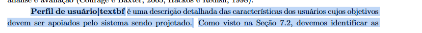
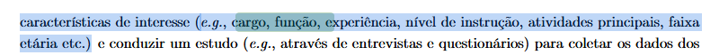
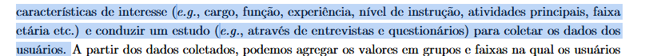
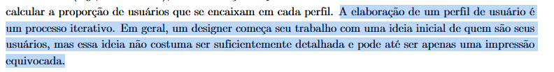

# Perfil do Usuário

## Introdução

O presente documento tem como objetivo apresentar o planejamento da verificação do artefato relacionado ao *Perfil do Usuário*.

## Lista de Verificação

A tabela a seguir apresenta a lista de verificação para *Perfil do Usuário*. A resposta será preenchida com "Conforme", "Não Conforme", "Não Aplicável" e "Sugestão de Melhoria".

<b>Tabela 1</b> - Lista de Verificação de Perfil do Usuário

| Categoria    | Questão | Resposta | Página e Fonte | Autor(es) |
|-------------|---------|----------|----------------|-----------|
| Perfil do Usuário | 1. O perfil de usuário foi detalhadamente elaborado com base nas características dos usuários, como cargo, função, experiência, nível de instrução, atividades principais, faixa etária, etc.? | | BARBOSA, Simone Diniz Junqueira et al. Interação humano-computador e experiência do usuário. 1. ed. Rio de Janeiro: Simone Diniz Junqueira Barbosa, 2021. p. 152. ISBN 978-65-00-19677-1. [G.1](./perfilDoUsuario.md#apêndice-g---perfil-do-usuário) | [Paulo Henrique](https://github.com/paulomh) e [Rodrigo Ferreira](https://github.com/rodwendrel) |
| Perfil do Usuário | 2. Foram realizadas atividades de coleta de dados dos usuários, como entrevistas e questionários, para identificar as características de interesse e construir os perfis de usuário? | |  | [Paulo Henrique](https://github.com/paulomh) e [Rodrigo Ferreira](https://github.com/rodwendrel) | [Necivaldo Amaral](https://github.com/junioramaral22) e [Weverton Rodrigues](https://github.com/vevetin) |
| Perfil do Usuário | 3. O processo de construção do perfil de usuário foi iterativo, com a evolução do entendimento dos usuários ao longo do tempo? | | | [Paulo Henrique](https://github.com/paulomh) e [Rodrigo Ferreira](https://github.com/rodwendrel) | [Paulo Henrique](https://github.com/paulomh) e [Rodrigo Ferreira](https://github.com/rodwendrel) |
| Perfil do Usuário | 4. Os modos de coleta de dados estão presentes? | | | [Necivaldo Amaral](https://github.com/junioramaral22) e [Weverton Rodrigues](https://github.com/vevetin) |
| Perfil do Usuário | 5. O artefato possui o resultado da coleta de dados? | | | [Paulo Henrique](https://github.com/paulomh) e [Rodrigo Ferreira](https://github.com/rodwendrel) |
| Perfil do Usuário | 6. O artefato demonstra a conclusão obtida dos dados coletados? | | | [Necivaldo Amaral](https://github.com/junioramaral22) e [Weverton Rodrigues](https://github.com/vevetin) |

## Resultados

Os resultados obtidos através da aplicação da inspeção da lista de verificação serão sumarizados com dados quantitativos e qualitativos, sendo posteriormente comparados com inspeções anteriores.

## Bibliografia

> **BARBOSA, Simone Diniz Junqueira; et al.** *Interação Humano-Computador e Experiência do Usuário*. 1ª ed. Autopublicação, 2021.

## Apêndice G - Perfil do Usuário

<b>G.1</b>

<b>G.2</b>

<b>G.3</b>

## Histórico de Versão

---
| Versão | Data | Autor(es) | Descrição | Data de Revisão | Revisor(es) |
|:---:|:---:|---|---|:---:|---|
| 1.0 | 03/02/2025 | [Rodrigo Wendrel](https://github.com/rodwendrel) | Criação do documento | 03/02/2025 | [Paulo Henrique](https://github.com/paulomh) |
