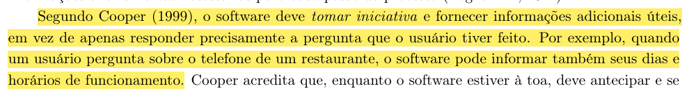
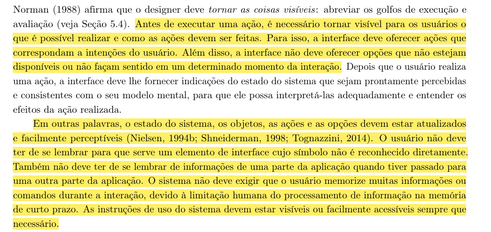

# Princípios Gerais

## Introdução

O presente documento tem como objetivo apresentar o planejamento da verificação do artefato relacionado aos Princípios Gerais do projeto.

## Lista de Verificação

A tabela a seguir apresenta a lista de verificação dos Princípios Gerais do projeto. Vale ressaltar que alguns itens presentes na lista são reaproveitados de outras listas de verificação presentes na seção: [Verificações](/docs/category/verificações). A resposta da lista de verificação será preenchida com "Conforme", "Não Conforme", "Não Aplicável" e "Sugestão de Melhoria". 

<b>Tabela 1</b> - Lista de Verificação Cenários

| Categoria         | Questão | Resposta | Versão, Data e hora da avaliação | Fonte | Autor(es) |
|-------------------|---------|----------|----------------------------------|-------|-----------|
| Princípios Gerais | 1. Uma página dedicada para os princípios gerais do projeto? |          |                                  | BARBOSA, Simone Diniz Junqueira et al. Interação humano-computador e experiência do usuário. 1. ed. Rio de Janeiro: Simone Diniz Junqueira Barbosa, 2021. Capítulo 10: Princípios e Diretrizes para o Design de IHC. Página 238. Autopublicação. ISBN: 978-65-00-19677-1. Figura [F.1](./principiosGerais.md#apêndice-f---princípios-gerais) | [Paulo Henrique](https://github.com/paulomh) e [Rodrigo Ferreira](https://github.com/rodwendrel) |
| Princípios Gerais | 2. Dos princípios gerais abordados, possui um tópico de correspondência com as expectativas do usuário? |          |                                  | BARBOSA, Simone Diniz Junqueira et al. Interação humano-computador e experiência do usuário. 1. ed. Rio de Janeiro: Simone Diniz Junqueira Barbosa, 2021. Capítulo 10: Princípios e Diretrizes para o Design de IHC. Página 238. Autopublicação. ISBN: 978-65-00-19677-1. Figura [F.2](./principiosGerais.md#apêndice-f---princípios-gerais) | [Paulo Henrique](https://github.com/paulomh) e [Rodrigo Ferreira](https://github.com/rodwendrel) |
| Princípios Gerais | 3. Dos princípios gerais abordados, possui um tópico sobre simplicidade nas estruturas das tarefas? |          |                                  | BARBOSA, Simone Diniz Junqueira et al. Interação humano-computador e experiência do usuário. 1. ed. Rio de Janeiro: Simone Diniz Junqueira Barbosa, 2021. Capítulo 10: Princípios e Diretrizes para o Design de IHC. Página 239. Autopublicação. ISBN: 978-65-00-19677-1. Figura [F.3](./principiosGerais.md#apêndice-f---princípios-gerais) | [Necivaldo Amaral](https://github.com/junioramaral22) e [Weverton Rodrigues](https://github.com/vevetin) |
| Princípios Gerais | 4. Dos princípios gerais abordados, possui um tópico sobre equilíbrio entre controle e liberdade do usuário? |          |                                  | BARBOSA, Simone Diniz Junqueira et al. Interação humano-computador e experiência do usuário. 1. ed. Rio de Janeiro: Simone Diniz Junqueira Barbosa, 2021. Capítulo 10: Princípios e Diretrizes para o Design de IHC. Página 240. Autopublicação. ISBN: 978-65-00-19677-1. Figura [F.4](./principiosGerais.md#apêndice-f---princípios-gerais) | [Necivaldo Amaral](https://github.com/junioramaral22) e [Weverton Rodrigues](https://github.com/vevetin) |
| Princípios Gerais | 5. Dos princípios gerais abordados, possui um tópico sobre consistência e padronização? |          |                                  | BARBOSA, Simone Diniz Junqueira et al. Interação humano-computador e experiência do usuário. 1. ed. Rio de Janeiro: Simone Diniz Junqueira Barbosa, 2021. Capítulo 10: Princípios e Diretrizes para o Design de IHC. Página 241-242. Autopublicação. ISBN: 978-65-00-19677-1. Figura [F.5](./principiosGerais.md#apêndice-f---princípios-gerais) e [F.6](./principiosGerais.md#apêndice-f---princípios-gerais) | [Necivaldo Amaral](https://github.com/junioramaral22) e [Weverton Rodrigues](https://github.com/vevetin) |
| Princípios Gerais | 6. Dos princípios gerais abordados, possui um tópico sobre promoção da eficiência do usuário? |          |                                  | BARBOSA, Simone Diniz Junqueira et al. Interação humano-computador e experiência do usuário. 1. ed. Rio de Janeiro: Simone Diniz Junqueira Barbosa, 2021. Capítulo 10: Princípios e Diretrizes para o Design de IHC. Página 242. Autopublicação. ISBN: 978-65-00-19677-1. Figura [F.7](./principiosGerais.md#apêndice-f---princípios-gerais) | [Paulo Henrique](https://github.com/paulomh) e [Rodrigo Ferreira](https://github.com/rodwendrel) |
| Princípios Gerais | 7. Dos princípios gerais abordados, possui um tópico sobre antecipação das necessidades do usuário? |          |                                  | BARBOSA, Simone Diniz Junqueira et al. Interação humano-computador e experiência do usuário. 1. ed. Rio de Janeiro: Simone Diniz Junqueira Barbosa, 2021. Capítulo 10: Princípios e Diretrizes para o Design de IHC. Página 243-244. Autopublicação. ISBN: 978-65-00-19677-1. Figura [F.8](./principiosGerais.md#apêndice-f---princípios-gerais) e [F.9](./principiosGerais.md#apêndice-f---princípios-gerais) | [Paulo Henrique](https://github.com/paulomh) e [Rodrigo Ferreira](https://github.com/rodwendrel) |
| Princípios Gerais | 8. Dos princípios gerais abordados, possui um tópico sobre visibilidade e reconhecimento? |          |                                  | BARBOSA, Simone Diniz Junqueira et al. Interação humano-computador e experiência do usuário. 1. ed. Rio de Janeiro: Simone Diniz Junqueira Barbosa, 2021. Capítulo 10: Princípios e Diretrizes para o Design de IHC. Página 244. Autopublicação. ISBN: 978-65-00-19677-1. Figura [F.10](./principiosGerais.md#apêndice-f---princípios-gerais) |[Necivaldo Amaral](https://github.com/junioramaral22) e [Weverton Rodrigues](https://github.com/vevetin) |
| Princípios Gerais | 9. Dos princípios gerais abordados, possui um tópico sobre conteúdo relevante e expressão adequada? |          |                                  | BARBOSA, Simone Diniz Junqueira et al. Interação humano-computador e experiência do usuário. 1. ed. Rio de Janeiro: Simone Diniz Junqueira Barbosa, 2021. Capítulo 10: Princípios e Diretrizes para o Design de IHC. Página 246. Autopublicação. ISBN: 978-65-00-19677-1. Figura [F.11](./principiosGerais.md#apêndice-f---princípios-gerais) |[Paulo Henrique](https://github.com/paulomh) e [Rodrigo Ferreira](https://github.com/rodwendrel)|
| Princípios Gerais | 10. Dos princípios gerais abordados, possui um tópico sobre projeto para erros? |          |                                  | BARBOSA, Simone Diniz Junqueira et al. Interação humano-computador e experiência do usuário. 1. ed. Rio de Janeiro: Simone Diniz Junqueira Barbosa, 2021. Capítulo 10: Princípios e Diretrizes para o Design de IHC. Página 247. Autopublicação. ISBN: 978-65-00-19677-1. Figura [F.12](./principiosGerais.md#apêndice-f---princípios-gerais) |[Necivaldo Amaral](https://github.com/junioramaral22) e [Weverton Rodrigues](https://github.com/vevetin)|

Autor: [Paulo Henrique](https://github.com/paulohm) 

## Resultados

Os resultados obtidos através da aplicação da inspeção da lista de verificação serão sumarizados com dados quantitativos e qualitativos, e posteriormente sendo feito um comparativo com os resultados obtidos de inspeções anteriores. Por fim, será disponibilizada a gravação da execução da inspeção.

## Bibliografia

> \- BARBOSA, Simone, et al. Interação Humano-Computador e Experiência do Usuário. Leanpub, 2022. Disponível em: https://leanpub.com/ihc-ux. Acesso em: 09 dez. 2024.

## Apêndice F - Princípios Gerais

<b>Figura F.1</b> - Princípios Gerais

<b>Figura F.2</b> - Tópico correspondência com as expectativas do usuário

<b>Figura F.3</b> - Tópico simplicidade nas estruturas das tarefas

<b>Figura F.4</b> - Tópico equilíbrio entre controle e liberdade do usuário

<b>Figura F.5</b> - Tópico consistência e padronização

<b>Figura F.6</b> - Tópico promoção da eficiência do usuário

<b>Figura F.7</b> - Tópico antecipação das necessidades do usuário

<b>Figura F.8</b> - Tópico visibilidade e reconhecimento

<b>Figura F.9</b> - Tópico projeto para erros

<b>Figura F.10</b> - Tópico correspondência com as expectativas do usuário

<b>Figura F.11</b> - Tópico correspondência com as expectativas do usuário

<b>Figura F.12</b> - Tópico correspondência com as expectativas do usuário

## Histórico de Versão
---
| Versão | Data | Autor(es) | Descrição | Data de Revisão | Revisor(es) |
|:---:|:---:|---|---|:---:|---|
| 1.0 | 02/02/2025 | [Paulo Henrique](https://github.com/paulomh) | Criação do documento | 02/02/2025 | [Rodrigo Ferreira](https://github.com/rodwendrel)|