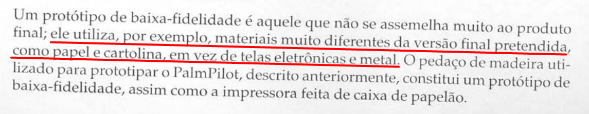
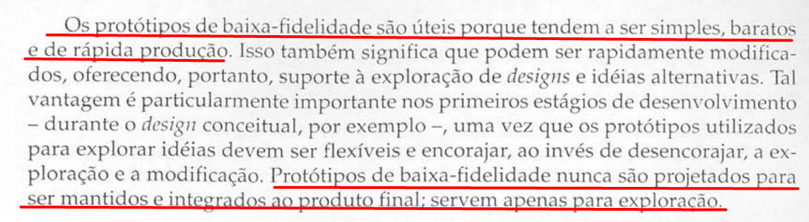
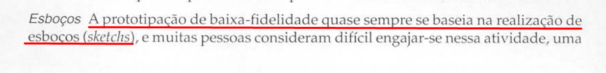
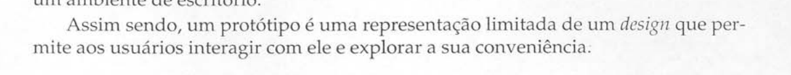

# Protótipo de Papel

## Introdução

O presente documento tem como objetivo apresentar o planejamento da verificação do artefato relacionado aos Protótipo de Papel.

## Lista de Verificação

A tabela a seguir apresenta a lista de verificação dos Protótipo de Papel. Vale ressaltar que alguns itens presentes na lista são reaproveitados de outras listas de verificação presentes na seção: [Verificações](/docs/category/verificações). A resposta da lista de verificação será preenchida com "Conforme", "Não Conforme", "Não Aplicável" e "Sugestão de Melhoria". 

<b>Tabela 1</b> - Lista de Verificação Cenários

| Categoria          | Questão | Resposta | Versão, Data e hora da avaliação | Fonte | Autor(es) |
|--------------------|---------|----------|----------------------------------|-------|-----------|
| Protótipo de Papel | 1. Uma página dedicada explicando os prótipo de papel?        |          |                                  |       | [Paulo Henrique](https://github.com/paulomh) e [Rodrigo Ferreira](https://github.com/rodwendrel) |
| Protótipo de Papel | 2. O(s) protótipo(s) de papel foram feitos à mão ou utilizando ferramentas digitais apropriadas? Ex: Marvel App.         |          |                                  | PREECE, Jenny; ROGERS, Yvonne; SHARP, Helen. Interaction design: beyond human-computer interaction. 1. ed. New York: J. Wiley & Sons, 2002. Capítulo 08: Design, Prototipação e Construção. Página 262. [A.1](./prototipoPapel.md#apêndice-a---protótipo-de-papel) | [Paulo Henrique](https://github.com/paulomh) e [Rodrigo Ferreira](https://github.com/rodwendrel) |
| Protótipo de Papel | 3. São simples e objetivos?         |          |                                  |  PREECE, Jenny; ROGERS, Yvonne; SHARP, Helen. Interaction design: beyond human-computer interaction. 1. ed. New York: J. Wiley & Sons, 2002. Capítulo 08: Design, Prototipação e Construção. Página 263. [A.2](./prototipoPapel.md#apêndice-a---protótipo-de-papel) | [Paulo Henrique](https://github.com/paulomh) e [Rodrigo Ferreira](https://github.com/rodwendrel) |
| Protótipo de Papel | 4. O(s) protótipo(s) de papel são apenas esboços conceituais?         |          |                                  | REECE, Jenny; ROGERS, Yvonne; SHARP, Helen. Interaction design: beyond human-computer interaction. 1. ed. New York: J. Wiley & Sons, 2002. Capítulo 08: Design, Prototipação e Construção. Página 263. [A.3](./prototipoPapel.md#apêndice-a---protótipo-de-papel) | [Necivaldo Amaral](https://github.com/junioramaral22) e [Weverton Rodrigues](https://github.com/vevetin) |
| Protótipo de Papel | 5. Foram feitos pensando na interação do usuário com a tarefa?        |          |                                  | REECE, Jenny; ROGERS, Yvonne; SHARP, Helen. Interaction design: beyond human-computer interaction. 1. ed. New York: J. Wiley & Sons, 2002. Capítulo 08: Design, Prototipação e Construção. Página 261. [A.4](./prototipoPapel.md#apêndice-a---protótipo-de-papel) | [Necivaldo Amaral](https://github.com/junioramaral22) e [Weverton Rodrigues](https://github.com/vevetin) |
| Protótipo de Papel | 6. A quantidade de protótipos é igual ao número de membros?        |          |                                  |       | [Necivaldo Amaral](https://github.com/junioramaral22) e [Weverton Rodrigues](https://github.com/vevetin) |

Autor: [Paulo Henrique](https://github.com/paulohm) 

## Resultados

Os resultados obtidos através da aplicação da inspeção da lista de verificação serão sumarizados com dados quantitativos e qualitativos, e posteriormente sendo feito um comparativo com os resultados obtidos de inspeções anteriores. Por fim, será disponibilizada a gravação da execução da inspeção.

## Bibliografia

> \- PREECE, Jenny; ROGERS, Yvonne; SHARP, Helen. Interaction design: beyond human-computer interaction. 1. ed. New York: J. Wiley & Sons, 2002. Capítulo 08: Design, Prototipação e Construção. Disponível em: libgen.li/file.php?md5=02236874c9b62b7d9aed9ec21639968a. Acesso em: 02 jan. 2025.

## Apêndice A - Protótipo de Papel

<b>A.1</b> - Modo como o protótipo foi feito

<b>A.2</b> - Simplicidade dos protótipos

<b>A.3</b> - Esboço conceitual da tarefa

<b>A.4</b> - Interação do usuário satisfatória

## Histórico de Versão
---
| Versão | Data | Autor(es) | Descrição | Data de Revisão | Revisor(es) |
|:---:|:---:|---|---|:---:|---|
| 1.0 | 02/02/2025 | [Paulo Henrique](https://github.com/paulomh) | Criação do documento | 02/02/2025 | [Rodrigo Ferreira](https://github.com/rodwendrel)|