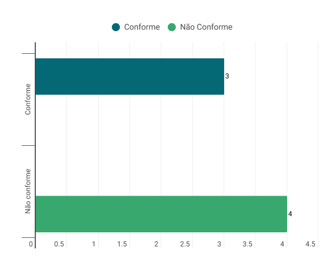

# Características da Plataforma - Verificação Grupo 07

## Introdução

O presente documento tem como objetivo apresentar a execução da verificação do artefato relacionado as Características da Plataforma do grupo 07.

## Lista de Verificação

<b>Tabela 1</b> - Lista de Verificação Características da Plataforma do grupo 07

| Categoria | Questão | Resposta | Versão, Data e hora da avaliação | Fonte | Autor(es) |
|-----------|---------|----------|----------------------------------|-------|-----------|
| Objetivos | 1. A plataforma possui objetivos claramente definidos que atendem às necessidades dos usuários?|     conforme     |   v1.1, 03/02/2025, 18:55        | |    |
| Objetivos | 2. A plataforma tem um modelo conceitual que o usuário consegue apreender rapidamente?|    conforme      |  v1.1, 03/02/2025, 18:56         | |   |
| Design da Interface e Interação | 3. A interface da plataforma utiliza uma linguagem familiar ao usuário?|    conforme      |     v1.1, 03/02/2025, 18:58      |  |      |
| Design da Interface e Interação | 4. A plataforma fornece instruções claras sobre como utilizar suas funcionalidades?|    não conforme      |      v1.1, 03/02/2025, 19:00     |  |   |
| Design da Interface e Interação | 5. A navegação na plataforma é intuitiva e eficiente?|  não conforme        |   v1.1, 03/02/2025, 19:02        | | |
| Design da Interface e Interação | 6. A plataforma previne erros de interação e oferece mecanismos de recuperação?|     não conforme     | v1.1, 03/02/2025, 19:05         | |  |
| Contexto e Uso da Plataforma | 7. A plataforma é adaptável aos diferentes níveis de conhecimento dos usuários?|    não conforme      |    v1.1, 03/02/2025, 19:07      | |    |
| Contexto e Uso da Plataforma | 8. A plataforma monitora o feedback dos usuários para identificar oportunidades de melhoria?|     não conforme     |   v1.1, 03/02/2025, 19:09       |  |  |

Autor: [Necivaldo Amaral](https://github.com/junioramaral22) 

## Resultados

Os resultados obtidos através da aplicação da inspeção da lista de verificação serão sumarizados com dados quantitativos e qualitativos. Por fim, será disponibilizada a gravação da execução da inspeção.

Gráfico do Resultado

## Video da Verificação 

<iframe width="560" height="315" src="https://www.youtube.com/embed/Svcg_H4ZQGM?si=L5NX8Fjyn4RtfkWT" title="YouTube video player" frameborder="0" allow="accelerometer; autoplay; clipboard-write; encrypted-media; gyroscope; picture-in-picture; web-share" referrerpolicy="strict-origin-when-cross-origin" allowfullscreen></iframe>

Autor: [Necivaldo Amaral](https://github.com/junioramaral22)

## Bibliografia

> \- BARBOSA, Simone, et al. Interação Humano-Computador e Experiência do Usuário. Leanpub, 2022. Disponível em: https://leanpub.com/ihc-ux. Acesso em: 09 dez. 2024.

## Histórico de Versão
---
| Versão | Data | Autor(es) | Descrição | Data de Revisão | Revisor(es) |
|:---:|:---:|---|---|:---:|---|
| 1.0 | 03/02/2025 | [Necivaldo Amaral](https://github.com/junioramaral22) | Criação do documento | 03/02/2025 |[Rodrigo Ferreira](https://github.com/rodwendrel)|