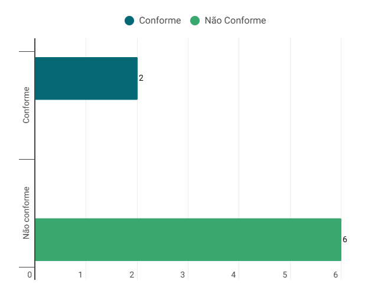

# Metas de Usabilidade - Execução da Verificação Interna

## Introdução

O presente documento tem como objetivo apresentar a execução da verificação do artefato relacionado as Metas De Usabilidade.

## Lista de Verificação

<b>Tabela 1</b> - Lista de Verificação Metas de Usabilidade

| Categoria | Questão | Resposta | Versão, Data e hora da avaliação | Fonte | Autor(es) |
|-----------|---------|----------|----------------------------------|-------|-----------|
| Objetivos | 1. Os objetivos principais da interface em termos de usabilidade estão definidos de forma clara?|    conforme      |  v1.1, 03/02/2025, 19:10      | |    |
| Objetivos | 	2. O sistema considera os objetivos gerais dos usuários ao usar a plataforma?|     não conforme     | v1.1, 03/02/2025, 19:12          | |   |
| Design da Interface e Interação | 3. Os fatores de qualidade de uso são priorizados no design da plataforma?|  conforme        |    v1.1, 03/02/2025, 19:15      |  |      |
| Design da Interface e Interação | 4. A interface é fácil de aprender?|  não conforme        | v1.1, 03/02/2025, 19:17          |  |   |
| Design da Interface e Interação | 5. A interação com o sistema é agradável para o usuário?|    não conforme      | v1.1, 03/02/2025, 19:18 | | |
| Design da Interface e Interação | 6. O sistema oferece mecanismos de recuperação de erros?|    não conforme      |  v1.1, 03/02/2025, 19:20        | |  |
| Contexto e Uso da Plataforma | 7. As metas de usabilidade foram representadas em guias de estilo?|    não conforme      |   v1.1, 03/02/2025, 19:21       | |    |
| Contexto e Uso da Plataforma | 8. A meta de aprendizagem é alcançada no sistema?|    não conforme      |    v1.1, 03/02/2025, 19:22      |  |  |

Autor: [Necivaldo Amaral](https://github.com/junioramaral22) 

## Resultados

Os resultados obtidos através da aplicação da inspeção da lista de verificação serão sumarizados com dados quantitativos e qualitativos. Por fim, será disponibilizada a gravação da execução da inspeção.

Gráfico do Resultado

## Video da Verificação 

<iframe width="560" height="315" src="https://www.youtube.com/embed/mRh10dXz_jw?si=GK4Th5Pn2ZkQIHWr" title="YouTube video player" frameborder="0" allow="accelerometer; autoplay; clipboard-write; encrypted-media; gyroscope; picture-in-picture; web-share" referrerpolicy="strict-origin-when-cross-origin" allowfullscreen></iframe>

Autor: [Necivaldo Amaral](https://github.com/junioramaral22)

## Bibliografia

> \- BARBOSA, Simone, et al. Interação Humano-Computador e Experiência do Usuário. Leanpub, 2022. Disponível em: https://leanpub.com/ihc-ux. Acesso em: 09 dez. 2024.

## Histórico de Versão
---
| Versão | Data | Autor(es) | Descrição | Data de Revisão | Revisor(es) |
|:---:|:---:|---|---|:---:|---|
| 1.0 | 03/02/2025 | [Necivaldo Amaral](https://github.com/junioramaral22) | Criação do documento | 03/02/2025 |[Rodrigo Ferreira](https://github.com/rodwendrel)|