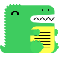

# Ferramentas

## Introdução

Esta seção tem como objetivo apresentar as ferramentas que serão utilizadas ao longo do projeto da disciplina, facilitando a organização e gerenciamento da equipe, bem como sua finalidade.

## Ferramentas utilizadas

|         | Ferramenta | Finalidade |
|---------|------------|------------|
|  | GitHub | Organizar, versionar e documentar os artefatos produzidos que estarão hospedados no Github Pages do projeto.1  |
|  | Visual Studio Code | Manipulação dos arquivos de documentação.3 |
|  | Microsoft Teams | Realização de reuniões e gravação das apresentações.3 |
|  | WhatsApp | Aplicativo utilizado para comunicação diária entre os membros do grupo.4 |
|  | Figma | Desenvolvimento dos protótipos de baixa e alta fidelidade. |
|  | Planilhas Google | Criação e organização do heatmap da equipe.5 |
|  | Google Docs | Elaboração de documentos para entrega externa do repositório.6 |
|  | Docusaurus | Utilizado para criação da página de documentação do projeto.7 |
|  | Draw.io | Elaboração de diagramas.8 |
|  | YouTube | Hospedar as gravações das reuniões e apresentações das etapas.9 |

## Bibliografia

> 1. GitHub. Disponível em: [https://docs.github.com/pt](https://docs.github.com/pt). Acesso em: 07 de novembro de 2024.
> 2. Visual Studio Code. Disponível em: [https://code.visualstudio.com/](https://code.visualstudio.com/). Acesso em: 07 de novembro de 2024.
> 3. Microsoft Teams. Disponível em: [https://www.microsoft.com/pt-br/microsoft-teams/group-chat-software](https://www.microsoft.com/pt-br/microsoft-teams/group-chat-software). Acesso em: 07 de novembro de 2024.
> 4. WhatsApp. Disponível em: [https://www.whatsapp.com/](https://www.whatsapp.com/). Acesso em: 07 de novembro de 2024.
> 5. Planilhas Google. Disponível em: [https://www.google.com/sheets/about/](https://www.google.com/sheets/about/). Acesso em: 07 de novembro de 2024.
> 6. Google Docs. Disponível em: [https://www.google.com/docs/about/](https://www.google.com/docs/about/). Acesso em: 07 de novembro de 2024.
> 7. Docusaurus. Disponível em: [https://docusaurus.io/](https://docusaurus.io/). Acesso em: 07 de novembro de 2024.
> 8. Draw.io. Disponível em: [https://app.diagrams.net/](https://app.diagrams.net/). Acesso em: 07 de novembro de 2024.
> 9. YouTube. Disponível em: [https://www.youtube.com/](https://www.youtube.com/). Acesso em: 07 de novembro de 2024.

