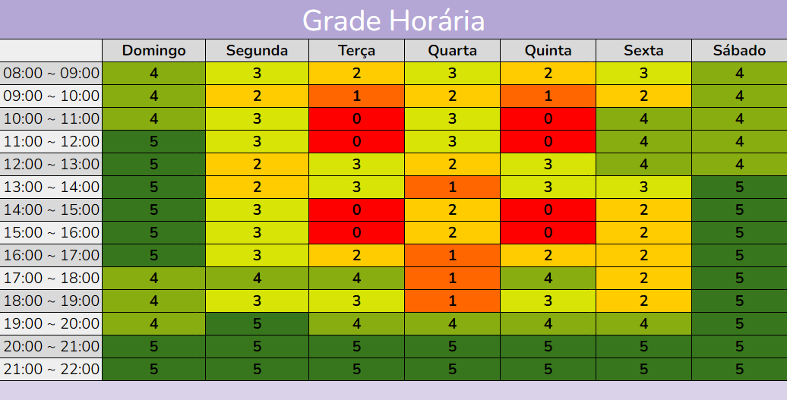

# Heatmap

## Introdução

Os mapas de calor fornecem visualização de dados, facilitando a descoberta de insights acionáveis e a identificação do comportamento do usuário. Um mapa de calor mostra dados financeiros em um formato visual e usa esquemas de cores em vez de números para descrever comportamentos e tendências. Com uma escala de cores que indica diferentes valores, os mapas de calor tornam-se mais intuitivos e fáceis de entender, permitindo que os padrões sejam reconhecidos de forma rápida e eficiente [1](../planejamento/heatmap.md#referências-bibliográficas).

## Objetivo

No contexto de websites, essa representação gráfica é essencial para detectar o que funciona e o que não funciona em um site ou página, e com quais partes e elementos de uma página os usuários se engajam. Ela facilita tanto a leitura quanto a interpretação de grandes volumes de dados, permitindo que uma vasta quantidade de informações seja compreendida de maneira simplificada e imediata." [2](../planejamento/heatmap.md#referências-bibliográficas).

## Metodologia 

Neste documento será apresentado um modelo de heatmap adaptado para o contexto de disponibilidade de tempo dos membros do projeto. Este modelo identifica os períodos onde há a maior quantidade de membros disponíveis para reuniões e atividades do projeto, sendo possível identificar os melhores dias e horários para fazer reuniões relacionadas às entregas das etapas, por exemplo.

Utilizando o Google Planilhas para a criação do heatmap, cada membro preencheu individualmente uma planilha com os horários disponíveis para reuniões e atividades do projeto. Feito o preenchimento, foi gerado um quadro geral com disponibilidade de todos da equipe. A figura 1 ilustra o quadro de disponibilidade de horários dos membros do projeto.

<b>Figura 1</b> - Mapa de calor, onde <b>0</b> indica que nenhum membro está disponível e <b>5</b> indica que todos os membros estão disponíveis naquela dia e horário.

<b>Autor:</b> [Paulo Henrique](https://github.com/paulomh)

## Resultados

Com os dados expressos na figura 1, observa-se que todos os membros possuem disponibilidade para reuniões em todos os dias da semana, das 20h às 22h. Entretanto, serão utilizados, no máximo, dois dias por semana para reuniões de planejamento e/ou gravação da etapa e os demais dias para atividades individuais, evitando sobrecarga e garantindo a qualidade das entregas.

## Referências Bibliográficas

> 1. MAILCHIMP. What is a heat map?. Disponível em: [https://mailchimp.com/pt-br/resources/what-is-a-heat-map/](https://mailchimp.com/pt-br/resources/what-is-a-heat-map/). Acesso em: 04 nov. 2024.

> 2. HOTJAR. Mapas de calor. Disponível em: [https://www.hotjar.com/pt-BR/mapas-de-calor/](https://www.hotjar.com/pt-BR/mapas-de-calor/). Acesso em: 04 nov. 2024.

## Histórico de Versão
---
| Versão | Data | Autor(es) | Descrição | Data de Revisão | Revisor(es) |
|:---:|:---:|---|---|:---:|---|
| 1.0 | 09/11/2024 | [Paulo Henrique](https://github.com/paulomh) | Criação do cronograma | 09/11/2024 | [Paulo Henrique](https://github.com/paulomh), [Pedro Luiz](https://github.com/pedroluizfo), [Necivaldo Amaral](https://github.com/junioramaral22), [Rodrigo Wendrel](https://github.com/rodwendrel), [Weverton Rodrigues](https://github.com/vevetin)  |
| 1.0.1 | 20/11/2024 | [Paulo Henrique](https://github.com/paulomh) | Adicionado autor na imagem. | 20/11/2024 | [Paulo Henrique](https://github.com/paulomh), [Pedro Luiz](https://github.com/pedroluizfo), [Necivaldo Amaral](https://github.com/junioramaral22), [Rodrigo Wendrel](https://github.com/rodwendrel), [Weverton Rodrigues](https://github.com/vevetin)  |

