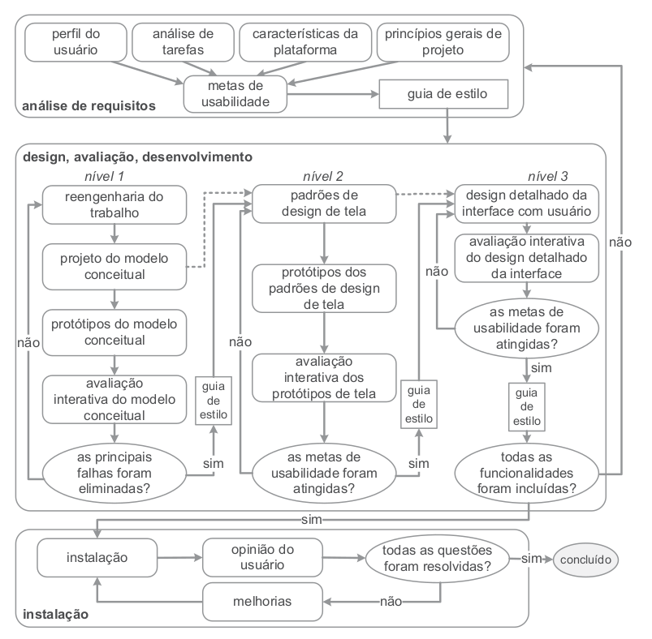
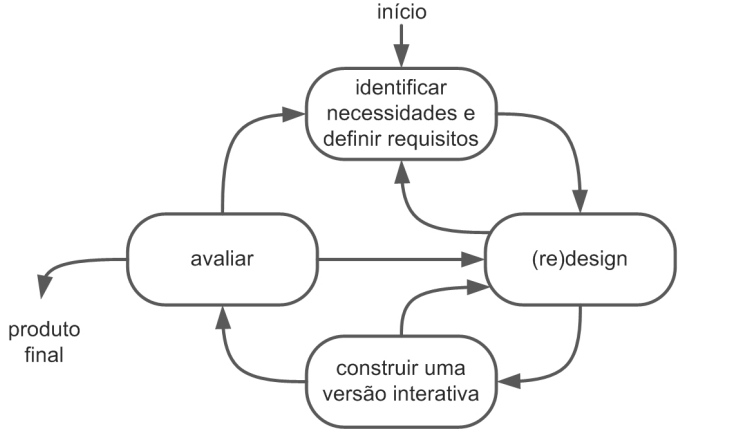
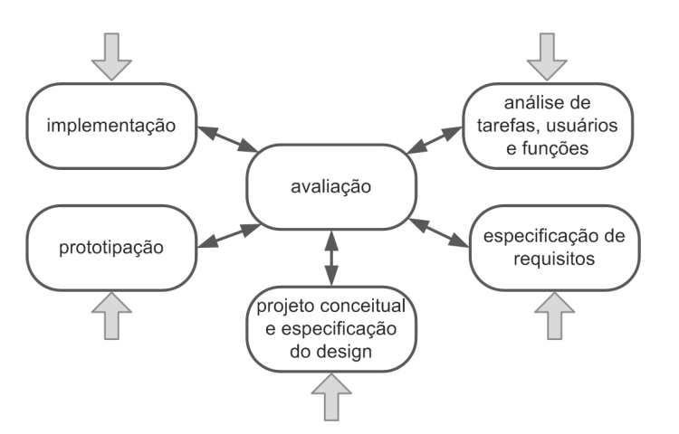

import Tabs from '@theme/Tabs';
import TabItem from '@theme/TabItem';

# Processo de Design

## Introdução

O design pode ser definido de forma básica como um processo com três atividades: Análise da situação atual,
a síntese de uma intervenção e a avaliação da nova situação. Cada uma delas com suas maneiras e ordens de
serem serem executadas durante o processo de forma iterativa, permitindo um aprimoramento constante dos artefatos.

## Engenharia de Usabilidade de Mayhew

**O processo de design escolhido pela equipe se trata da Engenharia de Usabilidade de Mayhew**, que é dividido em três etapas, sendo elas:
Análise de requisitos, Design, Avaliação, Desenvolvimento e Instalação. A escolha deste processo deve-se ao seu ciclo de execução
ser completo e abranger diversos detalhes que podem auxiliar a equipe com o planejamento e execução do projeto. No nosso caso,
apenas a etapa de instalação será utilizada, visto que as etapas anteriores são melhores aplicadas em sistemas que estão sendo desenvolvidos
e assim, não pertencendo ao escopo da disciplina de IHC onde trabalharemos em um site já construído.

 
<small>(Capítulo 6, ítem 6.3.3, Figura 6.7, página 106, Interação Humano-Computador e Experiência do Usuário, Simone Barbosa e Bruno Santana)</small>

## Outros Ciclos de Vida

### Ciclo de Vida Simples

Esse ciclo de vida organiza o desenvolvimento de forma mais prática e direta, com foco na criação de uma versão inicial e depois em melhorias. A cada rodada, o designer faz ajustes, podendo refinar o design várias vezes até chegar a um resultado satisfatório. Por ter poucas etapas definidas, ele é ideal para designers com experiência, que já sabem como lidar com a ausência de detalhes mais específicos nas etapas.

 
<small>(Capítulo 4, Figura 4.4, página 102, Interação Humano-Computador, Simone Barbosa e Bruno Santana, 2010)</small>

### Ciclo de Vida em Estrela
O ciclo em estrela é flexível e permite que o designer comece por qualquer etapa do processo. A principal regra é que, depois de completar cada atividade, o designer revise o que foi feito para garantir qualidade e alinhamento com os objetivos. Esse ciclo divide o processo de criação em fases como conceituação, prototipagem e implementação, proporcionando um pouco mais de estrutura em relação ao ciclo simples, mas ainda exigindo uma boa dose de experiência do designer, já que também não há um roteiro detalhado.

 

<small>(Capítulo 4, Figura 4.5, página 103, Interação Humano-Computador, Simone Barbosa e Bruno Santana, 2010)</small>

### Ciclo de Vida de Nielsen
Nielsen aborda o desenvolvimento com foco na usabilidade, destacando que algumas atividades essenciais precisam estar presentes em todas as fases do ciclo de vida de um produto. Sendo as atividades:

1. Conhecer o usuário;
2. Realizar uma análise competitiva (examinar produtos com funcionalidades semelhantes);
3. Definir as metas de usabilidade;
4. Fazer designs paralelos (criar alternativas de design);
5. Adotar o design participativo (acesso da equipe a usuários representativos do público-alvo);
6. Fazer o design coordenado da interface como um todo (design de todos os elementos da interface, como documentação, sistema de ajuda, etc.);
7. Aplicar diretrizes e análise heurística;
8. Fazer protótipos;
9. Realizar testes empíricos;
10. Praticar design iterativo (correção de problemas durante as iterações de design e avaliação).

## Bibliografia

> \- Processos de Design de IHC Capítulo 6, Interação Humano-Computador e Experiência do Usuário, Simone Barbosa e Bruno Santana

## Histórico de Versão

---

| Versão |    Data    | Autor(es)                                        | Descrição                | Data de Revisão | Revisor(es) |
| :----: | :--------: | ------------------------------------------------ | ------------------------ | :-------------: | ----------- |
|  1.0   | 07/11/2024 | [Rodrigo Wendrel](https://github.com/rodwendrel), [Necivaldo Amaral](https://github.com/junioramaral22) | Criação do documento     |                 |             |
