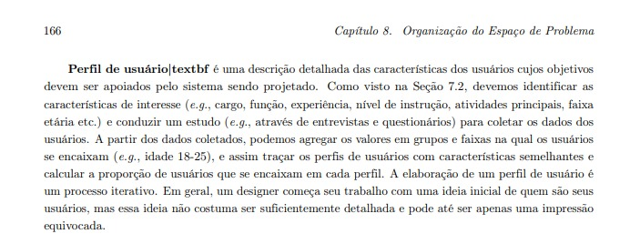
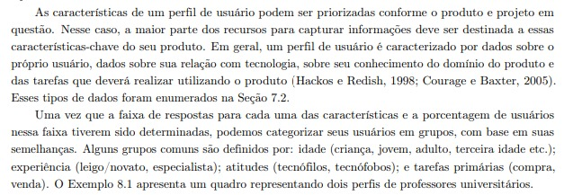
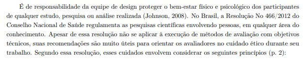
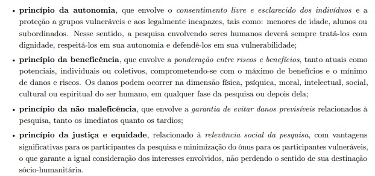
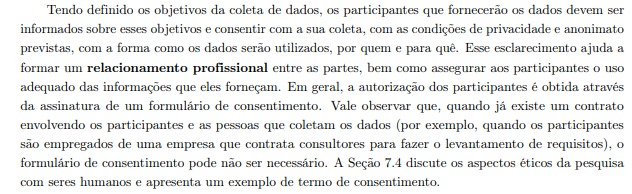
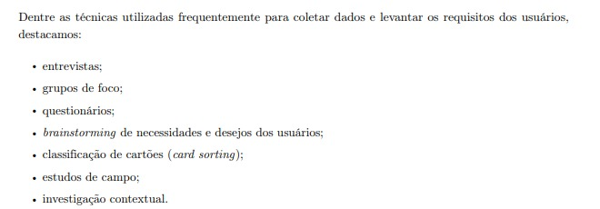
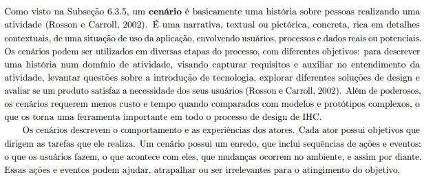
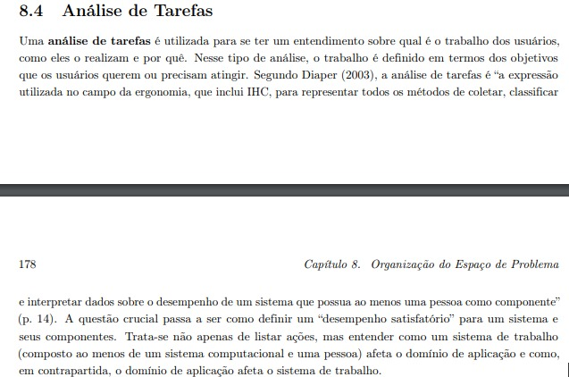
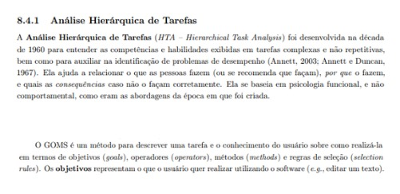

# Execução dos Itens do Desenvolvimento do Projeto

## Introdução

A execução da verificação dos itens do desenvolvimento do projeto norteiam o avaliador para que os artefatos produzidos na etapa sejam verificados e sua qualidade seja mantida. Nesta fase, são verificados os artefatos produzidos ao longo do projeto, assegurando que atendam aos requisitos estabelecidos e estejam livres de defeitos. A verificação é essencial para identificar e corrigir problemas precocemente, evitando retrabalho.

## Objetivo

O objetivo deste documento é apresentar a execução da verificação dos itens do desenvolvimento do projeto, verificando se os artefatos produzidos durante a etapa estão de acordo com uma lista de verificação disponibilizada no plano de ensino da disciplina.

## Lista de Verificação

<b>Tabela 1</b> - Itens do Desenvolvimento do Projeto

| O github pages possui:                                                                                                                            | Resposta | Versão, Data e hora da avaliação | Observação |
| ------------------------------------------------------------------------------------------------------------------------------------------------- | -------- | -------------------------------- | ---------- |
| 1 – O histórico de versão padronizado?                                                                                                            |       Sim     |               v1.0, 03/12/2024, 20:00                    |            |
| 2 – O(s) autor(es) e o(s) revisor(es) para cada artefato?                                                                                         |       Sim   |               v1.0, 03/12/2024, 20:00                |            |
| 3 – Referências bibliográficas e/ou bibliografia em todos os artefatos?                                                                           |  Sim        |        v1.0, 03/12/2024, 20:05                          |            |
| 4 – As tabelas e imagens possuem legenda e fonte e elas chamadas dentro do texto?                                                                 |    Sim      |         v1.0, 03/12/2024, 20:09                         |            |
| 5 – Um texto fazendo uma introdução dos artefatos?                                                                                                |    Sim      |           v1.0, 03/12/2024, 20:12                       |            |
| 6 – O cronograma executado com quem realizou cada artefato/atividade com as datas de início e fim da construção/realização do artefato/atividade. |   Sim       |             v1.0, 03/12/2024, 20:06                     |            |
| 7 – Ata(s) da(s) reuniões (com data, horário de início e do final, participantes, objetivo, atividades definidas etc).                            |     Sim     |           v1.0, 03/12/2024, 20:14                       |            |
| 8 – A gravação da reunião do grupo.                                                                                                               |  Sim        |        v1.0, 03/12/2024, 20:15                         |            |
| 9 – Vídeo de apresentação na categoria “não listado” no YouTube?                                                                                  |     Sim     |                        v1.0, 03/12/2024, 20:17          |            |
| 10 – O perfil do usuário?                                                                                                                         |  Sim        |      v1.0, 03/12/2024, 20:20                            |            |
| 11 – O perfil do usuário possui os atributos de um perfil.                                                                                        |          |      Sim                            |    v1.0, 03/12/2024, 20:22        |
| 12 – O perfil do usuário define os grupos de atributos apresentados no capítulo 8 - Organização do Espaço de Problema?                            |    Sim      |   v1.0, 03/12/2024, 20:26                               |            |
| 13 – Considera aspectos Éticos de Pesquisas Envolvendo Pessoas?                                                                                   |  Sim        |       v1.0, 03/12/2024, 20:29                           |            |
| 14 – Os 4 princípios (da autonomia, da beneficência, princípio da não maleficência e da justiça e equidade)?                                      |  Sim        |               v1.0, 03/12/2024, 20:32                   |            |
| 15 – Que solicitará a permissão para gravar a voz ou imagem de qualquer pessoa, antes de começar a gravação?                                      |     Sim     |      v1.0, 03/12/2024, 20:34                            |            |
| 16 – O termo de consentimento livre e esclarecido dos participantes?                                                                              |  Sim        |           v1.0, 03/12/2024, 20:35                       |            |
| 17 – Foram utilizadas no mínimo duas técnicas para coletar dados e levantar os requisitos dos usuários (quanto mais melhor)?                      |      Sim    |             v1.0, 03/12/2024, 20:38                    |            |
| 18 – Os Cenários?                                                                                                                                 |     Sim     |            v1.0, 03/12/2024, 20:40                      |            |
| 19 – A análise de tarefas?                                                                                                                        |   Sim       |           v1.0, 03/12/2024, 20:42                       |            |
| 20 – Uma atividade para cada integrante do grupo que deve estar modelizado em ao menos duas técnicas para especificar as tarefas?                 |     Sim     |                v1.0, 03/12/2024, 20:45                  |            |
| 21 – Utilizaram alguma técnica para especificar as tarefas?                                                                                       |  Sim        |                             v1.0, 03/12/2024, 20:50     |            |

# Lista de Verificação (Itens Membros do Grupo)

<b>Tabela 1</b> - Itens do Desenvolvimento do Projeto (Membros)

| O GitHub Pages possui:                                                                                       | Resposta  | Versão, Data e Hora da Avaliação | Observação   | Autor(es)  |
|-------------------------------------------------------------------------------------------------------------|-----------|----------------------------------|--------------|------------|
| 1. Foram definidas políticas de privacidade dos dados coletados?                                           |      Sim     |          v1.0, 03/12/2024, 20:10                          ||     [Pedro Luiz](https://github.com/pedroluizfo)        |
| 2. O termo de consentimento prevê o interrompimento da entrevista a qualquer momento?                      |    Sim       |              v1.0, 03/12/2024, 20:10                    |       |           [Necivaldo Amaral](https://github.com/junioramaral22)
      |
| 3. A política de privacidade é clara ao passar informações?                                                |      Sim     |                v1.0, 03/12/2024, 20:10                  |        |            [Paulo Henrique](https://github.com/paulomh), [Weverton Rodrigues](https://github.com/vevetin)
       |
| 4. O perfil do usuário considera restrições de acessibilidade (ex.: dificuldades de visão, audição ou limitações motoras)? |      Sim     |                  v1.0, 03/12/2024, 20:10                |       |             [Weverton Rodrigues](https://github.com/vevetin)
      |
| 5. O perfil do usuário divide os dados coletados em grupos etários?                                        |      Sim     |                v1.0, 03/12/2024, 20:10                  |        |            [Pedro Luiz](https://github.com/pedroluizfo)
      |
| 6. O perfil do usuário considera variáveis como nível de alfabetização tecnológica ou experiência com ferramentas digitais? |     Sim      |                v1.0, 03/12/2024, 20:10                  |       |            [Rodrigo Wendrel](https://github.com/rodwendrel), [Necivaldo Amaral](https://github.com/junioramaral22)
     |
| 7. O questionário de perfil de usuário coleta dados relevantes quanto ao contexto do sistema escolhido?    |     Sim      |               v1.0, 03/12/2024, 20:10                   |      |             [Rodrigo Wendrel](https://github.com/rodwendrel)       |
| 8. Cada persona está associada a um fluxo de uso típico do sistema?                                        |      Sim     |                v1.0, 03/12/2024, 20:10                  |     |               [Weverton Rodrigues](https://github.com/vevetin)      |
| 9. A persona possui classificação?                                                                         |     Sim      |                v1.0, 03/12/2024, 20:10                   |       |             [Pedro Luiz](https://github.com/pedroluizfo)      |
| 10. As personas incluem objetivos e motivações que influenciam o comportamento do usuário no sistema?       |    Sim       |                  v1.0, 03/12/2024, 20:15                 |       |            [Weverton Rodrigues](https://github.com/vevetin)       |
| 11. Os cenários consideram mudanças contextuais e imprevistos durante a interação do usuário?               |     Sim      |                  v1.0, 03/12/2024, 20:10                 |       |             [Paulo Henrique](https://github.com/paulomh)      |
| 12. Os cenários possuem modelo?                                                                             |     Sim      |                   v1.0, 03/12/2024, 20:10                |                    | [Necivaldo Amaral](https://github.com/junioramaral22), [Paulo Henrique](https://github.com/paulomh)     |
| 13. Os cenários são representativos quanto à funcionalidade apresentada?                                    |     Sim      |                   v1.0, 03/12/2024, 20:10                |                   | [Pedro Luiz](https://github.com/pedroluizfo), [Weverton Rodrigues](https://github.com/vevetin)      |
| 14. A análise explora alternativas ou atalhos que o usuário pode utilizar para concluir as tarefas?         |      Não     |                v1.0, 03/12/2024, 20:18                   |                 |   [Rodrigo Wendrel](https://github.com/rodwendrel), [Paulo Henrique](https://github.com/paulomh)      |
| 15. A análise de tarefas possui uma documentação detalhando cada tipo de análise de tarefa e suas técnicas? |     Sim      |                 v1.0, 03/12/2024, 20:18                  |                  |  [Necivaldo Amaral](https://github.com/junioramaral22), [Weverton Rodrigues](https://github.com/vevetin)      |
| 16. A análise de tarefas identifica possíveis erros comuns dos usuários e propõe soluções para mitigá-los?  |      Sim     |                   v1.0, 03/12/2024, 20:10                |                   |  [Paulo Henrique](https://github.com/paulomh), [Pedro Luiz](https://github.com/pedroluizfo)    |

## Bibliografia

> 1. SALES, André. Plano de Ensino da disciplina Interação Humano Computador. Universidade de Brasília, Campus UNB Gama: Faculdade de Ciências e Tecnologias em Engenharia, 2024. Disponível em: https://aprender3.unb.br/pluginfile.php/2972625/mod_resource/content/56/Plano_de_Ensino%20FIHC%20022024%20Turma%2001%20v1.pdf. Acesso em: 25 out. 2024.

## Histórico de Versão

---

| Versão |    Data    | Autor(es)                                    | Descrição                                                                   | Data de Revisão | Revisor(es)                                      |
| :----: | :--------: | -------------------------------------------- | --------------------------------------------------------------------------- | :-------------: | ------------------------------------------------ |
|  1.0   | 12/11/2024 | [Rodrigo Wendrel](https://github.com/rodwendrel), [Necivaldo Amaral](https://github.com/junioramaral22) | Criação do planejamento dos itens do desenvolvimento do projeto da etapa 01 |   12/11/2024    | [Weverton Rodrigues](https://github.com/vevetin), [Pedro Luiz](https://github.com/pedroluizfo)|

