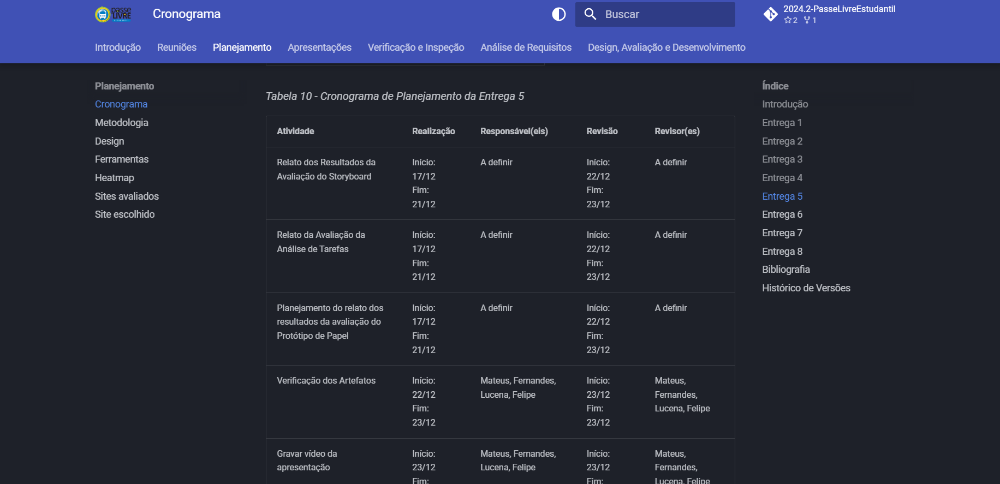
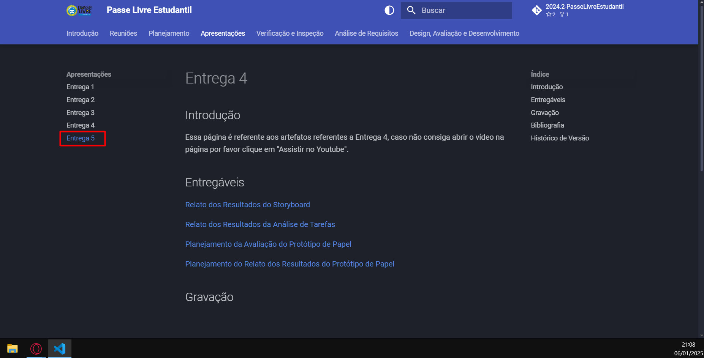
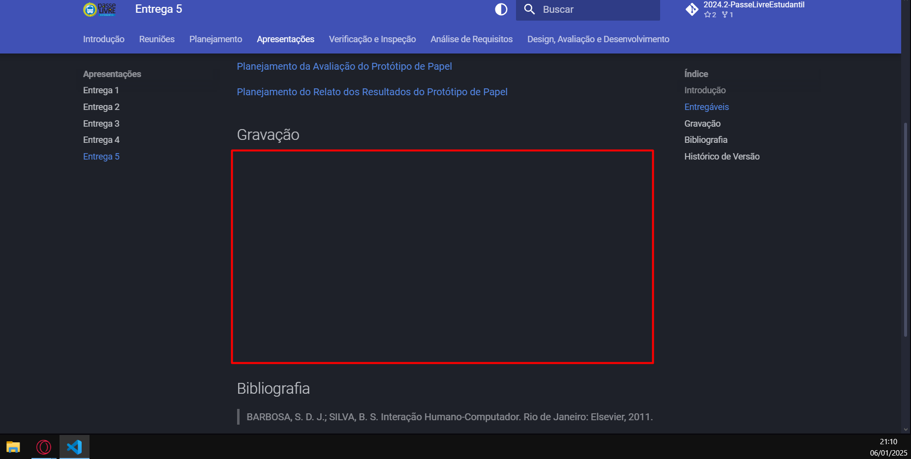
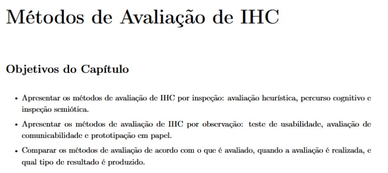
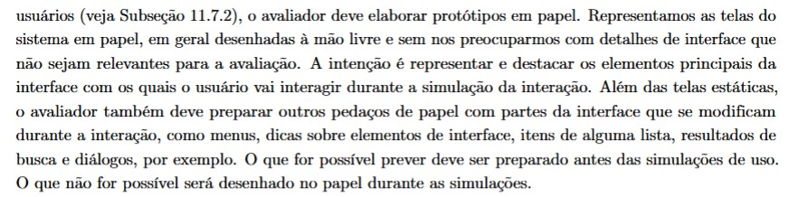
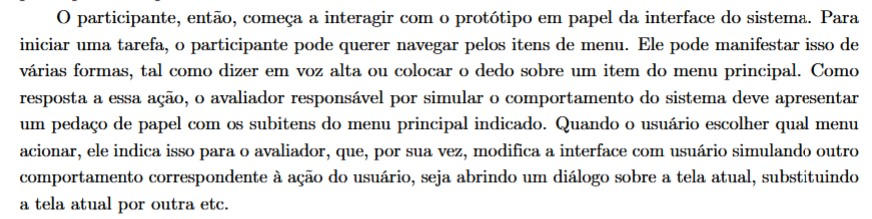
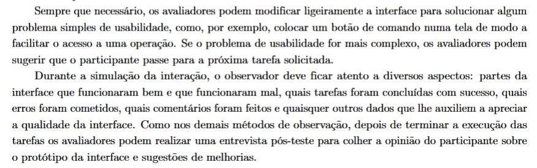
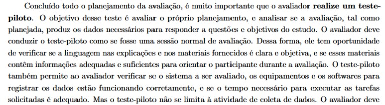

# Execução da Verificação dos Itens do Desenvolvimento do Projeto (Grupo 07)

## Introdução

O presente documento tem como objetivo apresentar a Lista de Verificação (disponibilizada no plano de ensino da disciplina e complementada com itens adicionais desenvolvidos pelo próprio grupo) dos Itens do Desenvolvimento do Projeto do Grupo 07.

## Lista de Verificação

<b>Tabela 1</b> - Itens do Desenvolvimento do Projeto (Grupo 07)

| O github pages possui: | Resposta  | Versão, Data e hora da avaliação  | Observação |
|---|---|---|---|
| 1 – O histórico de versão padronizado?  | Não | v1.0, 06/01/2025 - 20:52 | Dos artefatos dessa entrega, os relatos não tem histórico de versão e, até então, o planejamento da avaliação do protótipo de papel e planejamento do relato dos resultados não está funcionando corretamente.  |
| 2 – O(s) autor(es) e o(s) revisor(es) para cada artefato?  | Não | v1.0, 06/01/2025 - 21:00 ||
| 3 – Referências bibliográficas e/ou bibliografia em todos os artefatos?    | Não | v1.0, 06/01/2025 - 21:00 ||
| 4 – As tabelas e imagens possuem legenda e fonte e elas são chamadas dentro do texto? | Não | v1.0, 06/01/2025 - 21:01 ||
| 5 – Um texto fazendo uma introdução dos artefatos? | Não | v1.0, 06/01/2025 - 21:01 ||
| 6 – O cronograma executado com quem realizou cada artefato/atividade com as datas de início e fim da construção/realização do artefato/atividade. | Não | v1.0, 06/01/2025 - 21:03 | Existe apenas o cronograma planejado que está faltando atribuição de responsáveis nas tarefas da etapa. |
| 7 – Ata(s) da(s) reuniões (com data, horário de início e do final, participantes, objetivo, atividades definidas etc). | Não | v1.0, 06/01/2025 - 21:08 ||
| 8 – A gravação da reunião do grupo. | Não | v1.0, 06/01/2025 - 21:08 |  |
| 9 – Vídeo de apresentação na categoria “não listado” no YouTube?  | Não | v1.0, 06/01/2025 - 21:10 | Não possui gravação da entrega.  |
| 10 - O planejamento da avaliação segue o Framework DECIDE? | Não | v1.0, 06/01/2025 - 21:11| Não tem como saber devido à falha de carregamento da página.  |
| 11 - Descreve o(s) objetivo(s) da avaliação? (apropriação de tecnologia pelos usuários; ideias e alternativas de design; conformidade com um padrão; e/ou problemas na interação e na interface) | Não | v1.0, 06/01/2025 - 21:12 | Não tem como saber devido à falha de carregamento da página.  |
| 12 - Os métodos de avaliação a serem utilizados? | Não | v1.0, 06/01/2025 - 21:12 |    BARBOSA, Simone, et al. Interação Humano-Computador e Experiência do Usuário. Leanpub, p.281  cap 12, 2022.|
| 13 - As questões práticas da avaliação (sobre o recrutamento dos usuários que participarão da avaliação (onde e o perfil), quantos usuários participarão da avaliação e a razão dessa quantidade, presencial real ou remota; a preparação e o uso dos equipamentos necessários, os prazos; o orçamento; recursos de mão-de-obra necessária para conduzir a avaliação)? | Não | v1.0, 06/01/2025 - 21:13 ||
| 14 - As questões éticas ( se os participantes da avaliação devem ser respeitados e não podem ser prejudicados direta ou indiretamente, nem durante os experimentos, nem após a divulgação dos resultados da avaliação.)? | Não | v1.0, 06/01/2025 - 21:13 ||
| 15 - A estrutura do relatório do resultado da avaliação (os objetivos da avaliação; uma breve descrição do método de prototipação em papel; o número e o perfil de avaliadores e dos participantes; as tarefas executadas pelos participantes; lista de problemas encontrados etc)? | Não | v1.0, 06/01/2025 - 21:13 ||
| 16 - Um cronograma (data e horário) e local para realização da avaliação do Protótipo de Papel? | Não | v1.0, 06/01/2025 - 21:13 ||
| 17 - Quantidade de protótipos de papel é igual a quantidade de integrantes do grupo? | Não | v1.0, 06/01/2025 - 21:13 | Não há protótipos disponíveis na página |
| 18 - As telas principais estão representadas de maneira clara e destacando os elementos de interação (botões, menus, etc.)?| Não | v1.0, 06/01/2025 - 21:14 |  BARBOSA, Simone, et al. Interação Humano-Computador e Experiência do Usuário. Leanpub, p.316  cap 12, 2022.|
| 19 -  O usuário é capaz de navegar facilmente entre as diferentes partes do protótipo sem confusão ou erro?| Não | v1.0, 06/01/2025 - 21:14 |  BARBOSA, Simone, et al. Interação Humano-Computador e Experiência do Usuário. Leanpub, p.318  cap 12, 2022.|
| 20 - Todos os problemas graves de usabilidade foram identificados e priorizados para correção?| Não| v1.0, 06/01/2025 - 21:14 |  BARBOSA, Simone, et al. Interação Humano-Computador e Experiência do Usuário. Leanpub, p.318  cap 12, 2022.|
| 21 - A definição do teste piloto e data para realização do teste piloto antes da avaliação? | Não | v1.0, 06/01/2025 - 21:14 |  BARBOSA, Simone, et al. Interação Humano-Computador e Experiência do Usuário. Leanpub, p.276  cap 11, 2022.|
| 22 - Os itens que o avaliador deve realizar/anotar durante a avaliação (listar os problemas encontrados, priorizar a correção dos problemas não resolvidos)? | Não | v1.0, 06/01/2025 - 21:14 |  BARBOSA, Simone, et al. Interação Humano-Computador e Experiência do Usuário. Leanpub, p.319  cap 12, 2022.|

## Resultado

Com relação aos artefatos dessa entrega (Entrega 05), não houve entrega de relatos, gravação da reunião do grupo e vídeo de apresentação. Além disso, a página de planejamento da avaliação do protótipo de papel não está funcionando corretamente, impossibilitando a verificação de alguns itens da lista de verificação.

## Bibliografia
> \- BARBOSA, Simone, et al. Interação Humano-Computador e Experiência do Usuário. Leanpub, 2022. Disponível em: https://leanpub.com/ihc-ux. Acesso em: 09 dez. 2024.

> \- SALES, André. Plano de Ensino da disciplina Interação Humano Computador. Universidade de Brasília, Campus UNB Gama: Faculdade de Ciências e Tecnologias em Engenharia, 2024. Disponível em: https://aprender3.unb.br/pluginfile.php/2972625/mod_resource/content/56/Plano_de_Ensino%20FIHC%20022024%20Turma%2001%20v1.pdf. Acesso em: 25 out. 2024.

## Histórico de Versão
---
| Versão | Data | Autor(es) | Descrição | Data de Revisão | Revisor(es) |
|:---:|:---:|---|---|:---:|---|
| 1.0 | 02/01/2025 | [Weverton Rodrigues](https://github.com/vevetin) | criação do documento |05/01/2025|[Paulo Henrique](https://github.com/paulomh)|
| 1.1 | 06/01/2025 | [Paulo Henrique](https://github.com/paulomh) | verificação do grupo 07 |06/01/2025| [Weverton Rodrigues](https://github.com/vevetin) |