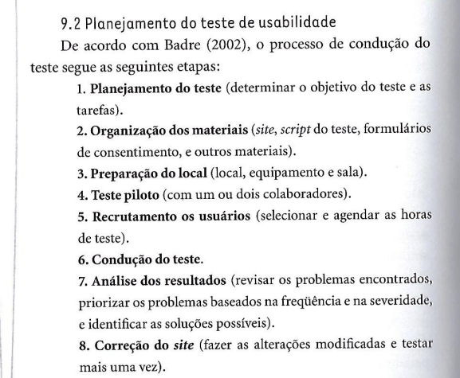
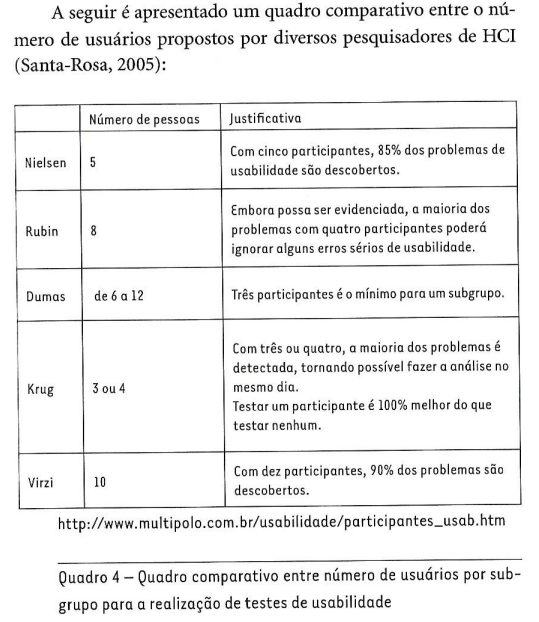
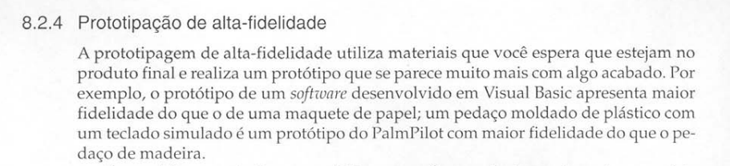

# Execução da Verificação dos Itens do Desenvolvimento do Projeto (Interna)

## Introdução

Feito o [planejamento da verificação dos itens do desenvolvimento do projeto](../etapa05/planejamento.md), o presente documento tem como objetivo apresentar a execução do planejamento de verificação dos artefatos do próprio grupo, com base em uma lista de verificação disponibilizada no plano de ensino da disciplina[1](../etapa05/execucao-interna.md#referência-bibliográfica) e complementada com itens adicionais desenvolvidos pelo próprio grupo.

## Lista de Verificação

<b>Tabela 1</b> - Itens do Desenvolvimento do Projeto

| O github pages possui: | Resposta  | Versão, Data e hora da avaliação  | Observação |
|---|---|---|---|
| 1 – O histórico de versão padronizado?  | Sim | v1.0, 14/01/2025, 21:25 ||
| 2 – O(s) autor(es) e o(s) revisor(es) para cada artefato?  | Sim | v1.0, 14/01/2025, 21:27 ||
| 3 – Referências bibliográficas e/ou bibliografia em todos os artefatos?    | Sim |v1.0, 14/01/2025, 21:27||
| 4 – As tabelas e imagens possuem legenda e fonte e elas são chamadas dentro do texto? |Sim| v1.0, 14/01/2025, 21:25 ||
| 5 – Um texto fazendo uma introdução dos artefatos? |Sim|v1.0, 14/01/2025, 21:28||
| 6 – O cronograma executado com quem realizou cada artefato/atividade com as datas de início e fim da construção/realização do artefato/atividade. |Sim|v1.0, 14/01/2025, 21:28||
| 7 – Ata(s) da(s) reuniões (com data, horário de início e do final, participantes, objetivo, atividades definidas etc). |Sim|v1.0, 14/01/2025, 21:29||
| 8 – A gravação da reunião do grupo. |Sim|v1.0, 14/01/2025, 21:29||
| 9 – Vídeo de apresentação na categoria “não listado” no YouTube?  |Sim|v1.0, 14/01/2025, 21:29||
| 10 - O planejamento da avaliação segue o Framework DECIDE? |Sim|v1.0, 14/01/2025, 21:30||
| 11 - Descreve o(s) objetivo(s) da avaliação? (apropriação de tecnologia pelos usuários; ideias e alternativas de design; conformidade com um padrão; e/ou problemas na interação e na interface) |Sim|v1.0, 14/01/2025, 21:30||
| 12 - Os métodos de avaliação a serem utilizados? |Sim|v1.0, 14/01/2025, 21:30|    BARBOSA, Simone, et al. Interação Humano-Computador e Experiência do Usuário. Leanpub, p.281  cap 12, 2022.|
| 13 - As questões práticas da avaliação (sobre o recrutamento dos usuários que participarão da avaliação (onde e o perfil), quantos usuários participarão da avaliação e a razão dessa quantidade, presencial real ou remota; a preparação e o uso dos equipamentos necessários, os prazos; o orçamento; recursos de mão-de-obra necessária para conduzir a avaliação)? |Sim|v1.0, 14/01/2025, 21:30||
| 14 - As questões éticas ( se os participantes da avaliação devem ser respeitados e não podem ser prejudicados direta ou indiretamente, nem durante os experimentos, nem após a divulgação dos resultados da avaliação.)? |Sim|v1.0, 14/01/2025, 21:30||
| 15 - Um cronograma (data e horário) e local para realização da avaliação do Protótipo de alta fidelidade? |Sim|v1.0, 14/01/2025, 21:31||
| 16 - Uma aba no pages para a documentação do protótipo de alta fidelidade? |Sim|v1.0, 14/01/2025, 21:31||
| 17 - O planejamento da avaliação segue os processos de condução do teste de usabilidade? |Sim|v1.0, 14/01/2025, 21:31| ROSA, José Guilherme Santa. Avaliação e Projeto No Deisng de Interfaces. 1. ed. Rio de Janeiro: Elsevier, 2010. Capítulo 8: Teste de Usabilidade. Página 148.|
| 18 - O planejamento da avaliação prevê a quantidade de usuários mínimos para a execução do teste de um dos autores mencionados no livro? |Sim|v1.0, 14/01/2025, 21:32|  ROSA, José Guilherme Santa. Avaliação e Projeto No Deisng de Interfaces. 1. ed. Rio de Janeiro: Elsevier, 2010. Capítulo 8: Teste de Usabilidade. Página 148.|
| 19 - O protótipo de alta fidelidade possui a quantidade de tarefas do grupo? (mínimo uma tarefa por membro) |Incompleto|v1.0, 14/01/2025, 21:32|Alguns protótipos ainda estão em fase de desenvolvimento|
| 20 - O planejamento do relato dos resultados segue os itens definidos no livro?|Sim|v1.0, 14/01/2025, 21:33| BARBOSA, Simone, et al. Interação Humano-Computador e Experiência do Usuário. Leanpub, p.279  cap 11, 2022.|
| 21 - O planejamento do relato dos resultados prevê um planejamento de reprojeto se necessário? |Sim|v1.0, 14/01/2025, 21:33||
| 22 - Os protótipo(s) seguem o guia de estilo definido pelo grupo? |Sim|v1.0, 14/01/2025, 21:33||
| 23 - O protótipo de alta fidelidade utiliza recursos que possivelmente estarão no produto final? |Sim|v1.0, 14/01/2025, 21:34| PREECE, Jenny; ROGERS, Yvonne; SHARP, Helen. Interaction design: beyond human-computer interaction. 1. ed. New York: J. Wiley & Sons, 2002. Capítulo 08: Design, Prototipação e Construção. Página 265|

## Resultado

A tabela de verificação apresentou **23 critérios** a serem avaliados, dos quais **22 foram atendidos** de forma satisfatória, resultando em uma **taxa de conformidade de 95,7%**. Entre os itens avaliados, apenas 1 ficou pendente:  
- Quantidade de tarefas no protótipo de alta fidelidade: Este item foi marcado como "Incompleto", pois alguns protótipos ainda estão em fase de desenvolvimento, não atendendo ao requisito de conter, no mínimo, uma tarefa por membro do grupo.

## Bibliografia

> \- BARBOSA, Simone, et al. Interação Humano-Computador e Experiência do Usuário. Leanpub, 2022. Disponível em: https://leanpub.com/ihc-ux. Acesso em: 09 dez. 2024.

> \- ROSA, José Guilherme Santa. Avaliação e Projeto No Deisng de Interfaces. 1. ed. Rio de Janeiro: Elsevier, 2010. Capítulo 8: Teste de Usabilidade. Página 148.

> \- PREECE, Jenny; ROGERS, Yvonne; SHARP, Helen. Interaction design: beyond human-computer interaction. 1. ed. New York: J. Wiley & Sons, 2002. Capítulo 08: Design, Prototipação e Construção. Página 265

## Referência Bibliográfica

> \- SALES, André. Plano de Ensino da disciplina Interação Humano Computador. Universidade de Brasília, Campus UNB Gama: Faculdade de Ciências e Tecnologias em Engenharia, 2024. Disponível em: https://aprender3.unb.br/pluginfile.php/2972625/mod_resource/content/56/Plano_de_Ensino%20FIHC%20022024%20Turma%2001%20v1.pdf. Acesso em: 25 out. 2024.

## Histórico de Versão
---
| Versão | Data | Autor(es) | Descrição | Data de Revisão | Revisor(es) |
|:---:|:---:|---|---|:---:|---|
| 1.0 | 13/01/2025 | [Paulo Henrique](https://github.com/paulomh) | criação do documento |13/01/2025|[Weverton Rodrigues](https://github.com/vevetin)|
| 1.1 | 14/01/2025 | [Weverton Rodrigues](https://github.com/vevetin) | execução da verificação |14/01/2025| [Paulo Henrique](https://github.com/paulomh)|
