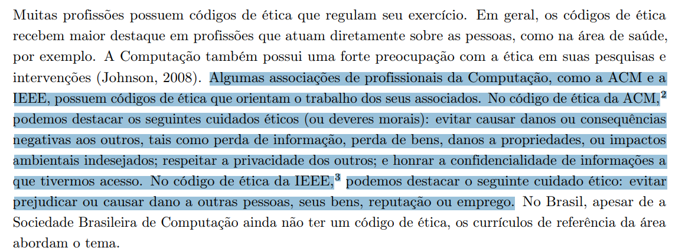
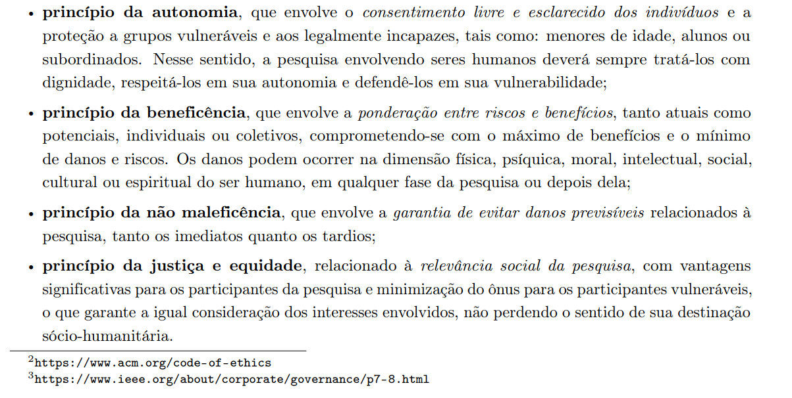
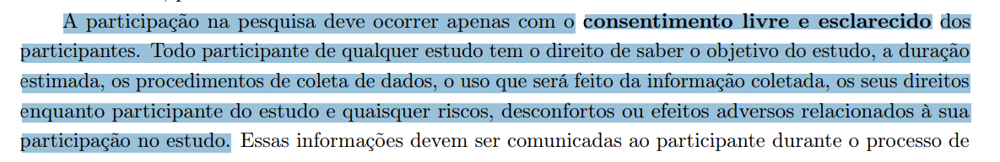
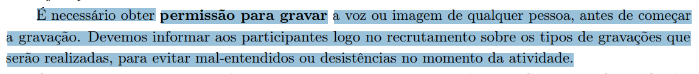
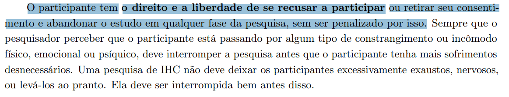
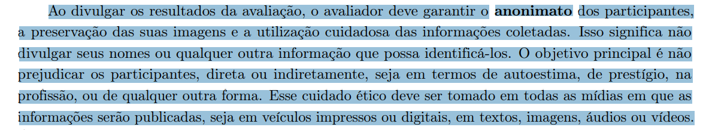
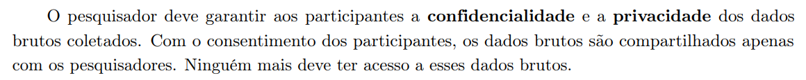
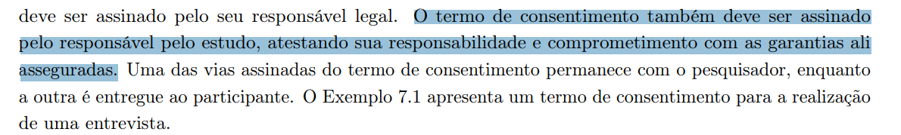
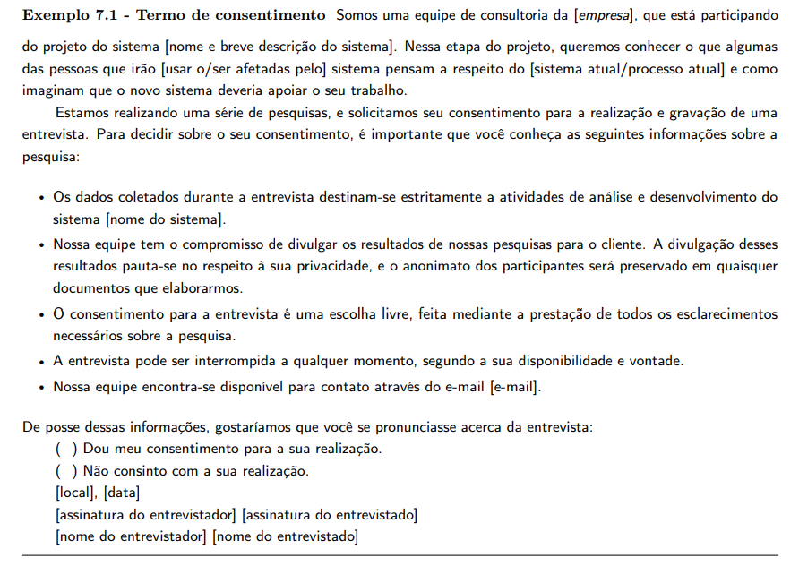

# Aspectos Éticos - Planejamento

## Introdução

O presente documento tem como objetivo apresentar o planejamento da verificação do artefato relacionado aos aspectos éticos do projeto.

## Lista de Verificação

A tabela a seguir apresenta a lista de verificação dos aspectos éticos do projeto. Vale ressaltar que alguns itens de presentes na lista são reaproveitados de outras listas de verificação presentes na seção: [Verificações](/docs/category/verificações). A resposta da lista de verificação será preenchida com "Conforme", "Não Conforme", "Não Aplicável" e "Sugestão de Melhoria". 

<b>Tabela 1</b> - Lista de Verificação Aspectos Éticos

| Categoria | Questão | Resposta | Versão, Data e hora da avaliação | Fonte | Autor(es) |
|-----------|---------|----------|----------------------------------|-------|-----------|
| Aspectos Éticos | 1 – Considera aspectos Éticos de Pesquisas Envolvendo Pessoas? Exemplo: garante que as eventuais pesquisas não causem danos ou consequências negativas aos participantes. |          |          |  Figura [A.1](./planejAspectosEticos.md#apêndice-a) (Apêndice A - Aspectos Éticos) | [Necivaldo Amaral](https://github.com/junioramaral22) e [Paulo Henrique](https://github.com/paulomh) |
|           | 2 – Os 4 princípios (da autonomia, da beneficência, princípio da não maleficência e da justiça e equidade)?  |   |           |  Figura [A.2](./planejAspectosEticos.md#apêndice-a) (Apêndice A - Aspectos Éticos) | [Necivaldo Amaral](https://github.com/junioramaral22) e [Paulo Henrique](https://github.com/paulomh) |
| Aspectos Éticos | 3 – O termo de consentimento livre e esclarecido dos participantes?  |          |                                  |  Figura [A.3](./planejAspectosEticos.md#apêndice-a) (Apêndice A - Aspectos Éticos) | [Necivaldo Amaral](https://github.com/junioramaral22) e [Paulo Henrique](https://github.com/paulomh) |
| Aspectos Éticos | 4 – Que solicitará a permissão para gravar a voz ou imagem de qualquer pessoa, antes de começar a gravação? |          |                                  | Figura [A.4](./planejAspectosEticos.md#apêndice-a) (Apêndice A - Aspectos Éticos) | [Weverton Rodrigues](https://github.com/vevetin) e [Rodrigo Ferreira](https://github.com/rodwendrel)  |
| Aspectos Éticos | 5 - O termo de consentimento prevê a liberdade do participante cancelar a entrevista a qualquer momento?        |          |                                  | Figura [A.5](./planejAspectosEticos.md#apêndice-a) (Apêndice A - Aspectos Éticos) | [Weverton Rodrigues](https://github.com/vevetin) e [Rodrigo Ferreira](https://github.com/rodwendrel)  |
| Aspectos Éticos | 6 - O termo de consentimento garante o anonimato dos participantes na divulgação dos dados coletados?  |          |                                  |  Figura [A.6](./planejAspectosEticos.md#apêndice-a) (Apêndice A - Aspectos Éticos) | [Weverton Rodrigues](https://github.com/vevetin) e [Rodrigo Ferreira](https://github.com/rodwendrel)  |
| Aspectos Éticos | 7 - O termo de consentimento prevê a confidencialidade e privacidade dos dados coletados durante as eventuais entrevistas?        |          |                                  | Figura [A.7](./planejAspectosEticos.md#apêndice-a) (Apêndice A - Aspectos Éticos) | [Paulo Henrique](https://github.com/paulomh) e [Weverton Rodrigues](https://github.com/vevetin) |
| Aspectos Éticos | 8 - Termo de consentimento possui um campo de assinatura que atesta a responsabilidade e comprometimento do pesquisador com a pesquisa?        |          |                                  |  Figura [A.8](./planejAspectosEticos.md#apêndice-a) (Apêndice A - Aspectos Éticos) | [Rodrigo Ferreira](https://github.com/rodwendrel) e [Necivaldo Amaral](https://github.com/junioramaral22) |
| Aspectos Éticos | 9 - Segue o modelo de exemplo de termo de consentimento disponiblizado pelo livro? |          |                                  |  Figura [A.9](./planejAspectosEticos.md#apêndice-a) (Apêndice A - Aspectos Éticos) | [Rodrigo Ferreira](https://github.com/rodwendrel) e [Necivaldo Amaral](https://github.com/junioramaral22) |

Autor: [Paulo Henrique](https://github.com/paulomh) 

## Resultados

Os resultados obtidos através da aplicação da inspeção da lista de verificação serão sumarizados com dados quantitativos e qualitativos, e posteriormente sendo feito um comparativo com os resultados obtidos de inspeções anteriores. Por fim, será disponibilizada a gravação da execução da inspeção.

## Referências Bibliográficas

> \- BARBOSA, Simone Diniz Junqueira et al. Interação humano-computador e experiência do usuário. 1. ed. Rio de Janeiro: Simone Diniz Junqueira Barbosa, 2021. Capítulo 7: Identificação de Necessidades dos Usuários e Definição dos Requisitos de IHC.  Autopublicação. ISBN: 978-65-00-19677-1.

## Apêndice A - Aspectos Éticos

<b>Figura A.1</b> - Aspectos éticos envolvendo pessoas

<b>Fonte:</b> BARBOSA (2021, p. 140)

---

<b>Figura A.2</b> - Princípios da autonomia, beneficência, não maleficência, justiça e equidade

<b>Fonte:</b> BARBOSA (2021, p. 140)

---

<b>Figura A.3</b> - Apresentação de um termo de consentimento

<b>Fonte:</b> BARBOSA (2021, p. 141)

---

<b>Figura A.4</b> - Permissão de gravação

<b>Fonte:</b> BARBOSA (2021, p. 141)

---

<b>Figura A.5</b> - Liberdade de cancelar a entrevista a qualquer momento

<b>Fonte:</b> BARBOSA (2021, p. 142)

---

<b>Figura A.6</b> - Garantia de anonimato no termo de consentimento

<b>Fonte:</b> BARBOSA (2021, p. 141)

---

<b>Figura A.7</b> - Confidencialidade e privacidade dos dados coletados

<b>Fonte:</b> BARBOSA (2021, p. 141)

---

<b>Figura A.8</b> - Campo de assinatura do pesquisador responsável pela pesquisa

<b>Fonte:</b> BARBOSA (2021, p. 141)

---

<b>Figura A.9</b> - Exemmplo de termo de consentimento

<b>Fonte:</b> BARBOSA (2021, p. 142)

## Histórico de Versão
---
| Versão | Data | Autor(es) | Descrição | Data de Revisão | Revisor(es) |
|:---:|:---:|---|---|:---:|---|
| 1.0 | 01/02/2025 | [Paulo Henrique](https://github.com/paulomh) | Criação do documento | 01/02/2025 | [Weverton Rodrigues](https://github.com/vevetin) |