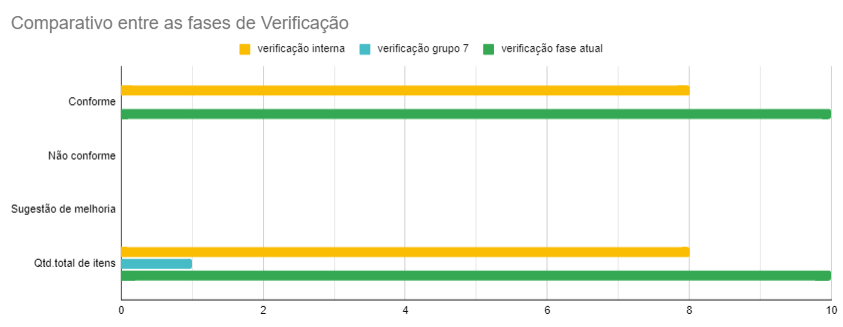

# Protótipo de Alta Fidelidade - Execução Interna

## Introdução

O presente documento tem como objetivo apresentar a exucução da verificação interna do artefato relacionado aos Protótipo de Alta Fidelidade.

## Lista de Verificação

<b>Tabela 1</b> - Lista de Verificação Protótipos de Alta Fidelidade

| Categoria        | Questão                                                                                  | Resposta | Versão, Data e hora da avaliação | Sugestão | Observação |
|------------------|------------------------------------------------------------------------------------------|----------|----------------------------------|----------|------------|
| Protótipos de Alta Fidelidade | 1. O protótipo utiliza linguagem e conceitos familiares ao usuário, correspondendo ao "mundo real"? | Conforme      |v1.0, 10/02/2025, 19:00 |          |            |
| Protótipos de Alta Fidelidade | 2. O protótipo oferece ao usuário controle e liberdade para desfazer ações ou sair de estados indesejados? | Conforme      | v1.0, 10/02/2025, 19:01 |          |            |
| Protótipos de Alta Fidelidade | 3. O protótipo de alta fidelidade apresenta uma representação visual clara e detalhada da solução interativa proposta? | Conforme      | v1.0, 10/02/2025, 19:02 |          |            |
| Protótipos de Alta Fidelidade | 4. A documentação do protótipo explica de forma concisa e compreensível os objetivos, as funcionalidades e os fluxos de interação do sistema?| Conforme      | v1.0, 10/02/2025, 19:04  |          |            |
| Protótipos de Alta Fidelidade | 5. A navegação no protótipo é intuitiva e eficiente, permitindo que os usuários encontrem facilmente as informações e funcionalidades desejadas? | Conforme      | v1.0, 10/02/2025, 19:05|          |            |
| Protótipos de Alta Fidelidade | 6. O protótipo considera diferentes estilos de interação, como menus e formulários, utilizando gramática, layout e terminologia consistentes? | Conforme      | v1.0, 10/02/2025, 19:06  |          |            |
| Protótipos de Alta Fidelidade | 7. O protótipo atende às necessidades e expectativas dos usuários, oferecendo funcionalidades relevantes e úteis? | Conforme      |v1.0, 10/02/2025, 19:08  |          |            |
| Protótipos de Alta Fidelidade | 8. O protótipo de alta fidelidade foi testado com usuários reais, e os resultados da avaliação foram utilizados para identificar problemas e oportunidades de melhoria? | Conforme      | v1.0, 10/02/2025, 19:10  |          |            |

## Resultados

A tabela apresentada reflete uma avaliação detalhada dos protótitpos de alta fidelidade desenvolvidos pelo grupo, com todos os itens sendo considerados conforme. Isso indica que os protótipos apresentam uma interface clara, contextualizada e de fácil aprendizagem.

<b>Figura 1</b> - Comparativo de Conformidade e Melhoria nas Diferentes Fases de Verificação

Autor: [Necivaldo Amaral](https://github.com/junioramaral22)

## Video da Verificação 

<iframe width="560" height="315" src="https://www.youtube.com/embed/qyN-BQfu_ZQ?si=m-oND_NGOyIrqizU" title="YouTube video player" frameborder="0" allow="accelerometer; autoplay; clipboard-write; encrypted-media; gyroscope; picture-in-picture; web-share" referrerpolicy="strict-origin-when-cross-origin" allowfullscreen></iframe>

## Bibliografia

> \- BARBOSA, Simone, et al. Interação Humano-Computador e Experiência do Usuário. Leanpub, 2022. Disponível em: https://leanpub.com/ihc-ux. Acesso em: 09 dez. 2024.

## Histórico de Versão
---
| Versão | Data | Autor(es) | Descrição | Data de Revisão | Revisor(es) |
|:---:|:---:|---|---|:---:|---|
| 1.0 | 02/02/2025 | [Necivaldo Amaral](https://github.com/junioramaral22) | Criação do documento | 02/02/2025 |[Weverton Rodrigues](https://github.com/vevetin)|