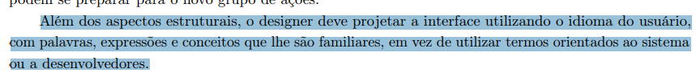

# Protótipo de Alta Fidelidade - Planejamento

## Introdução

O presente documento tem como objetivo apresentar o planejamento da verificação do artefato relacionado aos Protótipo de Alta Fidelidade.

## Lista de Verificação

A tabela a seguir apresenta a lista de verificação dos Protótipo de Alta Fidelidade. Vale ressaltar que alguns itens presentes na lista são reaproveitados de outras listas de verificação presentes na seção: [Verificações](/docs/category/verificações). A resposta da lista de verificação será preenchida com "Conforme", "Não Conforme", "Não Aplicável" e "Sugestão de Melhoria".

<b>Tabela 1</b> - Lista de Verificação Planejamento da Avaliação e do Relato dos Resultados

| Categoria | Questão | Resposta | Versão, Data e hora da avaliação | Fonte | Autor(es) |
|-----------|---------|----------|----------------------------------|-------|-----------|
|Protótipo de Altafidelidade| 1. O protótipo utiliza linguagem e conceitos familiares ao usuário, correspondendo ao "mundo real"?| || Figura [J.1](prototipoAlta.md#apêndice-J---protótipo-de-alta-fidelidade) (Apêndice J - Protótipo de Altafidelidade)|[Paulo Henrique](https://github.com/paulomh) e [Rodrigo Ferreira](https://github.com/rodwendrel)|
|Protótipo de Altafidelidade| 2. O protótipo oferece ao usuário controle e liberdade para desfazer ações ou sair de estados indesejados?| || Figura [J.2](prototipoAlta.md#apêndice-J---protótipo-de-alta-fidelidade) (Apêndice J - Protótipo de Altafidelidade) (Apêndice J - Protótipo de Altafidelidade)|[Paulo Henrique](https://github.com/paulomh) e [Rodrigo Ferreira](https://github.com/rodwendrel)|
|Protótipo de Altafidelidade| 3. O protótipo de alta fidelidade apresenta uma representação visual clara e detalhada da solução interativa proposta?| || Figura [J.3](prototipoAlta.md#apêndice-J---protótipo-de-alta-fidelidade) (Apêndice J - Protótipo de Altafidelidade) (Apêndice J - Protótipo de Altafidelidade)|[Necivaldo Amaral](https://github.com/junioramaral22) e [Weverton Rodrigues](https://github.com/vevetin)|
|Protótipo de Altafidelidade| 4. A documentação do protótipo explica de forma concisa e compreensível os objetivos, as funcionalidades e os fluxos de interação do sistema?| || Figura [J.4](prototipoAlta.md#apêndice-J---protótipo-de-alta-fidelidade) (Apêndice J - Protótipo de Altafidelidade) (Apêndice J - Protótipo de Altafidelidade)|[Necivaldo Amaral](https://github.com/junioramaral22) e [Weverton Rodrigues](https://github.com/vevetin)|, 
|Protótipo de Altafidelidade| 5. A navegação no protótipo é intuitiva e eficiente, permitindo que os usuários encontrem facilmente as informações e funcionalidades desejadas?| || Figura [J.5](prototipoAlta.md#apêndice-J---protótipo-de-alta-fidelidade) (Apêndice J - Protótipo de Altafidelidade) (Apêndice J - Protótipo de Altafidelidade)|[Necivaldo Amaral](https://github.com/junioramaral22) e [Weverton Rodrigues](https://github.com/vevetin)|
|Protótipo de Altafidelidade| 6. O protótipo considera diferentes estilos de interação, como menus e formulários, utilizando gramática, layout e terminologia consistentes?| || Figura [J.5](prototipoAlta.md#apêndice-J---protótipo-de-alta-fidelidade) (Apêndice J - Protótipo de Altafidelidade) (Apêndice J - Protótipo de Altafidelidade)|[Paulo Henrique](https://github.com/paulomh), [Rodrigo Ferreira](https://github.com/rodwendrel)|
|Protótipo de Altafidelidade| 7. O protótipo atende às necessidades e expectativas dos usuários, oferecendo funcionalidades relevantes e úteis?| || Figura [J.6](prototipoAlta.md#apêndice-J---protótipo-de-alta-fidelidade) (Apêndice J - Protótipo de Altafidelidade) (Apêndice J - Protótipo de Altafidelidade)|[Necivaldo Amaral](https://github.com/junioramaral22), [Paulo Henrique](https://github.com/paulomh)|
|Protótipo de Altafidelidade| 8. O protótipo de alta fidelidade foi testado com usuários reais, e os resultados da avaliação foram utilizados para identificar problemas e oportunidades de melhoria?| || Figura [J.7](prototipoAlta.md#apêndice-J---protótipo-de-alta-fidelidade) (Apêndice J - Protótipo de Altafidelidade) (Apêndice J - Protótipo de Altafidelidade)|[Rodrigo Ferreira](https://github.com/rodwendrel) e [Weverton Rodrigues](https://github.com/vevetin)|

Autor: [Necivaldo Amaral](https://github.com/junioramaral22) 

## Resultados

Os resultados obtidos através da aplicação da inspeção da lista de verificação serão sumarizados com dados quantitativos e qualitativos, sendo posteriormente comparados com inspeções anteriores.

## Referências Bibliográficas

> **BARBOSA, Simone Diniz Junqueira; et al.** *Interação Humano-Computador e Experiência do Usuário*. 1ª ed. Autopublicação, 2021.

## Apêndice J - Protótipo de Alta Fidelidade

<b>J.1</b> - Linguagem familiar

<b>Fonte:</b> BARBOSA (2021, p. 239 cap.10)

---

<b>J.2</b> - Controle do usuário

<b>Fonte:</b> BARBOSA (2021, p. 234 cap.10)

---

<b>J.3</b> - Visualização Clara

<b>Fonte:</b> BARBOSA (2021, p. 224 cap.9)

---

<b>J.4</b> - Documentação Protótipo

<b>Fonte:</b> BARBOSA (2021, p. 53 cap.3)

---

<b>J.5</b> - Padronização

<b>Fonte:</b> BARBOSA (2021, p. 221 cap.9)

---

<b>J.6</b> - Funcionalidades relevantes

<b>Fonte:</b> BARBOSA (2021, p. 102 cap.5)

---

<b>J.7</b> - Teste com usuários reais

<b>Fonte:</b> BARBOSA (2021, p. 115 cap.6)

## Histórico de Versão
---
| Versão | Data | Autor(es) | Descrição | Data de Revisão | Revisor(es) |
|:---:|:---:|---|---|:---:|---|
| 1.0 | 02/02/2025 | [Necivaldo Amaral](https://github.com/junioramaral22) | Criação do documento | 02/02/2025 | [Rodrigo Ferreira](https://github.com/rodwendrel)|
