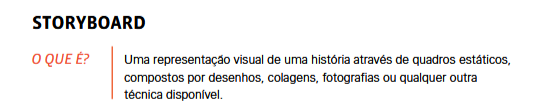
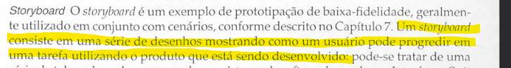
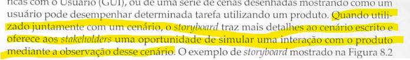

# Storyboards - Planejamento

## Introdução

O presente documento tem como objetivo apresentar o planejamento da verificação do artefato relacionado a *Storyboards*.

## Lista de Verificação

A tabela a seguir apresenta a lista de verificação para *Storyboards*. A resposta será preenchida com "Conforme", "Não Conforme", "Não Aplicável" e "Sugestão de Melhoria".

<b>Tabela 1</b> - Lista de Verificação de Storyboards

| Categoria    | Questão | Resposta | Página e Fonte | Autor(es) |
|-------------|---------|----------|----------------|-----------|
| Storyboards | 1. O artefato apresenta uma explicação sobre o conceito de *storyboard*?| |  Figura [B.1](./storyboard.md#apêndice-b---storyboard) | [Paulo Henrique](https://github.com/paulomh) e [Rodrigo Ferreira](https://github.com/rodwendrel) |
| Storyboards | 2. Os storyboards ilustram visualmente a interação do usuário com o sistema? | |  Figura [B.2](./storyboard.md#apêndice-b---storyboard) | [Necivaldo Amaral](https://github.com/junioramaral22) e [Weverton Rodrigues](https://github.com/vevetin) |
| Storyboards | 3. Os storyboards apresentam um cenário definido? | |Figura [B.3](./storyboard.md#apêndice-b---storyboard) | [Paulo Henrique](https://github.com/paulomh) e [Rodrigo Ferreira](https://github.com/rodwendrel) |
| Storyboards | 4. O artefato *storyboard* possui uma página dedicada aos storyboards? | | | [Necivaldo Amaral](https://github.com/junioramaral22) e [Weverton Rodrigues](https://github.com/vevetin) |
| Storyboards | 5. As tarefas dos *storyboards* estão descritas em seus documentos?  | | | [Paulo Henrique](https://github.com/paulomh) e [Rodrigo Ferreira](https://github.com/rodwendrel) |
| Storyboards | 6. Todos os membros do grupo adicionaram seus respectivos *storyboards*? | | | [Necivaldo Amaral](https://github.com/junioramaral22) e [Weverton Rodrigues](https://github.com/vevetin) |

## Resultados

Os resultados obtidos através da aplicação da inspeção da lista de verificação serão sumarizados com dados quantitativos e qualitativos, sendo posteriormente comparados com inspeções anteriores.

## Referências Bibliográficas

> **BARBOSA, Simone Diniz Junqueira; et al.** *Interação Humano-Computador e Experiência do Usuário*. 1ª ed. Autopublicação, 2021.

> **VIANNA, Maurício et al. Design Thinking.** *Inovação em negócios. Rio de Janeiro: MJV Press*. 2012.

> **PREECE, Jenny; ROGERS, Yvonne; SHARP, Helen. Design da Interação.** *Além da interação humano-computador. Porto Alegre.* Bookman, 2013.

## Apêndice B - Storyboard

<b>B.1 - Fonte: VIANNA, p. 135</b>

<b>B.2 - Fonte: PREECE, p. 265</b>

<b>B.3 - Fonte: PREECE, p. 265</b>

## Histórico de Versão

---
| Versão | Data | Autor(es) | Descrição | Data de Revisão | Revisor(es) |
|:---:|:---:|---|---|:---:|---|
| 1.0 | 03/02/2025 | [Rodrigo Wendrel](https://github.com/rodwendrel) | Criação do documento | 03/02/2025 | [Paulo Henrique](https://github.com/paulomh) |

